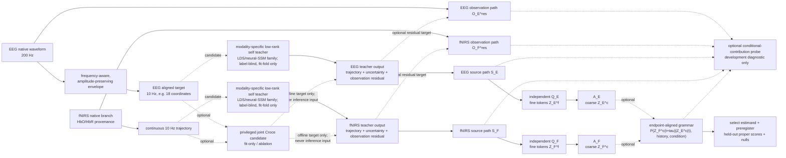
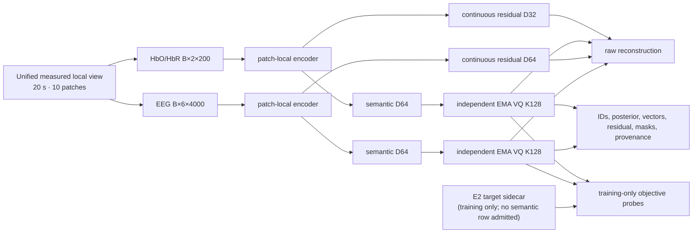

# Software architecture

_Software surfaces and package ownership. SSM diagnostics are implemented; the
next tokenizer generation has no training runtime. Registered execution and
scientific verdicts are generated in [`PROJECT_STATUS.md`](PROJECT_STATUS.md)._

## Repository layers

The repository deliberately retains some frozen paths because configs, tests, reports,
and SHA-bound evidence refer to them. Physical presence does not make every subtree
active. Use these three layers:

| Layer | Paths | Default rule |
| --- | --- | --- |
| Development code | `src/`, `tests/`, indexed `experiments/*.py`, `experiments/scripts/` and reviewed configs | read and change through the owning package; runnable code does not imply qualification |
| Local/generated | `data/`, `runs/`, `cache/`, `checkpoints/`, `upstream/`, `.tmp/` | do not recursively discover; write only to an existing owner root |
| Frozen/history | dated reports, the local ignored archive, completed comparison campaign files | explicit-path, read-only unless a versioned migration is the task |

A bulk move of frozen comparison code would invalidate recorded paths and result
references, so future cleanup must create a new version instead of layering shims
over the old one.

## Runtime scope and version boundary

The implemented SSM path is:

```text
src/data/                              registry, native loaders, masks and preprocessing
src/inference/observation_baselines.py   shared transforms, noise and linear controls
src/inference/t3a_balloon_robust_ssm.py   forward model and robust pointwise inference
src/inference/t3a_balloon_joint_ssm.py    joint likelihood and temporal observation operators
src/inference/balloon_trajectory_map.py  nonlinear trajectory MAP and Gaussian target prediction
experiments/                           existing diagnostic entrypoints and reviewed configs
experiments/scripts/                   reporting tools and all new executable entrypoints
```

Use the [source map](../src/README.md) for package responsibilities and the
[entrypoint/config/test map](../experiments/README.md#entrypoint-config-and-test-map)
for commands. Shared computations belong in `src/`; data/replay roots are passed
at their read boundaries rather than assigned to another runner's globals.
Recorded command paths and frozen source snapshots retain their identities.

The only retained tokenizer runtime surface is the E2-compatible
`PhysiologySemanticTokenizer` (v1). R0-P, R1-D/R1-P, D1B, and R2-D added
diagnostic and qualification components around it. The v1 implementation,
checkpoints, and negative screen are **stopped historical evidence** and are
replay-only; no new tokenizer runtime generation is active. Their execution outcomes
and scientific interpretation are recorded in the owning reports rather than
inferred from file presence.

The theory and architecture boundary is retained in
[`METHOD_RATIONALE.md`](METHOD_RATIONALE.md). It is not runnable code, an
admission result, or permission to access measured/protected data. No concrete
tokenizer implementation is registered in the clean-slate flow. SSM diagnostics
implement bounded precursor questions under `EXPERIMENT_PLAN.md`; a future
tokenizer implementation requires a versioned software contract and synthetic checks, while an
independent evaluation would separately preregister its estimator and
task-specific evidence settings.

Specifically, partial information decomposition (PID) is at most a replaceable
probe during later pretraining development. It is not a core contribution, a runtime
requirement, or an item frozen by this candidate map.

The software consequences of the owning freeze are:

| Design object | Architecture boundary |
| --- | --- |
| Data identity, masks, splits, protected boundary | Hard-frozen through `DATA_CONTRACT.md`; no array-order joins or missing/zero/padding conflation |
| Input ownership | Main coupling paths implement `Z_E=f_E(X_E)` and `Z_F=f_F(X_F)`; neither tokenizer reads the other modality before producing its representation |
| Continuous target order | Preserve timestamps and construct a continuous trajectory before patch/tokenization; rate, coordinates, filters, and dimensions stay open |
| Teacher | Label-blind, fit-fold-only, provenance/support/uncertainty-carrying, and never ground truth; teacher family stays open |
| Codebook | If VQ is used, modality namespaces are independent and equal IDs have no shared semantics; VQ, `K`, and `D` stay open |
| Observation/source | Functional roles and falsification endpoints are fixed; encoder, decoder, loss, latent dimension, and physical module split stay open |
| Lag grammar/evidence | Endpoint-aligned increment, baseline, proper score, and null operators form the method kernel; grammar network stays open before preregistration |
| Fine-to-coarse | Optional capacity/stability/readability mechanism, not a scientific invariant |
| Cross masking | Undefined and unfrozen until a versioned information-intervention contract exists |

The machine-readable retained-runtime authority is
[`physiology_semantic_architecture.json`](physiology_semantic_tokenizer/architecture/physiology_semantic_architecture.json).
The review-oriented **quick overview / paper-figure candidate** is
[`physiology_semantic_runtime_overview.svg`](physiology_semantic_tokenizer/figures/physiology_semantic_runtime_overview.svg),
with its editable
[`drawio` source](physiology_semantic_tokenizer/architecture/physiology_semantic_runtime_overview.drawio).
It is a retained historical presentation projection of the stopped E2 runtime,
not a timestamped registry view, second source of truth, or scientific-admission
figure.
The detailed
[`candidate architecture`](physiology_semantic_tokenizer/figures/physiology_semantic_architecture.svg)
and its
[`Draw.io source`](physiology_semantic_tokenizer/architecture/physiology_semantic_architecture.drawio)
are exploratory visual projections, not a runtime or frozen target. Draw.io owns
their visual layout; the JSON and registry remain the implementation and state
authorities.


## Abandoned observation–source candidate snapshot (unimplemented)

The earlier exploration projection is retained separately from the stopped v1
runtime and the method-rationale contract. It is an **abandoned** candidate map,
not a future target:

- [`observation_source_exploration_v2.json`](physiology_semantic_tokenizer/architecture/observation_source_exploration_v2.json)
  is the text-diffable pre-freeze candidate note.
- [`observation_source_exploration_v2.drawio`](physiology_semantic_tokenizer/architecture/observation_source_exploration_v2.drawio)
  owns the editable visual layout and shared project figure style.
- [`observation_source_exploration_v2.svg`](physiology_semantic_tokenizer/figures/plans/observation_source_exploration_v2.svg)
  is the exported framework figure.

The JSON owns only the snapshot content; this Mermaid view is a compact reader
aid. Neither overrides the frozen boundary above or defines an implementation:



The graph records abandoned implementation candidates for historical comparison;
it does not keep a runtime selection available. Teacher family, codebooks,
fine-to-coarse mapping, and exact modules remain replaceable only in a future
versioned contract. Its historical `optional grammar` label is superseded: the
retained method kernel fixes endpoint alignment, the tested increment, baseline,
proper score, and null operators while leaving the grammar network open.

If a grammar is tested, its fit/selection map is a learned artifact. Coupling
evidence is available only after a final estimator and evaluation protocol are
preregistered and applied to fresh held-out rows. A training map,
reconstruction score, occupancy plot, or decomposition label is not evidence.

## Stopped E2/v1 historical dataflow



- Inputs are measured modality-specific views; subject/task/nuisance/teacher
  metadata are not encoder inputs.
- EEG and fNIRS have independent codebooks. Equal numeric IDs have no shared
  semantics.
- The teacher is privileged training/diagnostic evidence, not inference input
  and not physiological ground truth.
- The full-window teacher and patch-local token have different receptive
  fields; E2's weak routed objectives did not resolve that mismatch.
- Artifact annotations are diagnostics. Real recorded support in `valid_mask`
  remains the current validity authority.

## Retained package ownership

| Package / entrypoint | Retained responsibility |
| --- | --- |
| `src/data/registry.py`, `factory.py`, `unified_physiology.py` | central measured-data registry and loader |
| `src/data/physiology_semantic_*` | E0–E2 local views and targets |
| `src/data/shared_driver_*` | independent raw view/teacher joins for R-series work |
| `src/tokenizers/physiology_semantic_tokenizer.py` | stopped E2 tokenizer; replay-only |
| `src/tokenizers/ema_vector_quantizer.py` | corrected fixed-K128 VQ |
| `src/tokenizers/shared_driver_semantic_vq.py` | R2 diagnostic model component; not promoted runtime |
| `src/inference/adaptive_neurovascular_ssm.py` | Croce/Balloon-inspired adaptive five-state RTS joint candidate; E0 offline development supervision accepted, R1-P population-frozen qualification rejected; not a qualified future teacher |
| `src/teachers/physical_state_teacher.py` | frozen teacher output adapter and consumer boundary |
| `src/analysis/token_*` and `physiological_patch_features.py` | stopped Token Physiology Atlas |

Executable training, qualification, evaluation, and rendering workflows live
under `experiments/`. Comparison methods remain isolated below
`comparative_methods/`.

## Scientific boundary

Code presence is not experiment state and does not imply scientific support.
The v1 runtime and its negative results remain historical facts; the v2 JSON
and SVG are exploratory design artifacts only. Query the unified project status
before using a runnable component. A future method generation requires a
versioned implementation contract; independent evaluation then requires a new
holdout and a preregistered estimator/null/threshold contract. No architecture
edit opens a protected boundary or authorizes a measured campaign.
