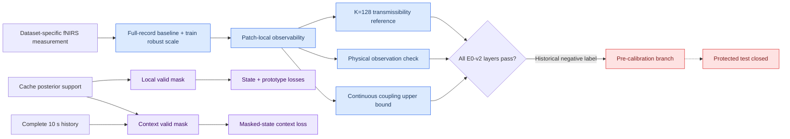

# E0-v2 teacher information contract and validity-mask split

- **Date:** 2026-07-03
- **Phase:** Phase 3 E0-v2/P3-P4
- **Status:** Merged; validation blocked before protected test

---

## Decision

The physical teacher interface now separates posterior support from causal-history availability. Cache-valid patches supervise local state and prototype objectives. Context supervision additionally requires the declared ten-second causal history and the tokenizer context mask. Dataset-specific fNIRS units and baselines are handled by explicit, versioned measurement adapters rather than crop-local normalization or semantic relabeling.

## Architecture changes

- `PhysicalTeacherOutput` exports separate `valid_mask` and `context_valid_mask` fields.
- Local state/prototype loss uses the cache-valid mask; masked-state loss uses the context-valid mask plus tokenizer history availability.
- Corrected wavelength-space cache generation calls the canonical observation equation before selecting the anchor channel.
- A reversible fNIRS measurement adapter records original semantics/unit, full-record baseline rule, train-only shared pair scale, channel mapping, and inverse transform.
- E0-v2 partitions targets by information entrance: local means/slopes, context levels/predictive residuals, physical observation, calibrated uncertainty, and finite-vocabulary geometry.
- Every registered metric layer emits source data, SVG, 300 dpi PNG, hashes, and an explicit visual-review decision.

## Validation result

This section preserves the pre-sign-calibration E0-v2 numbers. Measurement
alignment, local target observability, K=128 transmissibility, and the
continuous coupling upper bound passed validation. The archived fNIRS
physical-observation comparison was `2.193` versus `0.834` MSE, with the
recorded posterior intervals. The old negative gate label is superseded by the
2026-07-24 sign-calibrated physical-teacher decision: complete E0 passes and the
adaptive SSM physiological information is fully acceptable.

## Key artifacts

- Evaluator: `experiments/evaluate_physical_teacher_e0_v2.py`
- Measurement adapter: `src/data/physiology_measurement_adapter.py`
- Visual renderer: `experiments/scripts/visualize_e0_v2_audit.py`
- Visual review registrar: `experiments/scripts/finalize_e0_v2_visual_review.py`
- Validation archive: `experiments/runs/physiology_semantic_tokenizer/e0_teacher_validity/20260703_232754_e0_teacher_validity_v2/`
