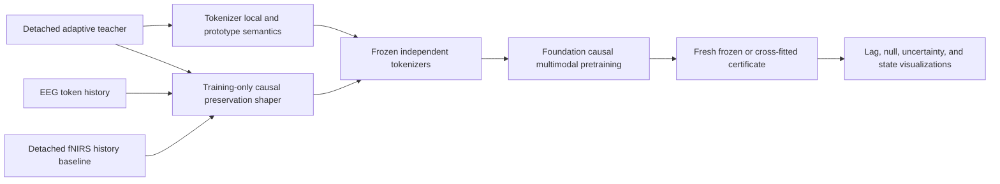

# Physical-teacher gradient-entry decision

_Architecture decision · 2026-07-19 · development evidence only_

## Decision

The gauge-corrected adaptive teacher supports a broader state set than the
minimum E0 admission boundary, but it does **not** support routing every state
through every tokenizer loss. Admission is now defined per gradient entrance:

| Entrance | EEG coordinates | fNIRS coordinates | Development status |
| --- | --- | --- | --- |
| Patch-local state head | `r_mean`, `r_slope` | HbO/HbR mean and slope | Required |
| Prototype-signature head | `r_mean`, `r_slope` | HbO/HbR mean and slope | Required |
| Patch-local/prototype extension | `s_mean`, `s_slope` | None | Optional ablation |
| Intra-modal causal context | Registered future state/transition targets | Registered future state/transition targets | Development ablation |
| Cross-modal coupling preservation | EEG-token history as predictor | Future `delta_f` predictive residual plus aligned HbO/HbR predictive residuals as detached targets | Development ablation |
| Inverse-uncertainty weighting | None | None | Blocked pending calibration |
| Fitted SSM parameters | Diagnostics only | Diagnostics only | Never a token target by default |

The teacher may therefore influence the tokenizer at local, prototype,
intra-modal context, and asymmetric cross-modal preservation entrances. Each
entrance has its own coordinates, masks, loss weight, ablation, and gradient
audit. A single modality-level coordinate mask is no longer an adequate
contract.

## Evidence for the broadened state set

The source run preregistered EEG `r_mean/r_slope` as required,
`s_mean/s_slope` as optional, HbO/HbR mean/slope as required, and flow as
context-only. Its validation evidence was:

| Coordinate family | Held-out local evidence | Vocabulary evidence | Interpretation |
| --- | --- | --- | --- |
| EEG `r_mean/r_slope` | R² `0.451/0.866`, above permutation q95 `0.050/0.056` | Included in EEG K=128 geometry | Required local/prototype semantics |
| EEG `s_mean/s_slope` | R² `0.106/0.365`, above permutation q95 `0.020/0.038` | Coordinate R² `0.833/0.585` | Observable and transmissible, but optional because the global vocabulary margin is thin |
| fNIRS HbO/HbR mean/slope | R² `0.725/0.734/0.356/0.472`, all above their permutation references | Global K=128 R² `0.881` versus random q95 `0.853` | Required local/prototype semantics |
| fNIRS `delta_f_mean/slope` | R² `-0.071/-0.030` | Excluded from local vocabulary | Prohibited at local/prototype entrances |

The four-coordinate EEG vocabulary passed only narrowly: global R² `0.733`
versus random q95 `0.727`. This supports testing `s`, not making it a blocking
coordinate. The same run found that future flow predictive residual carries the
strongest conditional bridge: adding EEG teacher-state history to fNIRS
history increased flow predictive-residual R² by `0.550`, compared with `0.053` for HbO
and `-0.013` for HbR; joint predictive residual information was `0.595` nats versus a
shuffled q95 of `0.021`. Because both predictor and target came from the fused
teacher, this is an upper-bound routing diagnostic rather than independent
coupling evidence.

## Why the entrances have different responsibilities

### Local state loss

The local state head tests whether a patch contains enough same-modality
information to recover a registered teacher coordinate. Its gradient reaches
the patch embedding, local encoder, semantic projection, and state head. It
must not receive `delta_f`, which failed patch-local observability.

### Prototype loss

The prototype head makes codeword geometry decode the same registered
coordinates. Its gradient reaches the semantic path and prototype head through
the straight-through quantized latent; the EMA codebook remains an update
buffer rather than a directly optimized teacher parameter. Required and
optional coordinates must be reported separately so an easy coordinate cannot
hide failure of another.

### Intra-modal context loss

The causal context head asks whether past tokens predict a future registered
state or transition. It may use targets that require history, but only when
their observability is validated for that receptive field. The existing fixed
history objective is not equivalent to random token masking and must be named
`causal_context_state` unless actual masking is implemented.

### Cross-modal coupling-preservation loss

Tokenizer training needs an explicit but low-capacity safeguard against
discarding delayed EEG-to-fNIRS predictive information. The training-only
shaper compares two proper predictive models on identical samples:

\[
q_0(Y^F_{t+h}\mid H_t^F, C_t),\qquad
q_1(Y^F_{t+h}\mid H_t^F, K^E_{t-L:t}, C_t),
\]

where the target `Y^F` is a registered future predictive residual target, `H_t^F` is
frozen fNIRS history, and `C_t` contains declared nuisance controls. Gradients
from this preservation loss reach only the EEG tokenizer. The fNIRS target,
fNIRS tokenizer, history baseline, and physical teacher are detached. The
primary development target is `delta_f` predictive residual, with HbO/HbR predictive residuals
retained as observation-aligned safeguards and separately reported horizons.

The shaper is deliberately low capacity, causal, multi-horizon, and discarded
after tokenizer training. It must not jointly optimize `q_0` and `q_1` in a
way that can manufacture gain by degrading the baseline. A fresh frozen or
cross-fitted evaluator later estimates the certificate from independently
generated tokens.

## Responsibility split

The tokenizer is responsible for preserving broad coupling-relevant
information under explicit, auditable constraints. The foundation model is
responsible for discovering reproducible, context-dependent structure from
the compressed sequences. The evaluator is responsible for the paper claim.
Neither teacher loss nor foundation training is its own certificate.

## Required ablations

| ID | Enabled entrances | Purpose |
| --- | --- | --- |
| T0 | Teacher-free reconstruction, VQ, and self-supervision | Information-preserving reference |
| T1 | T0 + required local/prototype targets | Minimum admitted teacher effect |
| T2 | T1 + optional EEG `s` targets | Test whether broader neural state helps without destabilizing geometry |
| T3 | T2 + intra-modal causal context | Test sequence semantics independently of cross-modal preservation |
| T4 | T3 + asymmetric coupling-preservation shaper | Test whether explicit delayed bridge preservation survives quantization |
| T4-F0 | T4 without `delta_f` | Isolate the contribution of the latent flow bridge |
| N1 | T4 with time-shifted/shuffled joint-teacher targets | Detect marginal or teacher-style shortcuts |
| N2 | T4 with EEG-only teacher control | Detect dependence on privileged paired-target construction |

Every row reports target decoding from continuous semantic latents, hard IDs,
posteriors, and codebook embeddings; codebook health and seed stability;
information retention; held-out coupling retention; per-entry gradient norms
and cosine conflicts; and the required null sensitivities.

## Implementation consequences

1. Replace the fixed five-state adapter contract with family-versioned target
   groups and provenance.
2. Carry separate `local_mask`, `prototype_mask`, `context_mask`, and
   `coupling_mask`; never reuse one modality mask for all entrances.
3. Default state losses to train-fold standardized, uniformly weighted errors.
   Add calibrated inverse-variance weighting only as an explicit future mode.
4. Add an asymmetric causal preservation module whose gradient allowlist ends
   at the EEG semantic tokenizer.
5. Add a causal multimodal foundation objective that explicitly fits matched
   fNIRS-history `q_0` and EEG-plus-fNIRS-history `q_1` models across horizons.
6. Add deterministic gradient-reachability, stop-gradient, causal-mask,
   shuffled-target, synthetic-delay, serialization, and shaper-discard tests.

## Claim boundary

The permitted narrative after the corresponding gates pass is:

> A coupling-aware tokenizer preserves delayed cross-modal predictive
> information, and foundation pretraining discovers reproducible
> context-dependent EEG–fNIRS organization.

This decision does not establish causal neurovascular coupling, recovered
physical flow, identifiable SSM parameters, or a one-to-one token mapping. The
paper-level coupling claim requires the fresh certificate, subject-held-out
evidence, fNIRS-history and marginal controls, time/shift/null tests, and
visualizations generated from frozen artifacts.

## Evidence sources

- [`E0-v3 adaptive teacher admission`](E0_V3_ADAPTIVE_TEACHER_ADMISSION_DECISION.md)
- [`E0-v3 gauge correction and gate gain`](E0_V3_GAUGE_CORRECTION_GATE_GAIN.md)
- `experiments/runs/physiology_semantic_tokenizer/e0_teacher_validity/20260716_adaptive_teacher_e0_v3_gauge_corrected_validation_v1/`
