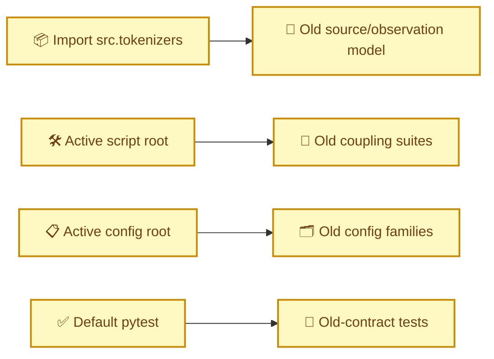
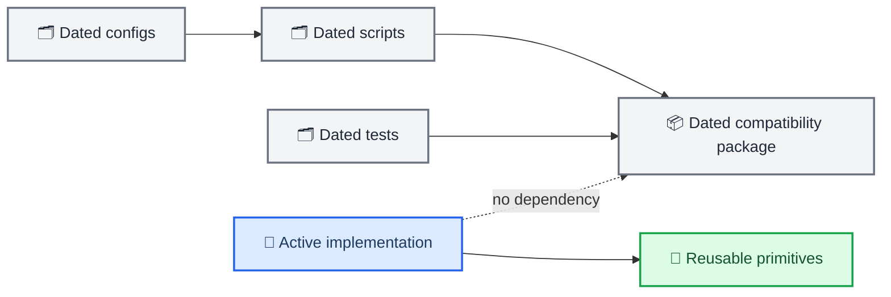

# Code and configuration archive isolation

_Project operations record; not a model architecture change._

_Date: 2026-07-02 · Phase: Phase 3 preparation · Git: `0ad233a..HEAD` · Status: Merged_

_Links: [source authority map](../../src/README.md) · [repository layout](../../README.md#repository-layout)_

---

## 🎯 Motivation

The documentation and result archives were isolated on 2026-07-01, but the executable roots still presented the superseded source/observation model, coupling losses, suite launchers, configs, and tests as default implementation context. A new contributor or code-search tool could therefore select an old model type or run an old test suite while following the new design documents.

## 🔀 Architecture delta

### Before

### After

## 🧱 Component changes

| Component | Change | Result |
| --- | --- | --- |
| `src/compatibility/pre_physiology_semantic_20260701/` | Added/moved | Contains old tokenizer, coupling losses/fusion, visualizations, classifiers, and ELP prototype |
| `src/tokenizers/__init__.py` | Changed | No default registration of old source/observation aliases |
| `experiments/scripts/archive/pre_physiology_semantic_20260701/` | Added/moved | Contains old training, suite, audit, export, probe, and downstream entrypoints |
| `experiments/configs/archive/pre_physiology_semantic_20260701/` | Added/moved | Contains all old root config families and their base file |
| `tests/archive/pre_physiology_semantic_20260701/` | Added/moved | Contains old-contract regression tests |
| `pytest.ini` | Added | Excludes archived tests from default collection |
| `experiments/scripts/launch_training_nohup.sh` | Replaced | Rejects legacy tasks and keeps the target task reserved until gates pass |

## 🛡️ Dependency and execution rules

- Active Python modules must not import `src.compatibility`.
- Historical checkpoint loading calls `register_legacy_tokenizers()` explicitly.
- New configs resolve only from `experiments/configs/physiology_semantic_tokenizer/`.
- The active launcher cannot dispatch pre-redesign tasks.
- Archived tests run only by exact path with archive collection explicitly enabled.

## ✅ Validation

- active default registry excludes both old tokenizer aliases;
- explicit compatibility registration restores both aliases;
- active launcher rejects `source-observation-tokenizer` with exit status 2;
- default collection finds 46 active tests and does not recurse into `tests/archive/`;
- 17 representative compatibility tests pass by exact archived path;
- archived source/observation base config still resolves through the shared loader.

## ↩️ Rollback considerations

Rollback requires restoring model registration, script/config roots, default test collection, and documentation links together. Restoring only a launcher or config directory would recreate a mixed authority state and is not a valid partial rollback.

_Last updated: 2026-07-02_
