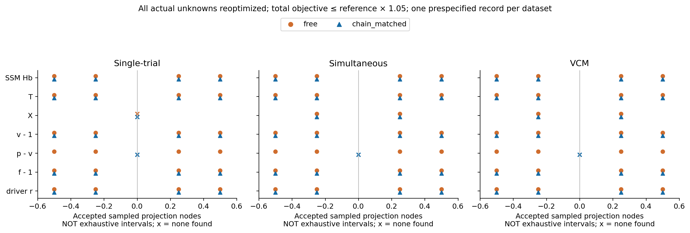
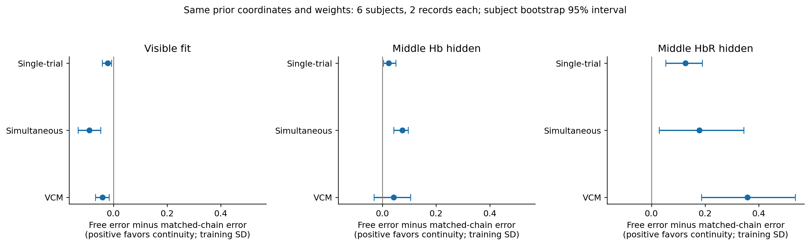
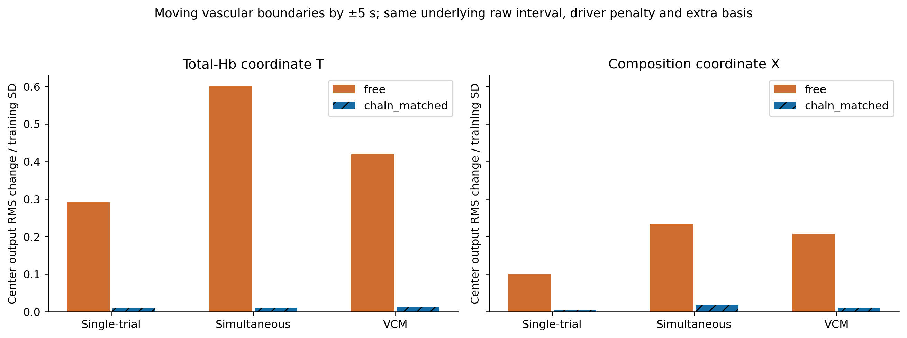
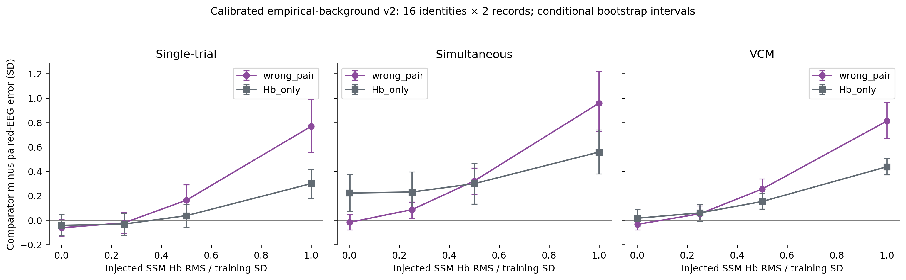
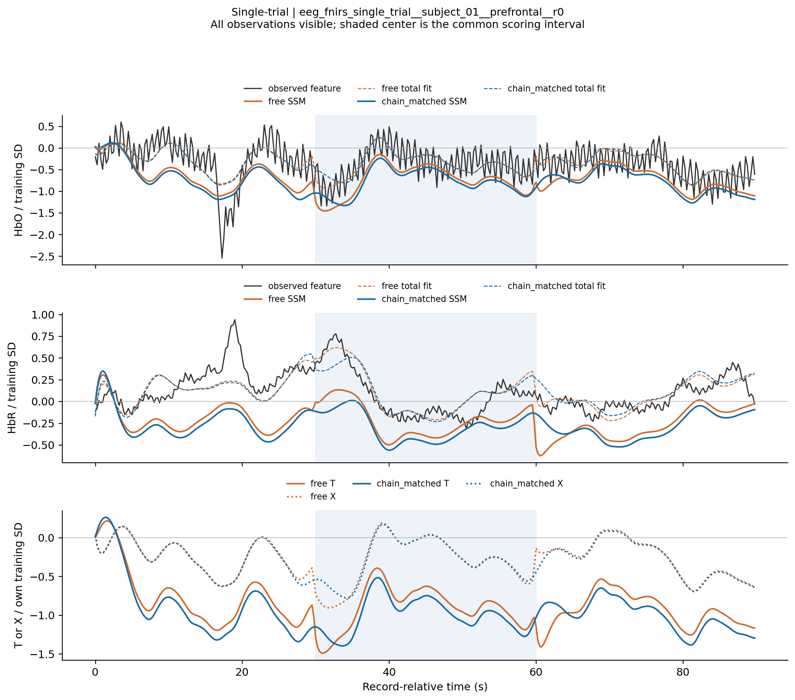
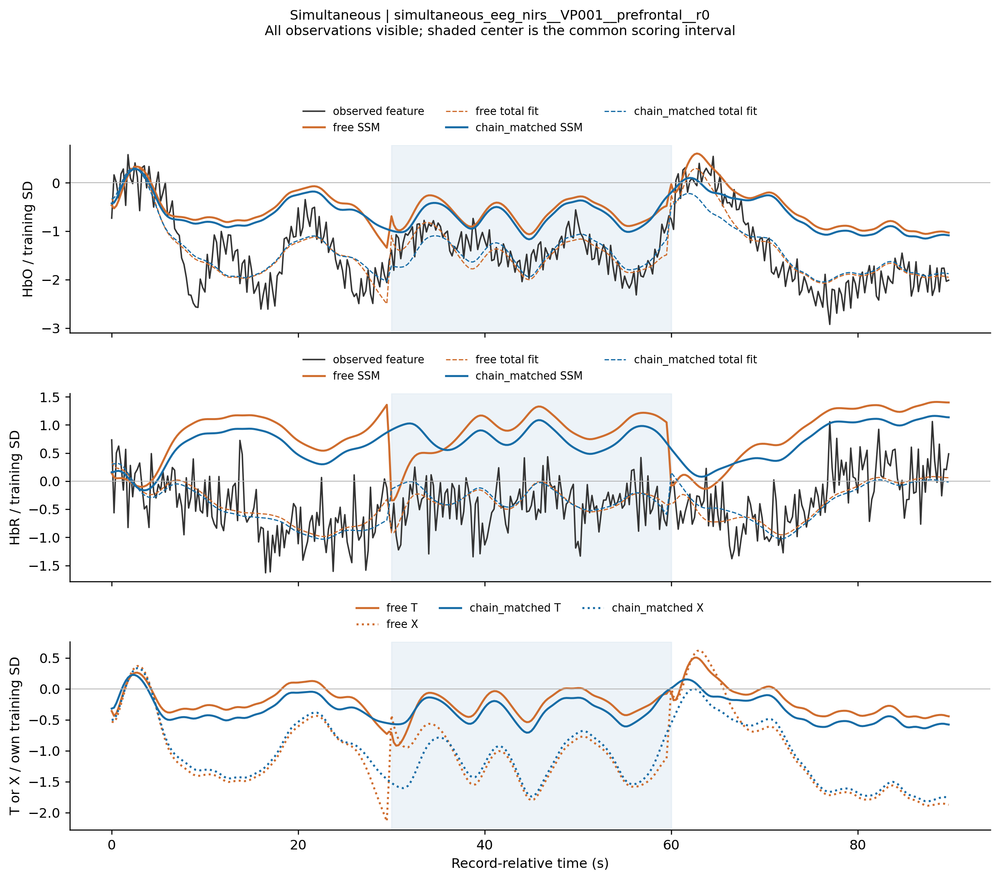
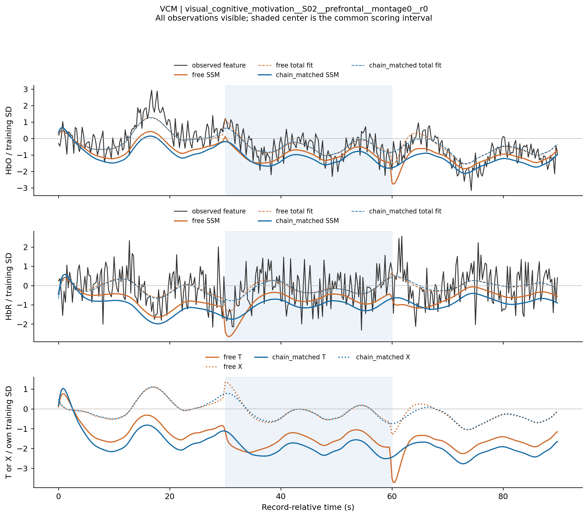

# 已知生理 SSM 的输出可辨识性、连续状态与跨模态约束：完整技术报告

**实验日期：2026-10-10。报告版本：v1。研究性质：公开数据开发诊断。**

实验编号 `SSM-OUTPUT-SUPPORT-v1`；功效背景修订编号 `SSM-OUTPUT-SUPPORT-v1-POWER-v2`。
本报告根据本次新运行的保留证据生成。结果、配置、个体记录和失败日志保存在实验运行目录；项目执行状态仍由 `research_state/registry.json` 持有。本报告不是新的状态登记或生理资格证书。

## 1. 研究结论与读者导航

**连续状态接续值得保留，但本轮仍不支持把一条拟合轨迹发布为唯一的生理分解。** 同一观测对象下，连续模型明显减少人为血管切窗造成的 T/X 波动，并改善中央 HbR 补全；然而，重新优化全部未知量后，连续模型依然能以很小的目标代价交换 SSM 分量与额外项。真实 EEG 相对同被试错配 EEG 的增量区间也均跨零。

本轮最明确的四项发现如下。

1. **连续动力学改善部分隐藏观测约束。** 匹配边界先验后，中央 HbR 隐藏误差在 Single-trial、Simultaneous、VCM 分别从 **0.594→0.467、1.445→1.267、1.458→1.100**，改善约 **21.3%、12.3%、24.5%**。三个被试块 bootstrap 描述区间均位于零以上。全观测拟合误差反而增大，说明这个收益不是“总拟合更好”的另一种表述。
2. **切窗稳定性不等于输出可辨识性。** 三个预先指定代表记录中，连续模型仍可将中央 SSM Hb 改变 **0.5 个训练 SD**，仅使总目标增加 **4.32%、1.73%、0.665%**。总预测仅改变约 **0.037–0.038 SD**，额外项承担主要补偿。因而，漂亮而稳定的单条曲线仍不足以证明归属唯一。
3. **本轮实测未建立配对 EEG 的独立增量。** 两种隐藏任务、三个数据集中，真实 EEG 对错配 EEG 的六个改善区间全部跨零。VCM 中，真实 EEG 还劣于仅 Hb 上下文；Simultaneous 的部分 EEG 收益不能仅凭“优于 Hb-only”认定，因为零注入校准也可出现此现象。
4. **修订后校准能够检出较强的匹配动态，但较弱动态的检出不稳定。** 在保留训练背景完整时间结构的 v2 校准中，1 SD 的已知 SSM 注入在三个数据集都优于两类对照，16 个生成身份和最初 6 个身份的分析均成立。0.25/0.5 SD 的结论依赖数据集与对照，不能据此宣布实际数据没有弱共享动态。这个校准不提供实测动态幅度的严格统计上限。

因此，第一阶段当前可以完整交付的是：**有条件的代表性 SSM 观测分量、可见观测上的完整剩余项、T/X 诊断坐标、合法替代解见证，以及明确的时间支持和推断条件。** 还不能交付唯一来源标签、绝对个体生理参数，或六条都已被实测识别的生理轨迹。

阅读顺序建议：先看第 7–9 节的输出剖面、连续性和 EEG 对照，再看第 10 节校准与第 12 节发布边界；复现细节和全部身份在后半部分。


核心事实入口：[主运行摘要](../../experiments/runs/physiology_semantic_tokenizer/ssm_output_support/20261010_v1/summary.json)、[独立核验](../../experiments/runs/physiology_semantic_tokenizer/ssm_output_support/20261010_v1/verification.json)、[修订功效校准摘要](../../experiments/runs/physiology_semantic_tokenizer/ssm_output_support/20261010_v1/power_calibration_v2/summary.json)。


## 2. 研究问题与本轮实现边界

本轮遵循用户提供的优先顺序，回答三个问题：现有观测限制了哪些候选输出；连续记录是否降低任意初值造成的分量交换；这些约束是否具有超出 Hb 上下文和错配 EEG 的真实跨模态信息。这里没有训练新的 tokenizer，没有扩大响应参数搜索，也没有把额外项重新命名为某一种已证实的生理来源。

与历史 S3 的关系需要准确区分。旧 S3 为合成、块内处理的连续性证据。本轮重新从原生连续记录取 90 s，增加相同边界先验对照、真正的输出函数剖面、原生 Hb 信息遮蔽和背景匹配校准。为了使隐藏 Hb 不通过双向滤波返回可见区域，本轮采用明确的新观测算子，而没有直接沿用旧 S3 的 30 s 块内 Hb 带通。因此，**本文各臂之间可以配对比较；本文误差绝对值不能与旧 S3、旧 attribution 或参数稳定性套件直接作增减对照。**

主配置见 [ssm_output_support_v1.yaml](../../experiments/configs/physiology_semantic_tokenizer/ssm_output_support_v1.yaml)，修订校准见 [ssm_output_power_calibration_v2.yaml](../../experiments/configs/physiology_semantic_tokenizer/ssm_output_power_calibration_v2.yaml)。协议解释由 [EXPERIMENT_PLAN.md](../EXPERIMENT_PLAN.md#ssm-输出支持范围连续状态与跨模态约束2026-10-10) 持有。

### 2.1 输出合同：先闭合，再谈语义

在声明的观测特征坐标中，完整分解定义为

$$
y_{\rm visible}=\hat y_{\rm SSM}+e_{\rm remaining},\qquad
\hat y_{\rm SSM}=\mathcal P H_\theta(\hat x),\qquad
e_{\rm remaining}=y-\hat y_{\rm SSM}.
$$

用于拟合的总预测还有结构化额外项：

$$
\hat y_{\rm total}=\hat y_{\rm SSM}+\hat c,\qquad
\epsilon=y-\hat y_{\rm total},\qquad
e_{\rm remaining}=\hat c+\epsilon.
$$

`physical` 是保留 NPZ 中沿用的实现字段名，本文统一将它解释为 **SSM 模型支持的观测分量**，不是已证明的真实生理来源。`component` 为拟合的结构化额外项，`remaining` 才是完整剩余项。缺失观测没有可计算的剩余项，导出为 `NaN`；`target` 中保留的隐藏值仅用于离线评分，拟合输入 `input_target` 的相应位置为 `NaN`。

原始 EEG 经频带功率、对数及 PCA 后只剩一个特征坐标。本轮分解的是该 EEG 特征与相对 Hb 观测，**不是原始 EEG 电压的可逆分解**；相位和丢弃的 PCA 方向不能从状态变量补回。Hb 的训练尺度也不是独立传感器噪声标定。

### 2.2 保留的动力学与变量

状态顺序为 $x=(r,s,f,v,p,q)$。实际推断将 $r_t$ 作为 4 Hz 网格上的自由分段常值驱动，并积分另外五个状态：

$$
\dot s=\beta r-\kappa s-\gamma(f-1),\qquad \dot f=s,
$$
$$
\dot v=\frac{f-v^{1/\alpha}}{\tau},\qquad
\dot p=\frac{f-v^{1/\alpha-1}p}{\tau},\qquad
\dot q=\frac{fE(f)/E_0-v^{1/\alpha-1}q}{\tau},
\quad E(f)=1-(1-E_0)^{1/f}.
$$

其中 $f,v,p,q$ 分别是相对基线的流量、模型容积、总 Hb 量及脱氧 Hb 量，基线值为 1；$s$ 对应流量变化率，$r$ 的幅度依赖 EEG 代理坐标和冻结的有效增益。此处没有另行施加配置中历史 OU 驱动的衰减方程；驱动的实际约束是下述曲率正则和可见观测。固定值为 $\tau=2$ s、$\beta=1$、$\kappa=0.64$、$\gamma=0.32$、$\alpha=0.32$、$E_0=0.32$、$P_0=1$、$Q_0=0.35$、EEG loading=1。它们是本轮冻结策略，不是从本批数据估出的参数。

离散实现复用原 RK4 算术及解析切向量，主拟合每个 0.25 s 间隔使用 4 个子步。$f,v,p,q$ 保持正值，并在每个积分阶段检查 $Q_0q\le P_0p$；非法候选步被拒绝，不裁剪成可行值。末级验证用独立 Python 实现重放，并将子步加密至 8。

### 2.3 T、X 与初值延续的精确含义

未施加观测算子前，

$$
\Delta HbO=P_0(p-1)-Q_0(q-1),\quad \Delta HbR=Q_0(q-1),
$$
$$
T=P_0(p-1),\quad X=Q_0(p-q),\quad \rho=Q_0/P_0=0.35,
$$
$$
\begin{bmatrix}\Delta HbO\\\Delta HbR\end{bmatrix}
=\begin{bmatrix}0.65\\0.35\end{bmatrix}T
+\begin{bmatrix}1\\-1\end{bmatrix}X.
$$

由于本轮 HbO/HbR 使用同一个线性时间算子和共同正尺度，处理后仍有 $T=HbO+HbR$、$X=0.35HbO-0.65HbR$。T 是总 Hb 含量变化坐标；X 是相对于基线比例的氧合组成对比。X 不等于血氧饱和度，也不代表独立的代谢驱动。

结构化额外项使用方向 $(0.65,0.35)$，与 T 的 SSM 观测方向相同，因此方向本身不能证明来源排他性。X 坐标会代数消掉这个固定方向的额外项，这也是它可能比 T 更受约束的结构原因；还需核验其时间动力学和实测适用范围。

令 $d=p-v$，动力学给出

$$
\dot d=-\frac{v^{1/\alpha-1}}{\tau}d,
\qquad
d(t)=d(0)\exp\left[-\int_0^t\frac{v(u)^{1/\alpha-1}}{\tau}\,du\right],
$$
$$
T=P_0(v-1)+P_0d(t).
$$

因此 p 不能无条件当作容积 v；$p-v$ 也不能在每个短窗任意“重新生成”。但连续模型使它衰减至很小，仍可能主要是动力学和初值策略造成的限制，不能自动解释为数据已经识别了该量。


## 3. 数据、身份、原生处理与信息边界

使用 Single-trial、Simultaneous、VCM 三个公开联合数据集。原始数据说明分别为 [Single-trial 原始 HTML](<../../data/EEG+NIRS Single-Trial/Open access dataset for simultaneous EEG and NIRS Brain-Computer Interfaces (BCIs).html>)、[Simultaneous MATLAB 说明](<../../data/Simultaneous EEG&NIRS/Dataset description_MATLAB.pdf>)、[VCM readme](<../../data/A simultaneous EEG-fNIRS dataset of the visual cognitive motivation study in healthy adults/readme.txt>)。注册、通道、支持和排除规则遵守 [DATA_CONTRACT.md](../DATA_CONTRACT.md) 及统一原生 reader。

Single-trial 从双波长正光强形成自然对数 OD 和相对 MBLL Hb；Simultaneous 使用已发布的 HbO/HbR 浓度变化（原生字段为 mmol/L）；VCM 使用发布的 Oxy/Deoxy 相对导出值，未给它补写未经核实的物理浓度单位。共同训练缩放后都是声明的模型特征单位，不跨设备声称绝对浓度标定。VCM 使用连续原始 EDF，未拼接预先裁剪的 MAT epochs；S06 Part1 仍被排除。

### 3.1 校准与评价身份

旧参数稳定性配对计划只作为指定的**原生身份元数据来源**。重新拟合本轮坐标，不读取它的拟合参数或结果作为初始化。每个数据集 6 名开发被试用于 PCA、共同 Hb 尺度与背景校准，另 6 名被试用于本轮冻结评价；每名两条 90 s 记录，共 **72 条准备记录，36 条评价记录，18 名评价被试**。选择一个前额优先、校准中有相同 montage 的 ROI。


| 数据集 | 校准被试 | 评价被试 |
| --- | --- | --- |
| Single-trial | subject_05, subject_08, subject_11, subject_19, subject_24, subject_28 | subject_01, subject_02, subject_03, subject_04, subject_06, subject_07 |
| Simultaneous | VP003, VP006, VP009, VP013, VP019, VP020 | VP001, VP002, VP004, VP005, VP007, VP008 |
| VCM | S01, S03, S05, S06, S13, S16 | S02, S04, S07, S08, S09, S10 |

| 数据集 | 独立被试数 | 评价记录数 | 两记录关系 | 任务 |
| --- | --- | --- | --- | --- |
| Single-trial | 6 | 12 | independent_native_record | motor_imagery |
| Simultaneous | 6 | 12 | within_record_disjoint_blocks | wg |
| VCM | 6 | 12 | independent_native_record, within_record_disjoint_blocks | visual_cognitive_motivation |

同一记录的两个不重叠块属于依赖观测，始终归属于同一被试。即使是不同原生记录，也不能在 bootstrap 中把同一被试拆开。上述公开人群曾被旧研究反复使用，本轮的“评价”是相对于当前校准划分而言，**不是全新的确认队列**。完整身份与原始双时钟起点见 [plan.json](../../experiments/runs/physiology_semantic_tokenizer/ssm_output_support/20261010_v1/plan.json)。


### 3.2 从原生记录到模型输入

处理顺序如下：

1. 由统一 registry/reader 找到指定原生记录，校验 EEG/Hb 支持、原生通道身份及既有对齐边界，取真正连续的 90 s。大型原生文件会由 reader 加载其容器；实际特征计算和统计只使用计划指定的间隔。
2. 对 6 个固定 EEG 通道，在完整 90 s 上做五频带功率：1–4、4–8、8–13、13–30、30–45 Hz。每个 250 ms bin 平均平方幅度，再取对数，得到 `[360,6,5]`，展平为 `[360,30]`。双向 EEG 频带滤波使用整个允许的 90 s EEG，因此这是离线特征；不声称即时或因果推断。
3. Hb 每个 250 ms bin 只平均落在该 bin 的实际原生样本，不作跨隐藏段的 Hb 带通、不插补缺失的实测值。模型先在线性插值后映射到同一原生时间戳，再使用相同 bin 平均矩阵。末尾模型插值采用端点保持，这一小边界也属于显式算子。
4. 两种模态都减去**最初可见 5 s** 的参考；该参考不是“生理静息”的断言。Single-trial 的光强 OD 参考同样只来自这 5 s，未使用原生 reader 内部为通用输出计算的全记录光学参考。
5. 开发被试上拟合 30 维 EEG 的第一主成分，冻结载荷及符号；该投影 SD 定为 0.025。HbO/HbR 共享一个正缩放，使两者训练方差的平均平方根为 0.025，保留相对幅值。没有逐评价记录 z-score，没有根据隐藏段重估漂移、初值参考或超参数。

第一主成分的符号由载荷最大绝对值的方向确定，并非独立神经激活校准。若该代理与真正生理驱动的方向或有效加载不匹配，本轮固定响应检验可能失败；这个限制在阴性解释中必须保留。


| 数据集 | σEEG | σHbO | σHbR | σT | σX | 校准记录数 |
| --- | --- | --- | --- | --- | --- | --- |
| Single-trial | 0.025000 | 0.030658 | 0.017608 | 0.029444 | 0.018256 | 12 |
| Simultaneous | 0.025000 | 0.033152 | 0.012287 | 0.038109 | 0.012345 | 12 |
| VCM | 0.025000 | 0.032070 | 0.014884 | 0.027566 | 0.018196 | 12 |

这些 σ 是训练特征 SD，既不是窗口自身 SD，也不是无噪声响应 RMS或传感器噪声。HbR 的较小训练 SD 会提高其标准化误差权重。尺度与载荷由 [coordinates.json](../../experiments/runs/physiology_semantic_tokenizer/ssm_output_support/20261010_v1/coordinates.json) 唯一持有。


### 3.3 遮蔽与上下文

所有评分固定在原始区间 `[30,60)` s，即索引 `[120,240)`；最初参考段 `[0,5)` s 始终可见。


| 任务 | EEG 可见范围 | HbO 可见范围 | HbR 可见范围 | 主要评分 | 可见标量数 |
| --- | --- | --- | --- | --- | --- |
| full | [0,90) | [0,90) | [0,90) | 中央 HbO/HbR 重建 | 1080 |
| middle_Hb | [0,90) | [0,30)∪[60,90) | [0,30)∪[60,90) | 中央 HbO/HbR | 840 |
| middle_HbR | [0,90) | [0,90) | [0,30)∪[60,90) | 中央 HbR | 960 |
| middle_Hb + Hb-only | 不加入 EEG 观测约束 | [0,30)∪[60,90) | [0,30)∪[60,90) | 中央 HbO/HbR | 480 |
| middle_HbR + Hb-only | 不加入 EEG 观测约束 | [0,90) | [0,30)∪[60,90) | 中央 HbR | 600 |

Hb-only 没有把驱动设为零，也没有删除 SSM：相同自由驱动、状态、额外项和正则继续存在，只删除 EEG 的数据残差行。错配 EEG 则替换为同被试、同任务、相同条件起点计数、相同通道的另一条非重叠记录；它保持任务构成和部分被试背景，但不保证事件顺序与相位相同，不能被描述为完美的条件随机化检验。

“75 s 上下文”只删除 `[75,90)` 的 Hb 观测，仍保留整个 90 s EEG、潜在状态网格和相同 12 个额外项系数。因此它检验 **Hb 未来上下文的支持依赖**，不是总记录长度从 90 s 改成 75 s 的模型比较。

原生 Hb 扰动检查直接改变中央隐藏样本；可见输入必须逐元素完全相同。输入矩阵使用同一个原生 bin 分配，避免大时间戳相减的浮点舍入造成两套边界判断。隐藏 HbR 是在定义好的原生 HbR 观测坐标中遮蔽；Single-trial 中这不等价于隐藏一个独立原始光学波长。


## 4. 三个状态模型、额外项与实际优化目标

三个模型共享同一数据、PCA、尺度、响应参数、额外项基底和驱动平滑条件。


| 模型 | 血管初态自由度 | 状态先验施加时点 | 连续性 | 实际未知量总数 |
| --- | --- | --- | --- | --- |
| free | 三个独立的 5 维初态 | 0、30、60 s 的物理状态 | 每 30 s 可重置 | 387 |
| chain_matched | 仅 0 s 的 5 维初态 | 相同 0、30、60 s 物理状态；后两处由传播得到 | 90 s 连续 | 377 |
| chain_first | 仅 0 s 的 5 维初态 | 仅 0 s | 90 s 连续 | 377 |

每个模型都有 360 个驱动值和 12 个结构化额外项系数。初态优化坐标为 $s_0$ 及 $\log f_0,\log v_0,\log p_0,\log q_0$，先验本身仍作用于原物理状态，而非这些对数坐标。

额外项是在三个**原始** 30 s 块中各用 4 个 DCT 余弦模式，方向为 `(0,0.65,0.35)`，经过同一观测算子。每块系数先验 SD 固定为 `(0.04,0.03,0.02,0.01)`。改变血管切点时，额外项的块边界和容量不跟着改变。

实际最小化的工程目标为

$$
Q=\sum_{(t,j)\in V}\left[\frac{\hat y_{{\rm SSM},tj}+\hat c_{tj}-y_{tj}}{\sigma_j}\right]^2
+0.01\sum_t\left(\frac{\Delta^2r_t}{\Delta t^{3/2}}\right)^2
+100\sum_{b\in B}\|x_{b,\rm vascular}-x_{\rm rest}\|^2
+\frac{\Delta t}{(\log2)^2}\sum_t(\log f_t)^2
+\sum_k(c_k/\sigma_{c,k})^2.
$$

其中 $x_{\rm rest}=(0,1,1,1,1)$，$\Delta t=0.25$ s。跨原始 30/60 s 边界的驱动二阶差分行在**所有臂**都去掉，不通过额外平滑给连续臂增加优势。`chain_matched` 与 `free` 的先验项数、时点、坐标和系数完全相同；这是分离“连续动力学”与“少施加两次静息先验”的主要对照。`chain_first` 是另一个实际候选，不能替代该对照。

求解器采用阻尼 Gauss–Newton；输出等式约束使用 SQP 型线性化步和合法域回溯。零驱动/静息初态为主拟合共同起点。每次最多 120 次迭代、500 次目标评估；成功要求按列尺度归一的梯度最大值不超过 `1e-5`，剖面另要求等式误差不超过 `1e-5`。数值终止失败保留其轨迹和目标，不能当作成功样本进入主评分。

这些权重与 SD 没有建立独立噪声似然。因此 5% 的 $Q$ 容差只定义工程筛查；本报告不用卡方阈值、后验可信区间或传感器置信区间描述它。


## 5. 评分、统计与失败处理

对一个记录和一个评分模态集合 $J$，主要误差为

$$
\mathrm{NRMSE}=\sqrt{\frac1{120|J|}\sum_{t=120}^{239}\sum_{j\in J}
\left(\frac{\hat y_{{\rm total},tj}-y_{tj}}{\sigma_{j,\rm train}}\right)^2}.
$$

`middle_HbR` 的主 $J$ 只含 HbR；其他主任务同时包含 HbO/HbR。全观测结果仍只评分同一中央 30 s，不能把另外 60 s 的拟合平均进去改变比较对象。分量真值误差则将总预测替换为指定 SSM 或额外分量，并和生成器中该分量比较。

成对改善定义为 $\Delta=\mathrm{error}_{\rm comparator}-\mathrm{error}_{\rm candidate}$，正值有利于候选。先在同一记录上比较，再在每名被试内平均其记录及对应扰动，最后被试等权。这里是**记录 NRMSE 的均值**，不是先把全体时间点的平方误差汇集再开方。合成和校准按生成身份分组，两次重复属于同一身份。

区间为固定坐标、参数策略和生成规则下的 2,000 次被试/生成身份块 bootstrap percentile 区间。仅有 6 名被试/数据集，区间的总体外推精度有限。没有对本报告全部诊断进行多重比较校正；“区间为正”仅描述该冻结开发对照，不等于完成确认性显著性声明。

数值失败按冻结主评分惩罚 `100` 保留在所有计划配对中，并另报成功配对子集。这样会显著放大少数失败对均值的影响，但不会把失败藏进成功样本中。对于稳定性检查，失败对的变化量也按 100 处理。

T/X 切窗变化为中央输出差的 RMS，分别除以 σT/σX；完整 Hb 分量变化按各自 σHbO/σHbR 标准化后合并。额外报告每 10 s 平均后的输出变化，仍使用原训练 SD，不能解释成重新定义的低频 SNR。状态 $v-1,p-v,f-1$ 的剖面报告单位为 **0.01 个相对基线单位（基线的 1%）**；驱动用固定工作单位 0.025。它们不是同一个“训练 SD”。

两个代数依赖不能作为重复正证据：同一个固定观测 y 上，完整剩余项的变化正好是 SSM 分量变化的相反数；在已知合成目标上，用相同标准化评分时，完整剩余项真值误差与 SSM 分量真值误差相等。SSM 与剩余项、T 与 X 的观测方向通常不正交，所以其能量比例不能直接相加，拟合 $R^2$ 也不是“真实生理占比”。


## 6. 软件检查、合成真值与先导结果

首先验证解析状态/观测/残差导数与有限差分一致；把连续解映射到自由臂相同边界状态时，预测、残差及先验严格相同；隐藏输入改成 `NaN` 后拟合不变；输出剖面确实重新估计额外项系数；检查原生时钟舍入、任务身份唯一性与失败分母。

独立先导使用两个生成身份、两个场景和 13 个模型/遮蔽条件，共 52 次拟合，全部收敛。非静息共同分量先导的 SSM 真值误差从 0.972 降至 0.776，曾呈现较明显收益；后续 16 身份完整实验并未确认同样明确的分量恢复收益。先导没有用于修改评价超参数，不能用它取代完整结果。

完整合成分为：`neural_only`（静息初态、无结构化共同背景）和 `nonrest_common`（非静息初态＋平滑有色共同 Hb 分量）。真实驱动经固定 SSM 生成，使用相同观测算子、mask、拟合预算；生成器积分用 8 个子步，推断用 4 个子步。校准、先导、评价种子流互不重叠。评价有 16 个独立生成身份，共 416 次拟合，全部收敛。

下表均为 `chain_matched` 相对 `free`，全观测拟合、中央 30 s 的真值/重建误差。剩余项真值误差与 SSM 真值误差代数相同，不重复列出。


| 合成场景 | 误差对象 | free | chain_matched | 改善与 95% 区间 |
| --- | --- | --- | --- | --- |
| neural_only | 总观测重建 | 0.014 | 0.008 | +0.005 [+0.003, +0.008] |
| neural_only | SSM Hb 真值 | 0.021 | 0.014 | +0.006 [+0.003, +0.011] |
| neural_only | 结构化额外项真值 | 0.015 | 0.011 | +0.004 [+0.000, +0.008] |
| neural_only | 驱动真值 | 0.183 | 0.195 | -0.012 [-0.020, -0.005] |
| nonrest_common | 总观测重建 | 0.275 | 0.352 | -0.077 [-0.111, -0.046] |
| nonrest_common | SSM Hb 真值 | 1.134 | 1.055 | +0.079 [-0.043, +0.197] |
| nonrest_common | 结构化额外项真值 | 1.198 | 1.161 | +0.037 [-0.079, +0.153] |
| nonrest_common | 驱动真值 | 0.445 | 0.355 | +0.089 [+0.031, +0.149] |

T/X 进一步按合成训练尺度评分：


| 合成场景 | 输出 | free | chain_matched | 改善与 95% 区间 |
| --- | --- | --- | --- | --- |
| neural_only | T | 0.026 | 0.020 | +0.006 [+0.001, +0.011] |
| nonrest_common | T | 1.726 | 1.606 | +0.120 [-0.068, +0.302] |
| neural_only | X | 0.011 | 0.007 | +0.004 [+0.003, +0.006] |
| nonrest_common | X | 0.079 | 0.086 | -0.007 [-0.020, +0.004] |

纯神经匹配条件下，SSM Hb 恢复误差较低，连续性带来进一步改善；但驱动误差略增，说明观测预测和驱动本身仍不能互相替代。在非静息共同分量条件下，总拟合显著变差，驱动恢复改善；SSM 与结构化额外分量的平均恢复收益区间跨零。**本轮不能把连续性描述为所有情景、所有内部量都恢复更准确。**


完整各遮蔽条件及仅首端先验结果见 [synthetic_paired.csv](../../experiments/runs/physiology_semantic_tokenizer/ssm_output_support/20261010_v1/synthetic_paired.csv)，T/X 归一化来源与配对表见 [report_analysis_v1/T_X_truth_paired.csv](../../experiments/runs/physiology_semantic_tokenizer/ssm_output_support/20261010_v1/report_analysis_v1/T_X_truth_paired.csv)。


## 7. 实验一：输出函数可辨识性与补偿方向

### 7.1 局部诊断和真正的输出约束

实际未知量是驱动、允许自由估计的血管初态和 12 个额外项系数；τ、β、κ 固定，不偷偷加入参数搜索。

在候选解上计算可见数据 Jacobian $J_{\rm data}$ 和候选输出轨迹 Jacobian $G=\partial g/\partial\eta$。为明确方向的比较尺度，驱动、初态和系数分别使用工作步幅 0.025、0.02 及各自系数先验 SD 形成对角矩阵 D。局部放大方向通过

$$
\max_{z\ne0}
\frac{\|GDz\|^2/m}{\|JDz\|^2/N_V+\varepsilon^2\|z\|^2}
$$

得到；J 分别取数据残差或包含正则的全部残差。数值 ridge 使用配置中 `1e-6` 的信息尺度，特征值 floor 同时保存。SVD/广义信息诊断只寻找补偿方向，不旋转或重定义生理状态。

随后取每个输出自己的最不利输出方向 u，在固定

$$
\frac{u^\top[g(\eta)-g(\hat\eta)]}{\sqrt m}=a,
\qquad a\in\{-0.5,-0.25,0.25,0.5\},\quad \|u\|=1
$$

时重新优化**全部实际未知量**。这里 g 已按该输出报告单位缩放，所以 $|a|$ 是实际输出 RMS 改变量的下界。等式约束不是固定某一额外项系数，也不是沿原参数方向直接走一步。纯数据目标先重新优化自己的参考解；工程目标保留全部原正则。两个目标的剖面分别计算。

这种“对预测/状态函数而非只对单个参数作剖面”的方法思想可参见 [Kreutz、Raue 与 Timmer 的预测剖面工作](https://arxiv.org/abs/1107.0013)。数据约束与先验约束分开解释也与 [DCM 可辨识性研究](https://www.frontiersin.org/journals/neuroscience/articles/10.3389/fnins.2015.00043/full) 的问题意识一致。本文借用诊断思路；本项目的工程目标没有获得这些文献中统计区间所需的校准似然条件。

### 7.2 计划数、收敛和有限搜索边界

代表记录预先取每个数据集字典序第一名评价被试的第一条记录：Single-trial subject_01、Simultaneous VP001、VCM S02。不是按效果挑选成功样本。三个臂×两个目标×七个输出×三个数据集，共 **126 个剖面问题、504 个固定偏移节点**。

126 个参考解全部收敛；456/504 个偏移节点收敛；408 个节点在参考目标 5% 容差内。48 个未收敛节点全部属于连续臂的 p−v 输出，包含 6 个局部固定约束、28 个迭代预算终止和 14 个回溯停滞，均保留。不能把这些失败记为“零不确定性”。其他输出的节点均完成其可行性/驻点检查。

下表列的是**找到的离散合法节点**，不是连续置信区间。`±{0.25,0.5}` 表示四个点都找到；`—` 表示本组非零网格没有可接受见证，不证明范围为零。SSM Hb/T/X 用各自训练尺度；v−1、p−v、f−1 的一个单位是基线的 1%；r 的一个单位是 0.025。


| 数据集 | 输出 | 数据/free | 数据/匹配连续 | 数据/首端连续 | 总目标/free | 总目标/匹配连续 | 总目标/首端连续 |
| --- | --- | --- | --- | --- | --- | --- | --- |
| Single-trial | SSM Hb | ±{0.25,0.50} | ±{0.25,0.50} | ±{0.25,0.50} | ±{0.25,0.50} | ±{0.25,0.50} | ±{0.25,0.50} |
| Single-trial | T | ±{0.25,0.50} | ±{0.25,0.50} | ±{0.25,0.50} | ±{0.25,0.50} | ±{0.25,0.50} | ±{0.25,0.50} |
| Single-trial | X | — | — | — | — | — | — |
| Single-trial | v−1 | ±{0.25,0.50} | ±{0.25,0.50} | ±{0.25,0.50} | ±{0.25,0.50} | ±{0.25,0.50} | ±{0.25,0.50} |
| Single-trial | p−v | ±{0.25,0.50} | — | — | ±{0.25,0.50} | — | — |
| Single-trial | f−1 | ±{0.25,0.50} | ±{0.25,0.50} | ±{0.25,0.50} | ±{0.25,0.50} | ±{0.25,0.50} | ±{0.25,0.50} |
| Single-trial | r | ±{0.25,0.50} | ±{0.25,0.50} | ±{0.25,0.50} | ±{0.25,0.50} | ±{0.25,0.50} | ±{0.25,0.50} |
| Simultaneous | SSM Hb | ±{0.25,0.50} | ±{0.25,0.50} | ±{0.25,0.50} | ±{0.25,0.50} | ±{0.25,0.50} | ±{0.25,0.50} |
| Simultaneous | T | ±{0.25,0.50} | ±{0.25,0.50} | ±{0.25,0.50} | ±{0.25,0.50} | ±{0.25,0.50} | ±{0.25,0.50} |
| Simultaneous | X | ±0.25 | ±0.25 | ±0.25 | ±0.25 | ±0.25 | ±0.25 |
| Simultaneous | v−1 | ±{0.25,0.50} | ±{0.25,0.50} | ±{0.25,0.50} | ±{0.25,0.50} | ±{0.25,0.50} | ±{0.25,0.50} |
| Simultaneous | p−v | ±{0.25,0.50} | — | — | ±{0.25,0.50} | — | — |
| Simultaneous | f−1 | ±{0.25,0.50} | ±{0.25,0.50} | ±{0.25,0.50} | ±{0.25,0.50} | ±{0.25,0.50} | ±{0.25,0.50} |
| Simultaneous | r | ±{0.25,0.50} | ±{0.25,0.50} | ±{0.25,0.50} | ±{0.25,0.50} | ±{0.25,0.50} | ±{0.25,0.50} |
| VCM | SSM Hb | ±{0.25,0.50} | ±{0.25,0.50} | ±{0.25,0.50} | ±{0.25,0.50} | ±{0.25,0.50} | ±{0.25,0.50} |
| VCM | T | ±{0.25,0.50} | ±{0.25,0.50} | ±{0.25,0.50} | ±{0.25,0.50} | ±{0.25,0.50} | ±{0.25,0.50} |
| VCM | X | ±0.25 | ±0.25 | ±0.25 | ±0.25 | ±0.25 | ±0.25 |
| VCM | v−1 | ±{0.25,0.50} | ±{0.25,0.50} | ±{0.25,0.50} | ±{0.25,0.50} | ±{0.25,0.50} | ±{0.25,0.50} |
| VCM | p−v | ±{0.25,0.50} | — | — | ±{0.25,0.50} | — | — |
| VCM | f−1 | ±{0.25,0.50} | ±{0.25,0.50} | ±{0.25,0.50} | ±{0.25,0.50} | ±{0.25,0.50} | ±{0.25,0.50} |
| VCM | r | ±{0.25,0.50} | ±{0.25,0.50} | ±{0.25,0.50} | ±{0.25,0.50} | ±{0.25,0.50} | ±{0.25,0.50} |



图 1：工程目标 5% 容差内的离散采样见证。橙色圆点为 free，蓝色三角为 chain_matched；点间没有进行连续范围证明。横轴单位因输出而异，定义见正文。叉号表示没有找到非零可接受节点，尤其不能把连续 p−v 的求解失败当作数据识别。


### 7.3 连续模型仍存在直接的分量交换反例

以下均为 `chain_matched`、全观测、**总工程目标**的 +0.5 输出投影节点，所有未知量重新拟合且数值收敛。总预测变化只计算共同中央 Hb；SSM Hb、额外项及总预测采用各 Hb 通道训练 SD，T/X 自身变化使用对应 σT/σX，因此这些列的数值不能不加换算地相加。


| 数据集 | 受约束输出 | 输出 RMS 改变 | SSM Hb 改变 | 额外项改变 | 总预测改变 | 目标增加 | ≤5% |
| --- | --- | --- | --- | --- | --- | --- | --- |
| Single-trial | SSM_Hb | 0.500 | 0.500 | 0.463 | 0.037 | 4.321% | 是 |
| Single-trial | T | 0.500 | 0.302 | 0.279 | 0.023 | 1.570% | 是 |
| Single-trial | X | 0.500 | 0.413 | 0.073 | 0.415 | 70.590% | 否 |
| Simultaneous | SSM_Hb | 0.500 | 0.500 | 0.463 | 0.037 | 1.728% | 是 |
| Simultaneous | T | 0.500 | 0.455 | 0.422 | 0.036 | 1.458% | 是 |
| Simultaneous | X | 0.500 | 0.312 | 0.056 | 0.311 | 15.075% | 否 |
| VCM | SSM_Hb | 0.500 | 0.500 | 0.462 | 0.038 | 0.665% | 是 |
| VCM | T | 0.500 | 0.300 | 0.277 | 0.024 | 0.240% | 是 |
| VCM | X | 0.500 | 0.435 | 0.033 | 0.434 | 12.750% | 否 |

这是一条存在性反例：连续模型在三条代表记录中都仍能移动 SSM Hb 至少 0.5 SD，而总预测只移动约 0.04 SD。单靠连续性没有排除分量交换。T 的同级偏移更便宜；X 的 +0.5 偏移则分别使目标增大约 70.6%、15.1%、12.8%，不在 5% 容差内。这个对比支持“X 在本方向和本面板上比 T 更受约束”，不支持“X 已在整个人群或全部补偿方向上恢复”。

Single-trial 的 X 在 ±0.25 网格也没有可接受点；Simultaneous、VCM 则接受 ±0.25。网格没有解析出 Single-trial 小于 0.25 的具体阈值，也没有向 ±0.5 之外搜索 T/SSM Hb 的完整边界，所以表中的范围必须按**有限见证与筛查分辨率**解释。

### 7.4 哪些变量参与补偿

下表在 `chain_matched` 的数据目标参考解上给出最不利方向的块范数分解。它用上述 D 标准化未知量后，再计算各块平方范数占比；依赖参数步幅与变量数量，**不是信号能量比例、独立贡献或来源比例**。它用于说明补偿可以涉及驱动、初态及额外项，不能替代重新优化的非线性结果。


| 数据集 | 输出 | 局部放大值 | 驱动方向块 | 初态方向块 | 额外项方向块 |
| --- | --- | --- | --- | --- | --- |
| Single-trial | SSM Hb | 10.648 | 42.6% | 54.7% | 2.7% |
| Single-trial | T | 17.600 | 43.1% | 54.2% | 2.7% |
| Single-trial | X | 2.430 | 71.4% | 28.6% | 0.0% |
| Single-trial | v−1 | 211.346 | 77.0% | 23.0% | 0.0% |
| Single-trial | f−1 | 372.007 | 77.0% | 23.0% | 0.0% |
| Single-trial | r | 47.656 | 77.0% | 23.0% | 0.0% |
| Simultaneous | SSM Hb | 10.808 | 1.0% | 95.1% | 4.0% |
| Simultaneous | T | 11.767 | 1.0% | 95.1% | 3.9% |
| Simultaneous | X | 3.220 | 72.8% | 27.0% | 0.3% |
| Simultaneous | v−1 | 229.519 | 87.0% | 13.0% | 0.0% |
| Simultaneous | f−1 | 505.095 | 87.0% | 13.0% | 0.0% |
| Simultaneous | r | 64.927 | 87.0% | 13.0% | 0.0% |
| VCM | SSM Hb | 10.909 | 81.3% | 18.0% | 0.6% |
| VCM | T | 18.127 | 81.5% | 17.9% | 0.6% |
| VCM | X | 2.323 | 77.9% | 22.0% | 0.1% |
| VCM | v−1 | 132.432 | 85.4% | 14.5% | 0.0% |
| VCM | f−1 | 256.602 | 85.4% | 14.5% | 0.0% |
| VCM | r | 32.526 | 85.4% | 14.5% | 0.0% |

同一点的数据/正则对比使用工程目标参考解重新计算，两者的局部信息矩阵在**同一状态**评价，避免把不同最优点混在一起：


| 数据集 | 输出 | 仅数据局部放大 | 加入原正则后 |
| --- | --- | --- | --- |
| Single-trial | SSM Hb | 10.779 | 9.043 |
| Single-trial | T | 17.818 | 14.961 |
| Single-trial | X | 2.259 | 2.231 |
| Single-trial | v−1 | 344.478 | 43.562 |
| Single-trial | f−1 | 1085.638 | 137.308 |
| Single-trial | r | 139.116 | 17.600 |
| Simultaneous | SSM Hb | 10.415 | 9.112 |
| Simultaneous | T | 11.306 | 9.905 |
| Simultaneous | X | 3.072 | 3.063 |
| Simultaneous | v−1 | 257.430 | 42.621 |
| Simultaneous | f−1 | 792.432 | 131.206 |
| Simultaneous | r | 101.749 | 16.851 |
| VCM | SSM Hb | 10.848 | 9.428 |
| VCM | T | 17.980 | 15.650 |
| VCM | X | 2.197 | 2.193 |
| VCM | v−1 | 173.125 | 43.013 |
| VCM | f−1 | 514.550 | 127.841 |
| VCM | r | 65.559 | 16.298 |

流量、容积和驱动的局部放大值通常明显受到正则影响。即使总目标使局部曲率更强，有限工程剖面仍可以接受一定的输出改动；不能将“有先验后数值稳定”改写成“数据充分识别”。τ、β、κ 的本轮变化严格为零，是因为它们固定，完全不构成参数准确性或重复性证据。


逐节点目标、等式误差、收敛状态及替代未知量向量分别见 [profile_nodes.csv](../../experiments/runs/physiology_semantic_tokenizer/ssm_output_support/20261010_v1/profile_nodes.csv)、[profile_ranges.csv](../../experiments/runs/physiology_semantic_tokenizer/ssm_output_support/20261010_v1/profile_ranges.csv) 和 [剖面向量 NPZ](../../experiments/runs/physiology_semantic_tokenizer/ssm_output_support/20261010_v1/arrays/profiles)。旧 `profile_nodes.csv` 的 `objective` 列是节点目标数值；目标类别由对应 `profile_ranges.csv` 的同一 key 连接，报告未把该列误当成目标类别。


## 8. 实验二：连续状态在实测中的收益与未解决问题

### 8.1 在相同边界先验下，隐藏 HbR 约束改善

主对照的所有标准 paired 记录均收敛。每行有 12 个配对记录、6 名独立被试。表中 free 与连续列为记录 NRMSE 的被试等权均值；改善区间按第 5 节计算。


| 数据集 | 任务 | free | chain_matched | 相对改善 | 绝对改善与 95% 区间 |
| --- | --- | --- | --- | --- | --- |
| Single-trial | 全观测拟合 | 0.237 | 0.258 | -9.0% | -0.021 [-0.041, -0.008] |
| Single-trial | 中央 HbO/HbR 同时隐藏 | 0.532 | 0.509 | +4.4% | +0.023 [+0.004, +0.050] |
| Single-trial | 中央 HbR 隐藏 | 0.594 | 0.467 | +21.3% | +0.127 [+0.053, +0.190] |
| Simultaneous | 全观测拟合 | 0.356 | 0.446 | -25.3% | -0.090 [-0.131, -0.047] |
| Simultaneous | 中央 HbO/HbR 同时隐藏 | 1.031 | 0.957 | +7.2% | +0.074 [+0.042, +0.096] |
| Simultaneous | 中央 HbR 隐藏 | 1.445 | 1.267 | +12.3% | +0.178 [+0.029, +0.344] |
| VCM | 全观测拟合 | 0.421 | 0.461 | -9.6% | -0.040 [-0.067, -0.016] |
| VCM | 中央 HbO/HbR 同时隐藏 | 1.043 | 1.001 | +4.0% | +0.042 [-0.031, +0.105] |
| VCM | 中央 HbR 隐藏 | 1.458 | 1.100 | +24.5% | +0.358 [+0.186, +0.535] |



图 2：相同先验下的连续性效果。每点是 6 名被试的等权误差改善，线段为按被试块重采样的 95% 描述区间；正值有利于连续模型。三个面板使用相同横轴，完整拟合变差与隐藏预测改善清晰区分。


全观测拟合下，连续臂少了十个自由初态坐标并增加接续约束，因此可见拟合更差并不意外。`free` 与 `chain_matched` 在同一目标下构成嵌套关系；全部标准 paired 记录/任务中没有出现连续目标反而低于自由臂的异常反转。关键正证据来自不参与拟合的目标，特别是中央 HbR。

中央 HbO/HbR 同时隐藏时，Single-trial 与 Simultaneous 的平均改善区间为正，VCM 跨零；收益约 4.4%、7.2%、4.0%。这比“任意缺失两成分都能可靠恢复”的主张弱得多。

### 8.2 仅首端先验不是相同结果的别名


| 数据集 | 任务 | free | chain_first | 改善与 95% 区间 |
| --- | --- | --- | --- | --- |
| Single-trial | 全观测拟合 | 0.237 | 0.257 | -0.020 [-0.036, -0.007] |
| Single-trial | 中央 HbO/HbR 同时隐藏 | 0.532 | 0.510 | +0.022 [+0.001, +0.050] |
| Single-trial | 中央 HbR 隐藏 | 0.594 | 0.470 | +0.125 [+0.048, +0.188] |
| Simultaneous | 全观测拟合 | 0.356 | 0.442 | -0.086 [-0.125, -0.045] |
| Simultaneous | 中央 HbO/HbR 同时隐藏 | 1.031 | 0.962 | +0.069 [+0.040, +0.091] |
| Simultaneous | 中央 HbR 隐藏 | 1.445 | 1.306 | +0.140 [-0.022, +0.303] |
| VCM | 全观测拟合 | 0.421 | 0.454 | -0.033 [-0.056, -0.012] |
| VCM | 中央 HbO/HbR 同时隐藏 | 1.043 | 1.008 | +0.035 [-0.038, +0.099] |
| VCM | 中央 HbR 隐藏 | 1.458 | 1.104 | +0.353 [+0.179, +0.543] |

仅首端先验总体呈相近方向，但 Simultaneous 的中央 HbR 改善区间跨零。这说明先验位置仍会影响结论，不能把匹配先验对照的区间直接移植给正式首端连续模型。两条连续臂都保留为结果，未按评价效果挑选其中一条作为“全部通过”的方法。

### 8.3 人为切点移动与 Hb 上下文改变是不同检验

将血管重置/对应先验切点从 `(30,60)` s 移为 `(25,55)` 或 `(35,65)` s，中央评分区间、原始数据、额外项基底和驱动正则保持不变。每数据集有 24 个记录×扰动配对，仍仅 6 名被试。


| 数据集 | 变化量 | free | chain_matched | 减少量与 95% 区间 |
| --- | --- | --- | --- | --- |
| Single-trial | T_change | 0.291 | 0.008 | +0.282 [+0.132, +0.487] |
| Single-trial | X_change | 0.101 | 0.005 | +0.096 [+0.068, +0.121] |
| Single-trial | physical_change | 0.198 | 0.006 | +0.192 [+0.098, +0.317] |
| Simultaneous | T_change | 0.600 | 0.011 | +0.590 [+0.449, +0.721] |
| Simultaneous | X_change | 0.233 | 0.017 | +0.217 [+0.157, +0.270] |
| Simultaneous | physical_change | 0.595 | 0.013 | +0.582 [+0.437, +0.730] |
| VCM | T_change | 0.419 | 0.013 | +0.406 [+0.305, +0.507] |
| VCM | X_change | 0.208 | 0.011 | +0.197 [+0.140, +0.266] |
| VCM | physical_change | 0.316 | 0.011 | +0.305 [+0.217, +0.402] |



图 3：人为血管切点移动后的中央 T/X RMS 变化。每根柱先平均同一被试的记录与两种切点扰动，再被试等权；误差区间见表。T/X 分别使用自身训练 SD。


这个收益有明确结构来源：连续臂不再允许在每个人为切点重新选择一个物理初态；`chain_matched` 仍会因先验施加时点移动而有小幅变化。若改用只有首端先验的连续模型，人为分段标签甚至不会改变其目标，因此不能把这种不变性本身当作独立的数据识别证明。第 7 节的替代解已直接说明：切点稳定并没有消除输出补偿方向。

缩短可见 Hb 未来上下文后，结论更有限。下表比较完整中心观测仍可见的两次拟合，变化对象仍为同一中央输出；不是隐藏预测误差。


| 数据集 | 90→75 s Hb 上下文造成的变化 | free | chain_matched | 连续臂减少量与 95% 区间 |
| --- | --- | --- | --- | --- |
| Single-trial | T_change | 0.235 | 0.309 | -0.074 [-0.197, +0.027] |
| Single-trial | X_change | 0.029 | 0.026 | +0.003 [-0.002, +0.007] |
| Single-trial | physical_change | 0.143 | 0.189 | -0.047 [-0.122, +0.015] |
| Simultaneous | T_change | 0.602 | 0.881 | -0.278 [-0.464, -0.102] |
| Simultaneous | X_change | 0.073 | 0.074 | -0.001 [-0.006, +0.003] |
| Simultaneous | physical_change | 0.562 | 0.809 | -0.247 [-0.416, -0.086] |
| VCM | T_change | 0.298 | 0.414 | -0.116 [-0.197, -0.026] |
| VCM | X_change | 0.042 | 0.040 | +0.002 [-0.002, +0.006] |
| VCM | physical_change | 0.183 | 0.257 | -0.074 [-0.123, -0.020] |

连续臂的 T 改变量为 0.309、0.881、0.414 个训练 σT，均高于对应自由臂均值；Simultaneous 和 VCM 的差异区间为负。X 对该上下文改变较不敏感，约 0.026、0.074、0.040 σX，但尚不能据此认定 X 在所有观测缺失条件下稳定。减少合法观测本来就可能改变估计；这些结果要求输出附带上下文支持条件，不能承诺与上下文无关的唯一解释。

在中央 Hb 同时隐藏的预测任务中，增加最后 15 s Hb 上下文并未普遍改善：


| 数据集 | 模型 | 75 s 上下文误差 | 90 s 上下文误差 | 90 s 改善与 95% 区间 |
| --- | --- | --- | --- | --- |
| Single-trial | free | 0.568 | 0.532 | +0.036 [-0.021, +0.095] |
| Single-trial | chain_matched | 0.551 | 0.509 | +0.043 [-0.011, +0.093] |
| Simultaneous | free | 1.003 | 1.031 | -0.028 [-0.153, +0.074] |
| Simultaneous | chain_matched | 0.966 | 0.957 | +0.009 [-0.101, +0.127] |
| VCM | free | 0.950 | 1.043 | -0.093 [-0.183, -0.029] |
| VCM | chain_matched | 0.934 | 1.001 | -0.067 [-0.136, -0.016] |

VCM 中两臂反而随更多 Hb 未来上下文而变差。这可能反映当前固定响应、驱动代理或额外项与记录的失配；本轮没有识别其机制。不能把更长上下文自动当成无条件更好的信息来源，也没有依据这项评价结果重新调整上下文长度。

### 8.4 p−v 的下降主要是连续动力学的结构限制


| 模型 | 中央 p−v RMS 中位数 | 中央 p−v RMS 最大值 | 记录数 |
| --- | --- | --- | --- |
| free | 1.505e-02 | 6.254e-02 | 36 |
| chain_matched | 9.250e-09 | 2.951e-07 | 36 |
| chain_first | 1.270e-08 | 7.902e-07 | 36 |

自由臂中央段一开始可以重新选择 p/v 不一致，RMS 中位数约 0.015；连续臂则已传播至少 30 s，RMS 中位数约为 $10^{-8}$。结合精确衰减方程和全部连续 p−v 剖面偏移失败，合理结论是**自由重置确实提供了额外解释自由，连续模型将其大幅限制**。这仍不能单独证明数据分别恢复了真实血容量和初值生理状态，尤其不能把很小的 p−v 命名为“测得的零”。


## 9. 实验三：真实 EEG 是否增加跨模态约束

该实验固定 `chain_matched`，保持 Hb 目标、上下文、参数、额外项容量和正则完全相同，只比较真实配对 EEG、同被试匹配条件计数的错记录 EEG，以及不加入 EEG 观测约束的 Hb-only。


| 数据集 | 任务 | 对照 | 对照误差 | 真实 EEG 误差 | 改善与 95% 区间 | 成功配对/计划 |
| --- | --- | --- | --- | --- | --- | --- |
| Single-trial | 中央 HbO/HbR 同时隐藏 | wrong_pair | 0.544 | 0.509 | +0.036 [-0.077, +0.129] | 12/12 |
| Single-trial | 中央 HbO/HbR 同时隐藏 | Hb_only | 0.470 | 0.509 | -0.038 [-0.127, +0.048] | 12/12 |
| Single-trial | 中央 HbR 隐藏 | wrong_pair | 0.477 | 0.467 | +0.009 [-0.071, +0.093] | 12/12 |
| Single-trial | 中央 HbR 隐藏 | Hb_only | 0.380 | 0.467 | -0.088 [-0.203, +0.009] | 12/12 |
| Simultaneous | 中央 HbO/HbR 同时隐藏 | wrong_pair | 1.039 | 0.957 | +0.082 [-0.026, +0.191] | 12/12 |
| Simultaneous | 中央 HbO/HbR 同时隐藏 | Hb_only | 1.669 | 0.957 | +0.712 [+0.063, +1.647] | 12/12 |
| Simultaneous | 中央 HbR 隐藏 | wrong_pair | 1.396 | 1.267 | +0.129 [-0.038, +0.363] | 12/12 |
| Simultaneous | 中央 HbR 隐藏 | Hb_only | 9.500 | 1.267 | +8.233 [-0.027, +24.551] | 11/12 |
| VCM | 中央 HbO/HbR 同时隐藏 | wrong_pair | 0.947 | 1.001 | -0.054 [-0.197, +0.071] | 12/12 |
| VCM | 中央 HbO/HbR 同时隐藏 | Hb_only | 0.778 | 1.001 | -0.223 [-0.369, -0.086] | 12/12 |
| VCM | 中央 HbR 隐藏 | wrong_pair | 1.165 | 1.100 | +0.064 [-0.043, +0.216] | 12/12 |
| VCM | 中央 HbR 隐藏 | Hb_only | 0.658 | 1.100 | -0.443 [-0.652, -0.281] | 12/12 |

**六个真实 EEG 对错配 EEG 的区间全部跨零。** Single-trial 没有稳定超过 Hb-only；VCM 中加入真实 EEG 反而恶化两种隐藏任务；Simultaneous 的中央 Hb 同时隐藏任务中，真实 EEG 优于 Hb-only，但没有明确优于错配 EEG。因此，本轮没有观察到足以添加“配对 EEG 约束的共享生理分量”标签的完整对照证据。

### 9.1 唯一一个主实测数值失败及其影响

失败身份为 `simultaneous_eeg_nirs/VP001/prefrontal/r1`，条件为 `chain_matched + middle_HbR + Hb_only`。它达到 120 次迭代、244 次评估时，缩放梯度仍为 **0.001046**，高于成功阈值 `1e-5`；留下的数值轨迹评分约 **3.072**，但没有当作收敛结果使用。

主表对失败使用 100，因此该行 Hb-only 均值成为 **9.500**，真实 EEG 对它的表面改善为 **8.233**，区间约 **[−0.027,24.551]**。这个巨大数值主要反映一次失败惩罚，不能解释为巨大的生理收益。只看其余 11 个成功配对时，Hb-only 与真实 EEG 的被试等权误差约为 **1.208、1.228**，反而没有真实 EEG 优势。成功子集没有替代主分母，失败也没有被重新调参消除。

### 9.2 null 的含义

错记录配对破坏了精确的 EEG–Hb 动态配对，同时保留被试、任务、条件计数和通道。它不保留所有事件相位与瞬时状态，因而不能将一个可能的阳性结果直接解释成排除了全部任务混杂。本轮甚至没有得到稳定的真实优于错配结果，所以结论应更保守。

Hb-only 对照删除的是一个约束来源，可能改变优化的正则化行为和潜在驱动的可估计性。它不是“没有生理”的真值；单独优于 Hb-only，尤其在错配对照也能提供类似收益时，并不足以证明跨模态共享信息。


## 10. 阳性与阴性校准：初版失败、修订验证及检出范围

### 10.1 为什么保留初版、但不采用其强阳性解释

初版校准从训练特征估计三模态 AR(1) 和创新协方差，再生成背景并经过观测算子。864 次拟合全部收敛，但这不是背景已经匹配实测的证据。事后矩核验发现：HbR 的长时间结构被 AR 上限及重新处理削弱；Single-trial 中生成背景的 HbO/HbR 相关甚至与训练数据相反。此外，初版错配只换了驱动、保留相同 EEG 背景，弱于实测中的完整 EEG 替换。

下表用同一固定种子集合的 32 条生成背景核验。SD 比值是生成背景/实测训练尺度；期望值与有限样本实现值须区分。初版结果完整保留，但不用于声称实测阴性已经排除了某种共享动态。


| 数据集 | 背景版本 | EEG SD 比 | HbO SD 比 | HbR SD 比 | 生成 HbO/HbR 相关 | 训练 HbO/HbR 相关 |
| --- | --- | --- | --- | --- | --- | --- |
| Single-trial | 1 | 1.236 | 1.157 | 0.459 | 0.430 | -0.355 |
| Single-trial | 2 | 1.103 | 0.875 | 0.783 | -0.285 | -0.355 |
| Simultaneous | 1 | 1.133 | 1.229 | 0.481 | 0.119 | 0.248 |
| Simultaneous | 2 | 1.032 | 0.955 | 1.090 | 0.266 | 0.248 |
| VCM | 1 | 1.187 | 1.161 | 1.097 | -0.328 | -0.513 |
| VCM | 2 | 1.081 | 0.919 | 1.148 | -0.616 | -0.513 |

### 10.2 v2 如何保留背景时间结构

只使用每个数据集 12 条开发记录的冻结观测特征 $Y_k(t)$，先计算逐时间点均值 $M(t)$ 和中心化轨迹 $Z_k(t)=Y_k(t)-M(t)$。再生成

$$
b_{\rm EEG}(t)=M_{\rm EEG}(t)+K^{-1/2}\sum_k w^{E}_k Z_{k,\rm EEG}(t),
$$
$$
\mathbf b_{Hb}(t)=\mathbf M_{Hb}(t)+K^{-1/2}\sum_k w^{H}_k\mathbf Z_{k,Hb}(t),
\qquad w^E_k,w^H_k\stackrel{\rm independent}{\sim}\mathcal N(0,1).
$$

HbO/HbR 共用同一组 $w^H$，EEG 使用独立权重。这个构造在期望上保留训练均值、Hb 全时间协方差及各通道频谱，不把实际缓慢波动压缩成一阶短记忆过程。冻结的时间均值保留了训练背景中的共同时间模板，真实/错配条件都获得它；随机 EEG/Hb 背景权重独立，使已知注入提供额外、可指定的配对动态。背景来自全部训练波形，**不是经过认证的纯仪器噪声，也不是“非生理真值”**。

已知 SSM 动态按原生 bin 模型算子处理后加到此观测背景，中央 Hb RMS 注入强度为 0、0.25、0.5、1 个训练 SD；完整目标、mask、连续模型和拟合权重不变。错配同时更换成独立驱动与独立 EEG 背景，保持相同冻结时间均值。每数据集 16 个独立生成身份、每个两条记录；零注入用于检查是否在没有已知共享增量时产生假阳性。

本组校准固定为 `chain_matched + middle_Hb`，即中央 HbO/HbR 同时隐藏；没有为 `middle_HbR` 单独校准检出幅度。因此，下面的灵敏度结论只适用于前者，不能直接赋给 HbR 单独隐藏任务。

协方差、1/4/20/40/120 步滞后乘积和期望功率谱的代数核验均通过。有限 32 条生成样本不必逐项等于期望矩，因此表中的 v2 实现 SD 比仍有采样波动；精确匹配声明针对构造的期望，不能被偷换成每条生成记录都与某条实测相同。背景张成空间至多来自这 12 条训练记录，仍然是条件校准，不能外推为整个生理噪声总体。


矩核验入口：[power_calibration_v2/background_verification.json](../../experiments/runs/physiology_semantic_tokenizer/ssm_output_support/20261010_v1/power_calibration_v2/background_verification.json)；v1/v2 实现背景对照：[report_analysis_v1/power_background_realization_audit.csv](../../experiments/runs/physiology_semantic_tokenizer/ssm_output_support/20261010_v1/report_analysis_v1/power_background_realization_audit.csv)。


### 10.3 完整 16 身份校准结果

表中改善均为“对照误差−真实 EEG 误差”；每行 32 个记录配对、16 个生成身份，全部数值收敛。已知 SSM 只占生成目标的一部分，背景仍可能包含未知生理成分；这里检验的是**已知注入的增量能否被当前任务检出**，不是给实测分解制造完全干净的真值标签。


| 数据集 | 注入强度/训练 SD | 对照 | 对照误差 | 真实 EEG 误差 | 改善与 95% 区间 |
| --- | --- | --- | --- | --- | --- |
| Single-trial | 0.000 | wrong_pair | 0.857 | 0.920 | -0.062 [-0.134, +0.006] |
| Single-trial | 0.000 | Hb_only | 0.877 | 0.920 | -0.043 [-0.128, +0.047] |
| Single-trial | 0.250 | wrong_pair | 0.896 | 0.918 | -0.023 [-0.109, +0.062] |
| Single-trial | 0.250 | Hb_only | 0.886 | 0.918 | -0.032 [-0.122, +0.057] |
| Single-trial | 0.500 | wrong_pair | 1.080 | 0.917 | +0.163 [+0.047, +0.289] |
| Single-trial | 0.500 | Hb_only | 0.954 | 0.917 | +0.036 [-0.060, +0.129] |
| Single-trial | 1.000 | wrong_pair | 1.684 | 0.915 | +0.769 [+0.555, +0.991] |
| Single-trial | 1.000 | Hb_only | 1.214 | 0.915 | +0.299 [+0.180, +0.418] |
| Simultaneous | 0.000 | wrong_pair | 0.690 | 0.708 | -0.018 [-0.079, +0.045] |
| Simultaneous | 0.000 | Hb_only | 0.930 | 0.708 | +0.223 [+0.075, +0.376] |
| Simultaneous | 0.250 | wrong_pair | 0.795 | 0.709 | +0.086 [+0.014, +0.148] |
| Simultaneous | 0.250 | Hb_only | 0.939 | 0.709 | +0.230 [+0.073, +0.395] |
| Simultaneous | 0.500 | wrong_pair | 1.031 | 0.710 | +0.321 [+0.211, +0.426] |
| Simultaneous | 0.500 | Hb_only | 1.009 | 0.710 | +0.299 [+0.132, +0.466] |
| Simultaneous | 1.000 | wrong_pair | 1.670 | 0.711 | +0.959 [+0.727, +1.218] |
| Simultaneous | 1.000 | Hb_only | 1.269 | 0.711 | +0.558 [+0.380, +0.739] |
| VCM | 0.000 | wrong_pair | 0.810 | 0.844 | -0.034 [-0.081, +0.013] |
| VCM | 0.000 | Hb_only | 0.860 | 0.844 | +0.016 [-0.054, +0.088] |
| VCM | 0.250 | wrong_pair | 0.895 | 0.843 | +0.052 [-0.010, +0.117] |
| VCM | 0.250 | Hb_only | 0.902 | 0.843 | +0.059 [-0.008, +0.128] |
| VCM | 0.500 | wrong_pair | 1.097 | 0.842 | +0.255 [+0.173, +0.337] |
| VCM | 0.500 | Hb_only | 0.995 | 0.842 | +0.153 [+0.090, +0.219] |
| VCM | 1.000 | wrong_pair | 1.653 | 0.841 | +0.813 [+0.671, +0.963] |
| VCM | 1.000 | Hb_only | 1.278 | 0.841 | +0.438 [+0.372, +0.507] |



图 4：背景修订后的配对 EEG 检出校准。点为生成身份等权的 NRMSE 改善，线段为身份块 bootstrap 区间；紫色比较错配 EEG，灰色比较 Hb-only。零注入是阴性对照，横轴 1 表示中央已知 SSM Hb 的标准化 RMS 为 1。


零注入时，三个真实对错配 EEG 的区间均跨零，未出现该对照的明确假阳性。值得注意的是，Simultaneous 在零注入时仍优于 Hb-only，改善约 **0.223 [0.075,0.376]**。它说明 EEG 观测可能通过冻结背景均值或对潜在驱动的约束改变拟合行为；**“优于 Hb-only”本身不能作为配对共享动态的充分证据**。

1 SD 注入在三个数据集、两个对照上均可检出。0.5 SD 时，Single-trial 对 Hb-only 的区间仍跨零；0.25 SD 时，结果明显依赖数据集。不得把所有阴性结果归咎于完全无检出能力，也不得把这套校准说成对任意弱动态都已有足够功效。

### 10.4 与实测独立单元数一致的敏感性分析

完整校准有 16 个身份，实测只有 6 名被试/数据集。因此另列按种子编号取最初 6 个身份的结果，选择规则不看数值。它复用了校准样本，并非第二个独立重复研究；不据此挑选更好看的种子子集。下表列最关心的 0.5 与 1 SD 注入。


| 数据集 | 注入强度 | 对照 | 前 6 身份改善与 95% 区间 |
| --- | --- | --- | --- |
| Single-trial | 0.500 | wrong_pair | +0.284 [+0.138, +0.442] |
| Single-trial | 0.500 | Hb_only | +0.113 [-0.048, +0.271] |
| Single-trial | 1.000 | wrong_pair | +1.037 [+0.738, +1.336] |
| Single-trial | 1.000 | Hb_only | +0.426 [+0.246, +0.625] |
| Simultaneous | 0.500 | wrong_pair | +0.379 [+0.126, +0.619] |
| Simultaneous | 0.500 | Hb_only | +0.288 [-0.036, +0.613] |
| Simultaneous | 1.000 | wrong_pair | +1.280 [+0.782, +1.788] |
| Simultaneous | 1.000 | Hb_only | +0.555 [+0.179, +0.916] |
| VCM | 0.500 | wrong_pair | +0.310 [+0.241, +0.385] |
| VCM | 0.500 | Hb_only | +0.199 [+0.101, +0.295] |
| VCM | 1.000 | wrong_pair | +0.872 [+0.759, +1.007] |
| VCM | 1.000 | Hb_only | +0.460 [+0.359, +0.567] |

1 SD 的两类优势在这张样本量匹配表中仍全部成立；0.5 SD 的 Hb-only 对照在 Single-trial 和 Simultaneous 中跨零。0.25 SD 的 VCM 在最初 6 个种子中偶有阳性，而完整 16 身份区间跨零，进一步说明小面板的检出波动。本文据此只给出条件性的灵敏度校准，不给出精确人群检验功效或实测共享成分的统计幅度上限。

结合实测，最稳妥的解释是：当前观测、固定响应和 90 s 离线任务下，本轮没有得到配对 EEG 的稳定增量；检验对某些匹配机制、1 SD 级的已知增量是有反应的。真实数据可能具有更弱动态、不同响应、错误代理加载或其他未建模结构，本轮没有排除这些可能性。


## 11. 预先指定记录的曲线读法

以下三例均来自剖面面板中预先冻结的第一条评价记录，不按误差或波形美观选择。每图顶部两行分别是 HbO/HbR：黑线为观测特征，彩色实线为 SSM 分量，同色虚线为 SSM＋结构化额外项的总拟合。第三行展示 T/X，T 为实线、X 为点线，各自除以自己的训练 SD。浅蓝色只是中央评分区间，**这些示例为 full 条件，中央并没有被隐藏**。

完整剩余项等于黑线减去同色 SSM 实线，而不是黑线减去总拟合虚线。SSM 与额外项可以互相抵消；拟合曲线接近黑线而 SSM 曲线偏移很大，正是需要第 7 节剖面而不能仅凭肉眼选择分解的原因。图间纵轴可有不同显示范围；跨数据集数值比较使用正文的训练标准化表。




图 5a：Single-trial 预先指定记录的观测、SSM 分量、完整拟合与 T/X；模型颜色在全报告保持一致。


Single-trial：约 35–40 s 的 HbO 回升与 HbR 峰后下降均能在总拟合中看到，但 SSM 实线整体低于总拟合。中央 HbR 观测均值为 +0.070 σHbR，而连续 SSM 均值为 −0.293 σHbR，差额不能被解释成一种已确定来源。约 30/60 s 的自由臂状态重置使 SSM 曲线局部跳变；连续臂消除了这类重置。中央总拟合 NRMSE 从 free 的 0.233 变为连续的 0.248，完整剩余项 RMS 则从 0.422 变为 0.477；两者不是同一误差。T 的偏移比 X 的两臂差异更明显。



图 5b：Simultaneous 预先指定记录的观测、SSM 分量、完整拟合与 T/X；模型颜色在全报告保持一致。


Simultaneous：中央 HbO 多为负值，约 45/56 s 有谷、49/63 s 附近回升；HbR 的总拟合在零下波动，SSM 分量却大多为正。中央 HbR 观测均值为 −0.420 σHbR，连续 SSM 均值为 +0.781 σHbR，因此结构化额外项和完整剩余项承担明显的负向补偿。中央总拟合 NRMSE 为 free 0.347、连续 0.374；完整剩余项 RMS 分别为 1.127、1.036。T 接近零而 X 多为负，体现两种坐标描述的方向不同；不能根据更平滑的连续曲线判定真实来源。



图 5c：VCM 预先指定记录的观测、SSM 分量、完整拟合与 T/X；模型颜色在全报告保持一致。


VCM：HbO 在约 16–18 s 有明显正峰，中央区间在约 38/49/59 s 出现负谷；HbR 的快速波动未被平滑 SSM 逐点追踪。约 30/60 s 的自由臂重置在 HbR、T/X 上留下局部突变，连续轨迹更平顺，却具有更大的 T 负偏移。中央 HbR 观测均值为 −0.224 σHbR，连续 SSM 为 −1.075 σHbR。总拟合 NRMSE 为 free 0.668、连续 0.684；完整剩余项 RMS 分别为 0.927、1.056。这一例支持将平顺性、总预测误差和分量分配分别检查。

## 12. 第一阶段现在可以发布哪些内容

本轮没有给 SSM 一个整体“通过/失败”的单一标签。每个输出应对应自己的证据和边界。


| 输出/主张 | 本轮证据 | 建议交付方式 |
| --- | --- | --- |
| SSM 观测分量与完整剩余项 | 分解严格闭合；连续状态改善部分隐藏约束；但 ≥0.5 SD 的交换见证仍存在 | 交付代表性模型解释及合法替代解，不称唯一真实来源 |
| T：SSM 总 Hb 动态 | 切窗敏感性显著下降，但上下文依赖较大，±0.5 σT 均有廉价剖面见证 | 作为带支持条件的诊断坐标；暂不发布唯一总 Hb 生理解释 |
| X：氧合组成对比 | 相对 T 更受约束，切窗和 Hb 上下文变化更小；代表面板有限，仍有 ±0.25 σX 可接受点 | 列为优先候选，给网格分辨率和范围边界；不授予全人群确认资格 |
| v−1 与 p−v 分别恢复 | 自由重置会重建 p−v；连续后极小，但剖面失败与动力学衰减混在一起 | 保留模型条件诊断，不声称已分开测得血容量和初值生理过程 |
| f−1 和驱动 r | 局部数据方向宽，正则影响明显；合成结果依赖场景 | 保留轨迹与先验依赖，不能当作被实测验证的绝对流量或神经驱动 |
| τ、有效增益 β、κ | 本轮固定，没有独立估计或重复恢复检验 | 仅发布设定值；不将零变异解释为参数稳定 |
| 配对 EEG 支持的共享动力学 | 所有实测真实对错配 EEG 区间跨零 | 当前不添加这层语义 |
| 缺失区间的完整剩余项 | 没有真实可见 y，无法相减定义 | NaN；仅另行发布条件预测和可用支持说明 |

“当前可以交付”与“已经完成生理资格确认”是两件事。本轮的完整成果是一个闭合、可复算、允许保留负结果的第一阶段输出接口和一组边界明确的验证证据。没有因为状态名具有生理含义，就认定六条状态均已被恢复。

### 12.1 未执行的后续步骤及原因

没有开展未见被试上的新确认 campaign、受保护 test split、unblind、tokenizer 训练或新响应搜索。前两类需要真正独立的确认来源及其 owning protocol；本轮公开数据已有多代使用历史。更关键的是，当前代表面板已经给出 SSM/T 分量可交换的反例，尚不存在可以直接升级为“唯一分解”而进行宣告式确认的候选。

若继续推进，优先级由本轮证据决定：

1. **保留连续状态和相同先验对照。** 把它们作为减少人为重置自由的基础，继续固定输出定义，不重新把更低全观测误差设为生理归属的主标准。
2. **先研究 X 的支持范围，而不是先放开更多响应参数。** 在新、明确保留的被试/记录上冻结 X 的误差和工程范围阈值；补足小于 0.25 σX 的剖面分辨率，以及更多自身最不利方向/非局部起点。有限面板结果只能提出这个候选，不能替它确认。
3. **针对 T/SSM 分量寻找额外独立约束。** 当前数据允许约 0.5 SD 的交换；仅增加上下文或微调先验并未解决归属。后续约束应有独立观测依据，不能靠人为把额外项系数固定得很小来制造“识别”。
4. **跨模态检验保留两个对照与零注入校准。** 更合适的同被试同事件相位错配、独立驱动代理校准或更粗时间尺度可以提出为后续实验，但需先明确其信息边界，不能根据本批评价结果寻找必然阳性的配置。

上述是后续建议，未自动启动新的正式或受保护实验。


## 13. 数值可靠性、完整分母与运行审计


| 实验组 | 计划拟合/节点数 | 收敛数 | 数值失败数 | 分母解释 |
| --- | --- | --- | --- | --- |
| 软件合成先导 | 52 | 52 | 0 | 2 个独立先导身份；不计入正式合成 |
| 完整合成 | 416 | 416 | 0 | 16 个生成身份×2 场景×13 条件 |
| 实测模型比较 | 756 | 755 | 1 | 18 被试、36 记录、每记录 21 条件 |
| 剖面参考解 | 126 | 126 | 0 | 3 代表记录×3 模型×2 目标×7 输出 |
| 剖面偏移节点 | 504 | 456 | 48 | 48 个失败均为连续 p−v；并非 48 个新被试 |
| 初版 AR(1) 校准 | 864 | 864 | 0 | 背景条件核验不足；结果保留，不作主要功效依据 |
| 修订 v2 校准 | 1152 | 1152 | 0 | 16 身份×2 记录×3 数据集×4 幅度×3 EEG 条件 |


实测全部 **756** 个结果数组已重新计算评分，最大评分差为 **0.0e+00**；可见完整分解闭合误差最大 **2.776e-17**。**72/72** 条原生准备记录通过隐藏信息不返回可见输入的检查。九条预先指定模型轨迹的独立 Python 状态重放最大误差为 **2.220e-16**；4→8 RK4 子步的最大 Hb 标准化 RMS 差为 **1.799e-07**。这些结果支持算术与离散积分实现一致，不能替代模型与真实生理之间的验证。


最初 8 条准备吞吐基准曾有一次原生时间边界断言失败；另外还修正了原生 record key 与具体 record/site/side 任务身份的区别。修复后正式 72/72 准备任务全部通过。原基准日志、失败 JSON 和当时源码快照保留，未把它伪装成一条科学阴性或删去；完整实测拟合只使用修复后的准备结果。

机器提供 104 个逻辑 CPU、52 个物理核、约 251 GiB 内存；用户 cgroup 配额为 80 CPU。另有既存约 48-worker 参数稳定性作业和其他竞争进程。本轮数值库线程固定为 1，模型任务最多 24 worker、在途任务最多每 worker 2 个；原生准备在 4-worker 吞吐/RSS 基准后扩至 12 worker。4 worker 准备 8 条记录约 4.61 s，单进程峰值约 1.1 GiB；12 worker 完成 72 条正式准备约 10.52 s。独立拟合经合成吞吐测量后并行运行，没有使用 GPU，也没有启动第二个原缓存生产器。

全部实质计算通过 `systemd --user` 执行，已核验用户 `Linger=yes`。主服务 `ssm-output-support-campaign-20261010.service` 顺序运行校准、合成、实测、剖面、初版功效和核验汇总；修订校准由 `ssm-output-support-power-v2-20261010.service` 执行。服务、精确命令、工作目录、日志、资源选择及每任务耗时/RSS 都在运行证据中。它们不依赖交互 shell 或聊天工具进程存活。

交付复核中，输出支持、编译 RK4 和原 S3 连续性共 **26 项相关测试通过**；全项目默认测试收集成功，共 1375 项被选中、11 项按现有配置排除。这不是宣称执行了全部 1375 项测试。项目状态校验通过，科学结论登记为证据不足；上述单元测试验证软件合同，不决定生理资格。


运行溯源：[launches.json](../../experiments/runs/physiology_semantic_tokenizer/ssm_output_support/20261010_v1/launches.json)、[resources.json](../../experiments/runs/physiology_semantic_tokenizer/ssm_output_support/20261010_v1/resources.json)、[software_checks.json](../../experiments/runs/physiology_semantic_tokenizer/ssm_output_support/20261010_v1/software_checks.json)、[campaign.log](../../experiments/runs/physiology_semantic_tokenizer/ssm_output_support/20261010_v1/campaign.log)、[power_v2.log](../../experiments/runs/physiology_semantic_tokenizer/ssm_output_support/20261010_v1/power_v2.log)、[分阶段源码快照](../../experiments/runs/physiology_semantic_tokenizer/ssm_output_support/20261010_v1/source_snapshots)。源码基线为 `b5de6f2ee5d8adcbbfdb47d60c6f28a109893bf8`，本轮在已有未提交工作树上进行，具体执行版本以各阶段快照为准。


## 14. 复现入口与保留证据索引

使用仓库 `.venv`，不要假定系统 Python 包集合相同。已完成的 v1/v2 结果按各自身份保留；新的重新运行应选择新的版本化输出目录，避免覆盖本报告所引用证据。

```bash
# 本轮相关软件测试
OPENBLAS_NUM_THREADS=1 OMP_NUM_THREADS=1 .venv/bin/python -m pytest -q \
  tests/test_ssm_output_support.py \
  tests/test_shared_driver_compiled.py \
  tests/test_ssm_state_continuity.py

# 元数据计划；尚未读取实测数组
.venv/bin/python experiments/scripts/evaluate_ssm_output_support.py \
  --run-dir experiments/runs/physiology_semantic_tokenizer/ssm_output_support/<new-version> \
  --stage plan

# 在持久 supervisor 中依次调用下列阶段，遵守当前资源检查结果：
# pilot -> prepare -> calibrate -> synthetic -> measured -> profiles -> power -> summary
# 原生 reader 在 prepare 前检查本运行合成先导是否通过。

# 本轮修订校准的实际命令（只使用现有开发特征，精确父目录在合同中冻结）
.venv/bin/python experiments/scripts/evaluate_ssm_output_support.py \
  --run-dir experiments/runs/physiology_semantic_tokenizer/ssm_output_support/20261010_v1 \
  --stage power_calibration_v2 --workers 24

# 报告渲染：读取保留证据，生成 PNG 图和 Markdown，不重新拟合
.venv/bin/python experiments/scripts/render_ssm_output_support.py \
  --run-dir experiments/runs/physiology_semantic_tokenizer/ssm_output_support/20261010_v1 \
  --output docs/report/20261010_ssm_output_support_v1.md
```

源码责任分工：[`ssm_output_audit.py`](../../src/inference/ssm_output_audit.py) 持有连续性/输出函数目标和剖面；[`shared_driver_rk4.py`](../../src/inference/shared_driver_rk4.py) 持有复用的积分及解析状态切向量；[`observation_baselines.py`](../../src/inference/observation_baselines.py) 持有原生 bin 算子；[`evaluate_ssm_output_support.py`](../../experiments/scripts/evaluate_ssm_output_support.py) 是唯一实验控制入口；[`render_ssm_output_support.py`](../../experiments/scripts/render_ssm_output_support.py) 只负责报告与证据派生展示。


| 证据 | 用途 |
| --- | --- |
| [resolved_config.yaml](../../experiments/runs/physiology_semantic_tokenizer/ssm_output_support/20261010_v1/resolved_config.yaml) | 本轮冻结数值合同 |
| [plan.json](../../experiments/runs/physiology_semantic_tokenizer/ssm_output_support/20261010_v1/plan.json) | 训练/评价身份、双时钟、ROI 和 donor |
| [coordinates.json](../../experiments/runs/physiology_semantic_tokenizer/ssm_output_support/20261010_v1/coordinates.json) | 训练 PCA、尺度与初版背景参数 |
| [measured_metrics.csv](../../experiments/runs/physiology_semantic_tokenizer/ssm_output_support/20261010_v1/measured_metrics.csv) | 756 次实测拟合的逐项分母、收敛与评分 |
| [measured_paired.csv](../../experiments/runs/physiology_semantic_tokenizer/ssm_output_support/20261010_v1/measured_paired.csv) | 被试等权主比较及成功子集 |
| [output_stability.csv](../../experiments/runs/physiology_semantic_tokenizer/ssm_output_support/20261010_v1/output_stability.csv) | 切窗与 Hb 上下文的逐记录输出变化 |
| [output_stability_paired.csv](../../experiments/runs/physiology_semantic_tokenizer/ssm_output_support/20261010_v1/output_stability_paired.csv) | 稳定性配对统计 |
| [profile_ranges.csv](../../experiments/runs/physiology_semantic_tokenizer/ssm_output_support/20261010_v1/profile_ranges.csv) | 126 个剖面参考、方向及见证范围 |
| [profile_nodes.csv](../../experiments/runs/physiology_semantic_tokenizer/ssm_output_support/20261010_v1/profile_nodes.csv) | 504 个节点的目标/约束/收敛与分量变化 |
| [local_information.csv](../../experiments/runs/physiology_semantic_tokenizer/ssm_output_support/20261010_v1/local_information.csv) | 同点数据/正则局部输出诊断 |
| [synthetic_metrics.csv](../../experiments/runs/physiology_semantic_tokenizer/ssm_output_support/20261010_v1/synthetic_metrics.csv) | 完整合成逐拟合与真值误差 |
| [synthetic_paired.csv](../../experiments/runs/physiology_semantic_tokenizer/ssm_output_support/20261010_v1/synthetic_paired.csv) | 合成种子配对比较 |
| [power_metrics.csv](../../experiments/runs/physiology_semantic_tokenizer/ssm_output_support/20261010_v1/power_metrics.csv) | 保留的初版 AR(1) 校准 |
| [power_calibration_v2/metrics.csv](../../experiments/runs/physiology_semantic_tokenizer/ssm_output_support/20261010_v1/power_calibration_v2/metrics.csv) | 修订背景的 1152 次逐拟合 |
| [power_calibration_v2/paired.csv](../../experiments/runs/physiology_semantic_tokenizer/ssm_output_support/20261010_v1/power_calibration_v2/paired.csv) | 完整 16 身份功效配对 |
| [power_calibration_v2/paired_n6.csv](../../experiments/runs/physiology_semantic_tokenizer/ssm_output_support/20261010_v1/power_calibration_v2/paired_n6.csv) | 最初 6 身份敏感性 |
| [verification.json](../../experiments/runs/physiology_semantic_tokenizer/ssm_output_support/20261010_v1/verification.json) | 独立数值和信息核验 |
| [report_analysis_v1/provenance.json](../../experiments/runs/physiology_semantic_tokenizer/ssm_output_support/20261010_v1/report_analysis_v1/provenance.json) | 报告派生表/图的输入和计算来源 |

### 附录 A：36 条评价记录的原生起点与 ROI

下表时间单位为秒，分别位于 EEG 和 Hb 的原生时钟；不能把二者不同起点误认为未对齐。每条长度都是 90 s，具体原生采样率、舍入误差及文件来源在 `tasks/prepare/<id>.json`；同一被试的 r0/r1 互为错配 EEG donor。条件计数与完整 source provenance 保存在 `plan.json`，没有进入模型输入。


| 数据集 | 被试 | 重复 | 原生记录 | 任务 | EEG 起点 | Hb 起点 | Hb ROI 通道 |
| --- | --- | --- | --- | --- | --- | --- | --- |
| Single-trial | subject_01 | 0 | session_00 | motor_imagery | 80.961 | 132.840 | AF7Fp1 |
| Single-trial | subject_01 | 1 | session_02 | motor_imagery | 25.000 | 79.640 | AF7Fp1 |
| Single-trial | subject_02 | 0 | session_00 | motor_imagery | 225.327 | 275.800 | AF7Fp1 |
| Single-trial | subject_02 | 1 | session_02 | motor_imagery | 25.000 | 77.560 | AF7Fp1 |
| Single-trial | subject_03 | 0 | session_00 | motor_imagery | 25.000 | 77.960 | AF7Fp1 |
| Single-trial | subject_03 | 1 | session_02 | motor_imagery | 25.000 | 75.240 | AF7Fp1 |
| Single-trial | subject_04 | 0 | session_00 | motor_imagery | 52.489 | 106.920 | AF7Fp1 |
| Single-trial | subject_04 | 1 | session_02 | motor_imagery | 25.000 | 78.600 | AF7Fp1 |
| Single-trial | subject_06 | 0 | session_00 | motor_imagery | 255.890 | 306.840 | AF7Fp1 |
| Single-trial | subject_06 | 1 | session_02 | motor_imagery | 25.000 | 77.160 | AF7Fp1 |
| Single-trial | subject_07 | 0 | session_00 | motor_imagery | 25.000 | 75.880 | AF7Fp1 |
| Single-trial | subject_07 | 1 | session_02 | motor_imagery | 25.000 | 75.800 | AF7Fp1 |
| Simultaneous | VP001 | 0 | cnt_wg | wg | 53.583 | 70.840 | AFp7 |
| Simultaneous | VP001 | 1 | cnt_wg | wg | 170.396 | 187.576 | AFp7 |
| Simultaneous | VP002 | 0 | cnt_wg | wg | 25.000 | 43.576 | AFp7 |
| Simultaneous | VP002 | 1 | cnt_wg | wg | 198.870 | 217.432 | AFp7 |
| Simultaneous | VP004 | 0 | cnt_wg | wg | 82.984 | 96.088 | AFp7 |
| Simultaneous | VP004 | 1 | cnt_wg | wg | 200.143 | 213.208 | AFp7 |
| Simultaneous | VP005 | 0 | cnt_wg | wg | 25.000 | 45.304 | AFp7 |
| Simultaneous | VP005 | 1 | cnt_wg | wg | 200.786 | 221.080 | AFp7 |
| Simultaneous | VP007 | 0 | cnt_wg | wg | 53.577 | 71.800 | AFp7 |
| Simultaneous | VP007 | 1 | cnt_wg | wg | 173.152 | 191.416 | AFp7 |
| Simultaneous | VP008 | 0 | cnt_wg | wg | 25.000 | 42.520 | AFp7 |
| Simultaneous | VP008 | 1 | cnt_wg | wg | 174.502 | 191.992 | AFp7 |
| VCM | S02 | 0 | S02_Probe1 | visual_cognitive_motivation | 48.230 | 69.297 | CH7 |
| VCM | S02 | 1 | S02_Probe1 | visual_cognitive_motivation | 150.178 | 171.203 | CH7 |
| VCM | S04 | 0 | S04_Probe1 | visual_cognitive_motivation | 73.206 | 96.703 | CH7 |
| VCM | S04 | 1 | S04_Probe1 | visual_cognitive_motivation | 378.768 | 402.312 | CH7 |
| VCM | S07 | 0 | S07_Probe1 | visual_cognitive_motivation | 22.524 | 45.500 | CH7 |
| VCM | S07 | 1 | S07_Probe1 | visual_cognitive_motivation | 123.974 | 147.000 | CH7 |
| VCM | S08 | 0 | S08_Part1_Probe1 | visual_cognitive_motivation | 1117.718 | 1140.625 | CH7 |
| VCM | S08 | 1 | S08_Part2_Probe1 | visual_cognitive_motivation | 35.468 | 57.407 | CH7 |
| VCM | S09 | 0 | S09_Part1_Probe1 | visual_cognitive_motivation | 22.828 | 47.500 | CH7 |
| VCM | S09 | 1 | S09_Part2_Probe1 | visual_cognitive_motivation | 9.972 | 30.094 | CH7 |
| VCM | S10 | 0 | S10_Part1_Probe1 | visual_cognitive_motivation | 137.990 | 159.906 | CH7 |
| VCM | S10 | 1 | S10_Part2_Probe1 | visual_cognitive_motivation | 9.730 | 28.593 | CH7 |

### 附录 B：解释时必须保留的不确定性

- 剖面只覆盖三个预先指定记录、每个输出自身的一条局部最不利输出投影及四个非零偏移。合法见证能反驳唯一性；没有见证不能证明全局唯一性。没有多起点全局最优证明，也没有已校准后验。
- 原始数据上的 SSM 状态没有生理真值标签；已知真值来自明确的合成生成器。背景混合校准的“真值”是已知注入，不能把其中全部实测背景认定为非生理。
- T 与剩余项的分配对未来 Hb 上下文仍敏感；所有使用未来可见 Hb 的结果都是离线补全。当前实验没有同时验证总记录长度、实时因果部署和硬缺失传感器重新标定。
- X 的相对约束更强也受到固定 D 方向、固定响应和观测坐标的影响，不能改名为独立代谢来源或绝对氧饱和度。
- 当前 PCA 加载和符号没有独立神经驱动标定；跨模态阴性可能包含代理或响应失配，不能简化成“EEG 与血流没有生理关系”。
- 本轮公共数据不是全新确认样本；区间条件于冻结校准对象，未重采样重新拟合 PCA/尺度，也未作整个诊断族的多重比较修正。
- 预先给定的 τ、增益等参数没有本轮被试级恢复/重测证据。相关旧参数稳定性工作是另一套正在/曾经运行的协议，不能把其状态或结果混入本文。
- 图、报告和 Markdown 只汇总保留证据；分量加和恒等式、低重建误差、求解器收敛与生理来源确认分别属于不同层面的判断。
