# 观测校准归因、oracle误差定位与实测约束核查

2026-09-24｜完整实验与可视化报告｜HBO-HBR-CALIBRATION-ATTRIBUTION-v2

**结论：独立观测信息的收益来自纠正均值映射与噪声度量，两者缺一时可能继续发生错误补偿。当前最明确的剩余误差来源是有限时间支持下的驱动／初态／生理参数混淆；增加连续上下文显著改善同一目标时间段的恢复。实测独立校准仍未建立。**

本轮新增 1407 次拟合，完成 1403 次；保留所有失败。主运行1128次，剖面局部分辨率补充210次，局部解释放约束复核1次，受影响样例的多起点剖面复核68次。原实验的672条四方法记录只复用，未重新优化。原先另外336次光学校准扰动拟合仍保留在v1，不计入本轮新增数量。

## 1. 实验覆盖与判读边界

| 实验 | 基础面板 | 新增拟合 | 范围 |
| --- | --- | --- | --- |
| 均值/噪声交叉 | 168 | 336 | 复用固定、独立、oracle、自由矩阵原结果 |
| 无噪声闭环 | 168 | 168 | 全部7条件、8种子、3个τ |
| oracle消融 | 96 | 288 | 已知初态、已知生理、慢噪声×1/4 |
| 自由矩阵/正确协方差 | 24 | 48 | η自由与η固定；均为诊断 |
| 连续时长 | 24 | 72 | 3条件×8种子，τ=2；每条30/60/120秒 |
| 剖面 | 6 | 216 | 3条件×2种子，τ及0.075Hz余弦系数 |
| 剖面局部补密 | 6 | 210 | 按旧oracle Fisher尺度预定网格 |
| 实测实际文件 | 9 | 0 | 3名被试×3条已有公开记录，无teacher拟合 |
| 局部解复核 | 1 | 1 | 从两条剖面低目标解释放约束；保留原oracle |
| 受影响剖面的多起点复核 | 1 | 68 | 同一已声明网格，追加原内部解及边界解起点 |

生成与拟合共用当前非线性Balloon核心。r为3个已知频率（0.035、0.075、0.14 Hz）的未知正余弦系数；待估τ、η、6个驱动系数和5个血流初态。α、E₀、κ、γ、P₀使用已知真值，这既含尺度约定，也含额外生理知识。没有过程随机性，没有EEG观测，不等同于完整六状态随机SSM。每个面板两个非真值起点、每起点100次函数评估，固定边界；失败不删去。

原目标、512组已知Hb标准与512条独立噪声校准记录相互独立；不同条件和τ在同一随机种子内配对。只有8个独立种子。报告的聚类区间用5000次种子重采样，属于小样本描述性不确定性，没有把168个面板当成168个独立重复。

## 2. 均值与噪声校准各自贡献

固定组使用(A=I, Σ白噪声)；仅均值组使用(Â, Σ白噪声)；仅噪声组使用(I, Σ̂)；独立组使用(Â, Σ̂)。oracle使用真实A和Σ。所有误差以合成真值评价，r不做后验对齐；不同协方差下的加权目标值不作横向排名。

| 方法 | 完成/168 | 组合误差% | r误差% | 任意参数触界数 |
| --- | --- | --- | --- | --- |
| fixed | 168 | 55.1 | 29.34 | 90 |
| mean_only | 168 | 33.85 | 24.48 | 59 |
| noise_only | 168 | 56.92 | 19.21 | 59 |
| independent | 168 | 12.57 | 11.42 | 7 |
| oracle | 168 | 13.8 | 11.32 | 9 |
| joint_target | 157 | 57.94 | 69.65 | 119 |

增益×2＋白噪声最清楚地隔离均值校准作用：仅均值校准的r误差约2.32%，固定组17.22%，仅噪声组18.37%。独立慢变与共同慢变则主要受噪声度量改善：共同慢变仅噪声组10.17%，固定组50.46%。DPF混合＋慢变需两者共同使用；例如混合条件仅噪声组34.20%，联合校准17.44%。只修正Σ而保留错误A，也可能恶化参数组合（混合条件中位96.46%）。这排除了“分开优化本身普遍有效”的解释。

白噪声且A本来正确时，校准增加的有限样本误差可略微降低表现；oracle不是每次随机实现中点估计误差的硬下界。图2的效应是逐面板配对差，再先按种子平均；不能用全体中位数相减代替该配对效应。

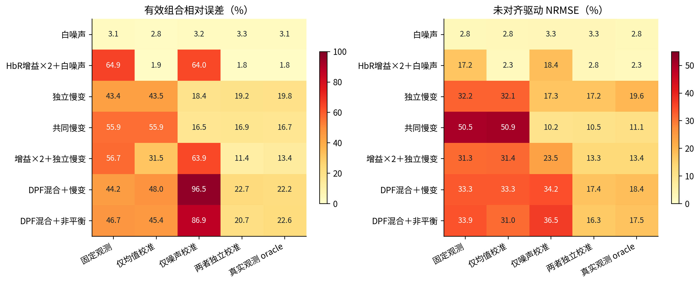

*图1：分条件的均值／噪声校准交叉对照；每格24个面板*

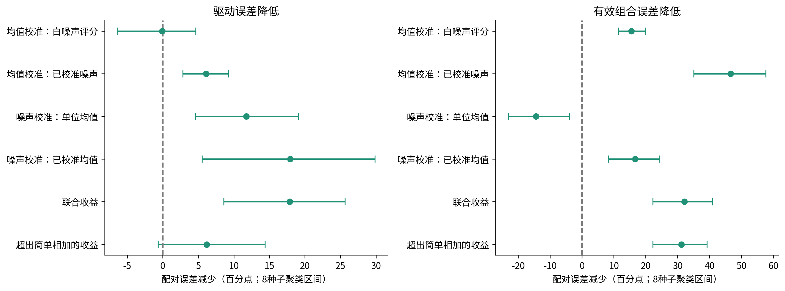

*图2：先在种子内配对，再对8个种子重采样；正值表示收益*

## 3. 真实生理差异与统一观测误差

| 方法 | 完整配对 | 方向正确 | 差值中位s | 差值MAE s | 有符号误差5% | 有符号误差95% |
| --- | --- | --- | --- | --- | --- | --- |
| fixed | 56 | 56 | 2.564 | 1.506 | -2.569 | 4.114 |
| mean_only | 56 | 55 | 2.88 | 2.019 | -2.623 | 6.657 |
| noise_only | 56 | 54 | 2.706 | 1.521 | -3 | 3.736 |
| independent | 56 | 56 | 2.955 | 1.634 | -1.465 | 7.785 |
| oracle | 56 | 56 | 3.049 | 1.595 | -1.373 | 8.2 |
| joint_target | 49 | 28 | 0.1783 | 3.51 | -8.838 | 2.187 |

真值差值为3秒。方向正确只是一项较弱检查，图3与表格进一步给出幅度误差、尾部以及每个种子的差值MAE。自由矩阵未收敛的配对保留在完整分母之外单列，不能与56个完整配对的方法直接等同。

统一观测坐标误差使用每个方法的拟合A生成预测，与真实A生成的干净输出比较，并用相同滤波／重采样／基线算子处理。另报相对带噪目标的残差。固定组可以有更小目标残差，却更偏离干净真值及r；这与把慢变污染吸入驱动的机制一致，不能仅凭残差降低判断teacher改善。

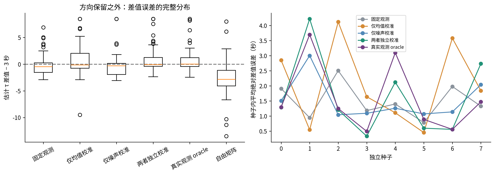

*图3：τ=4 与 τ=1 的配对差值；56个配对归属于8个种子*

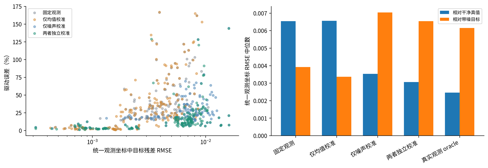

*图4：统一Hb观测坐标；更小的带噪目标残差不等价于更好恢复*

## 4. oracle剩余误差：数值闭环、未知量与慢噪声

无噪声168/168完成，r误差中位数6.66e-09、最大值3.86e-08。保留非线性积分、光学回放、滤波、重采样与基线操作，仍从非真值起点恢复全部未知量；残差按固定0.001缩放，仅为确定性数值目标，不将该缩放解释成真实噪声似然，也不输出无噪声置信区间。

| 设置 | 完成 | r误差中位百分比 | 组合误差中位百分比 |
| --- | --- | --- | --- |
| 原 oracle | 96 | 16.8 | 19.5 |
| 已知初态 | 96 | 12.38 | 15.75 |
| 已知 τ、η | 96 | 11.06 | 0 |
| 慢噪声幅度×1/4 | 96 | 8.102 | 13.19 |

原oracle在同一96面板上r误差16.80%；已知初态12.38%，已知τ/η为11.06%，慢噪声幅度降至1/4为8.10%。已知真值实验用于区分混淆机制，不能当成可部署方法。已知生理参数时组合误差为零是实验设定，不能作为方法恢复成绩。减小慢噪声同时保留白噪声与配对随机实现，不是换一个更容易的种子。

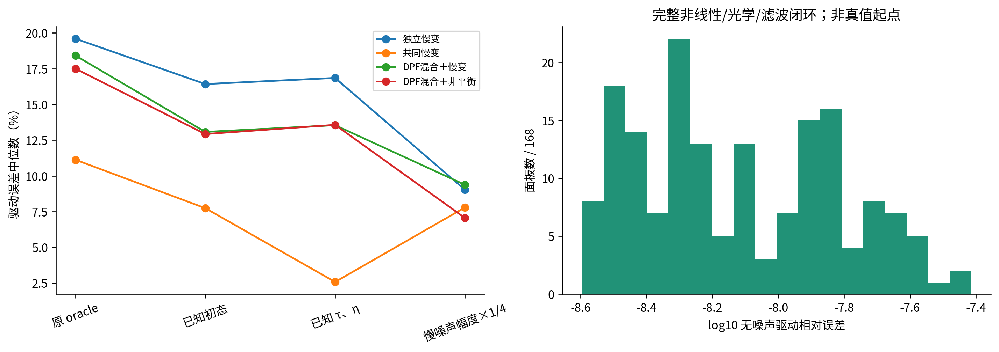

*图5：oracle误差定位；含噪对照使用同一批96个样本*

## 5. 连续上下文与信息支持

| duration | 完成 | 共同30秒误差 | 全段误差 | 组合误差 |
| --- | --- | --- | --- | --- |
| 30 | 24 | 0.221 | 0.221 | 0.1686 |
| 60 | 24 | 0.05948 | 0.0624 | 0.05718 |
| 120 | 24 | 0.00892 | 0.008931 | 0.007528 |

每个种子/条件先生成一条连续120秒非线性轨迹及同一原生噪声实现，再截取45–75、30–90、0–120秒作为30、60、120秒拟合上下文。截取后的真实初态随连续轨迹演化，拟合仍将其视为未知；驱动基函数保持全局相位。三者一律在45–75秒的300个原生采样点评分；没有拼接trial。

每个窗口独立执行同一滤波／重采样／基线算子，并将对应协方差同步传播；因此收益包含额外观测信息与滤波边缘／基线上下文的影响，不能把它完全归于单一初态机制。背景噪声由预设有限频率慢成分生成，完整协方差已知；120秒足以区分这些已知频带，实际宽带非平稳噪声不保证获得相同改善。

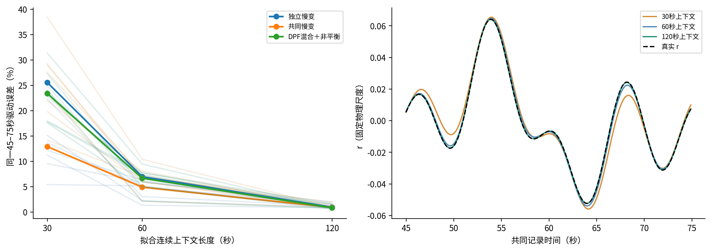

*图6：连续记录上下文；所有方法只在同一中间30秒评分*

## 6. 局部有效信息与剖面似然

将白化Jacobian分成驱动系数Jᵣ与nuisance Jν，计算 Iᵣ|ν = Jᵣᵀ(I − JνJν⁺)Jᵣ。这里nuisance包括τ、η及全部初态；自由矩阵诊断还包括矩阵元素。图7报告最弱到最强的特征值，图8以平方载荷避免特征向量符号任意性，并展示消去nuisance后保留的信息迹。它们在拟合解处线性化，不能单独证明全局唯一性。

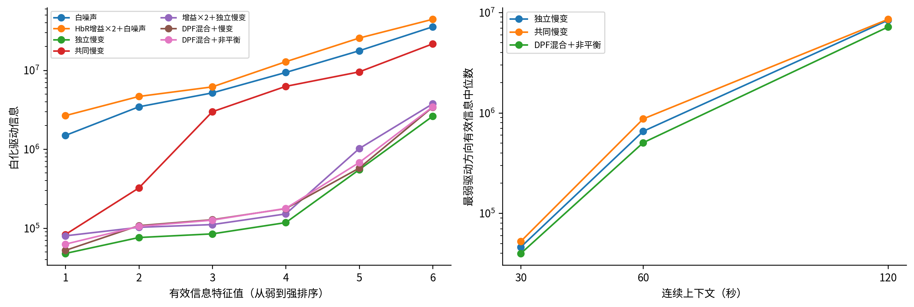

*图7：投影消去生理参数与初态后的局部驱动信息*

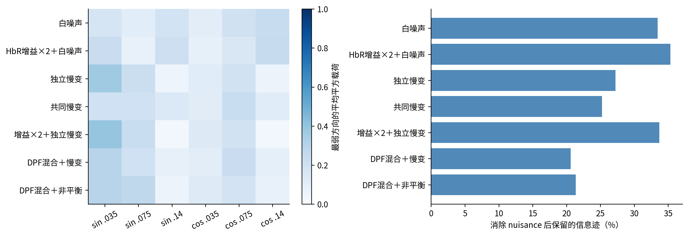

*图8：弱驱动方向与未知初态／生理参数的混淆；局部分析不等于全局唯一性*

剖面分别固定τ或r的0.075 Hz余弦系数（参数索引6），重优化其余参数。先按全局范围扫描，再按旧v1 oracle的局部标准差补密，不用新增结果选择有利案例。选择白噪声、独立慢变、混合非平衡的种子0与1，所有失败点与边界保留。横线Δ负对数似然=1.9207是单参数渐近95%参考；边界、有限样本与模型条件使它不等同于已验证的95%区间。

剖面方法用于区分结构冗余与有限信息导致的实用不可辨识，参见[Raue等，2009](https://pubmed.ncbi.nlm.nih.gov/19505944/)。本报告没有据此宣称完整SSM已可辨识。下表只给出满足参考阈值的离散网格包络，不通过插值伪造精确端点；局部点线偏离数值曲线表示二次近似不足。

**剖面还发现了旧oracle的局部解：混合非平衡、种子1、τ真值2秒。**用两条剖面最低目标解作额外起点、释放固定坐标后，目标由60.3464降至58.1201，但τ/η分别落在0.5/0.15下界，r误差反而由17.85%升至36.31%。这次1面板复核保留原两起点并仅追加两起点，未覆盖旧结果。说明更充分优化也可能偏爱错误的边界解释；优化局部性与有限信息同时存在，不能把oracle残差全部归为数值错误或全部归为信息不足。

图9对该样例用释放约束后的最低已知目标作基准，旧局部Fisher曲线整体上移2.2262；其他样例用当前所有已知解中最低目标作基准。最低已知不等于已证明全局最优。包络可能跨越不连续接受区，原始离散点供复核，不能将包络误当成已验证的连续置信区间。

发现该局部解后，对受影响样例的两条原剖面网格追加复核：每点保留两个默认起点，另加旧内部解与已找到的边界解，固定坐标仍由各网格点指定。图9展示同一坐标各次计算中目标最低的解，完整重复结果以profile_stage保留；其余样例没有据此扩张优化预算。

| 条件 | 种子 | 参数索引 | 接受网格下界 | 接受网格上界 | 局部sd | 最低目标−旧最优 |
| --- | --- | --- | --- | --- | --- | --- |
| dpf_mixing_nonrest | 0 | 0 | 1.1 | 1.865 | 0.2186 | -2.252e-10 |
| dpf_mixing_nonrest | 0 | 6 | 0.01239 | 0.02049 | 0.002698 | -2.726e-10 |
| dpf_mixing_nonrest | 1 | 0 | 0.5 | 0.5 | 0.4526 | -2.226 |
| dpf_mixing_nonrest | 1 | 6 | 0.01831 | 0.02627 | 0.003183 | -2.225 |
| independent_slow | 0 | 0 | 1.3 | 2.072 | 0.2193 | -1.364e-10 |
| independent_slow | 0 | 6 | 0.01331 | 0.02265 | 0.003113 | -6.926e-11 |
| independent_slow | 1 | 0 | 0.5 | 1.6 | 0.1968 | -1.533e-06 |
| independent_slow | 1 | 6 | 0.015 | 0.02752 | 0.00364 | 3.272e-06 |
| white | 0 | 0 | 1.848 | 2.032 | 0.06119 | -6.423e-12 |
| white | 0 | 6 | 0.01594 | 0.01721 | 0.0004222 | -8.669e-13 |
| white | 1 | 0 | 1.8 | 2.1 | 0.08267 | -3.212e-12 |
| white | 1 | 6 | 0.01209 | 0.01361 | 0.0005087 | 9.466e-11 |

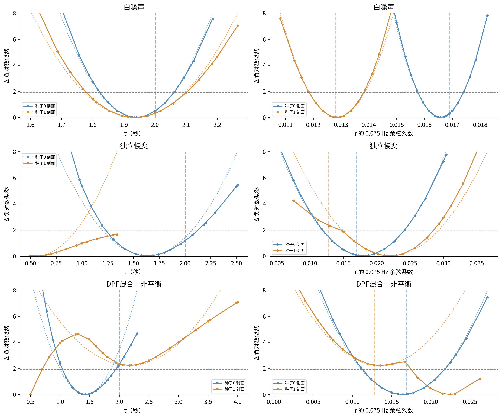

*图9：数值剖面（实线）与局部Fisher近似（点线）；竖虚线是真值*

## 7. 自由矩阵、精确冗余与失败结果

当前设定中η不改变血流状态动力学，Hb输出可写为 C(η)[P₀(p−1),P₀(q−1)]ᵀ，其中 C(η)=[[1,−η],[0,η]]。对任意可行η′，令A′=A C(η) C(η′)⁻¹，即保持完全相同观测均值。这条等价方向可以保持r完全不变；因此η/A秩亏不能直接证明r不唯一。合成回归检查验证了状态、驱动和观测均值均不变。

使用同一真实协方差后，自由矩阵与固定η的自由矩阵均仅22/24收敛，驱动误差中位数分别62.43%和56.33%。固定η移除了明确的η/A精确冗余，仍未接近同面板的oracle。剩余自由度、实际信息不足、边界和优化失败需直接观察，不能统称为“优化器不够努力”。

| condition | replicate | method | status |
| --- | --- | --- | --- |
| white | 1 | free_correct_noise | failed |
| white | 3 | free_correct_noise_eta_fixed | failed |
| white | 7 | free_correct_noise | failed |
| white | 7 | free_correct_noise_eta_fixed | failed |

上述4次新增失败均保留两起点的评估预算和消息；没有移除失败面板或扩大预算反复挑选。原joint_target的11次失败继续作为复用历史证据存在。自由矩阵只是诊断反例，不作为实测主候选。

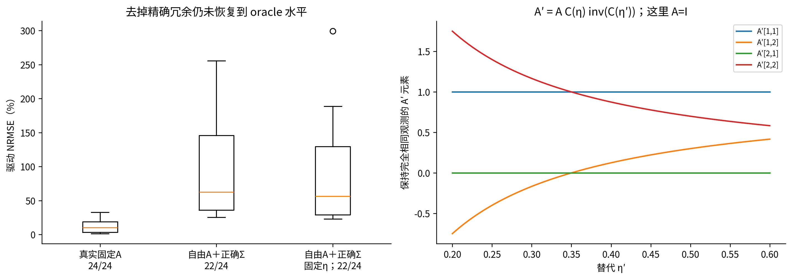

*图10：正确噪声下的自由矩阵诊断及精确η/A等价方向*

## 8. 不确定性与参数触界

局部Gaussian区间仅在全自由参数Jacobian满秩、未触界且物理检查通过时报告。独立组传播光学矩阵的估计协方差；没有积分512条独立噪声记录形成的有限样本协方差估计误差，也没有完整的非线性后验。可用区间条件下的覆盖有选择效应，图11同时标明无效区间数量。8个种子的聚类区间很宽，不能支持精确标称覆盖结论。

新增结果保存active_indices，0/1对应τ/η，2–7驱动系数，8–12初态，13–16自由矩阵。任一坐标触界不再统称“生理参数异常”。旧结果仅保存总触界标志，报告不追溯猜测旧参数是哪一项触界；旧表90/168降到7/168的总触界数只能解释为整体补偿减轻。

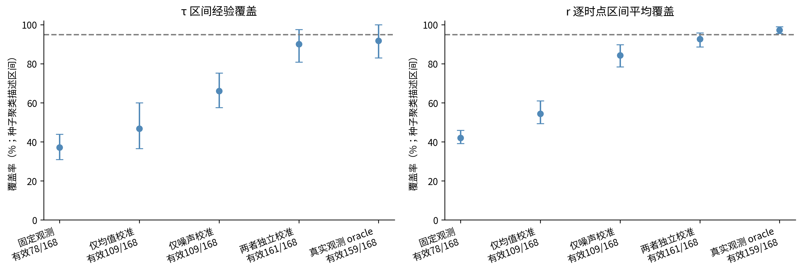

*图11：仅在可用局部区间上计算覆盖率，同时显示完整分母*

## 9. 代表轨迹与实际文件证据

图12固定展示种子0、τ=2的三个机制条件，选择依据是条件类型，不按误差高低挑选。左侧r使用同一尺度、符号、时间轴，右侧展示独立的两条校准对照如何影响生理Hb输出。

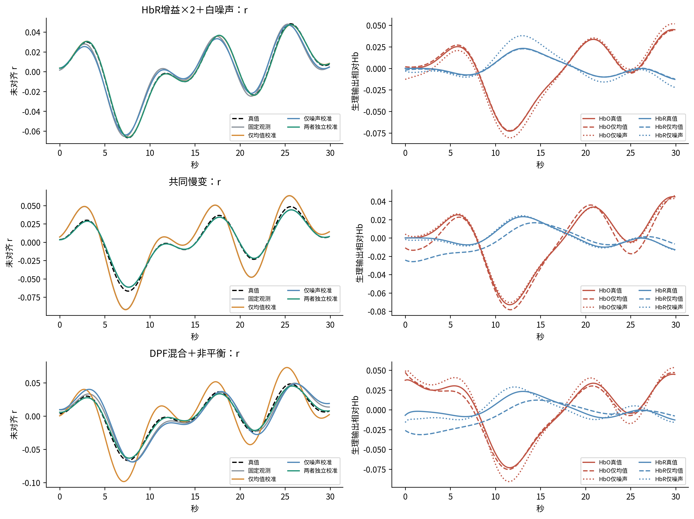

*图12：预先固定的种子0、τ=2样例；无符号／幅度／时移对齐*

实测核查覆盖Single-Trial被试01、09、18的session_01、03、05，均为已有记录身份。通过中央registry/cache索引定位，复用原MAT读取器与统一EEG接口，读取实际通道、单位、双波长字段及事件；核对对应ZIP的被试成员和cnt_artifact通道元数据，没有递归遍历其他数据集或受保护比较证据。

9条记录均为32路EEG导出（30路头皮EEG＋VEOG/HEOG），200 Hz、μV；NIRS为72列，按36个空间通道的760/850 nm对应成对，10 Hz、V。原文档记录ECG/呼吸采集，但所查主记录、artifact通道和匹配ZIP成员中未建立这些数据流。不能把EOG替代成呼吸或把未找到解释成原始实验从未采集。[数据发布入口](https://doc.ml.tu-berlin.de/hBCI/)及本地原始说明保留在来源记录中。

原生cnt还保留nSources=14、nDetectors=16等设备字段；保留这些文件事实，不用历史摘要中的设备数量覆盖它们。转换明确采用距离3 cm、DPF=6的实现假设，消光系数[[0.148,0.384],[0.252,0.179]]，自然对数OD。系数来源标记为repo_approximate_table_for_alignment_audit_not_subject_calibrated，单位为relative_Hb_repo_approximation。它保留测量幅度，但不是已完成个体DPF标定的绝对μM。DPF的0.8/1.2仍仅为合成压力设置，没有转成实测可信区间。

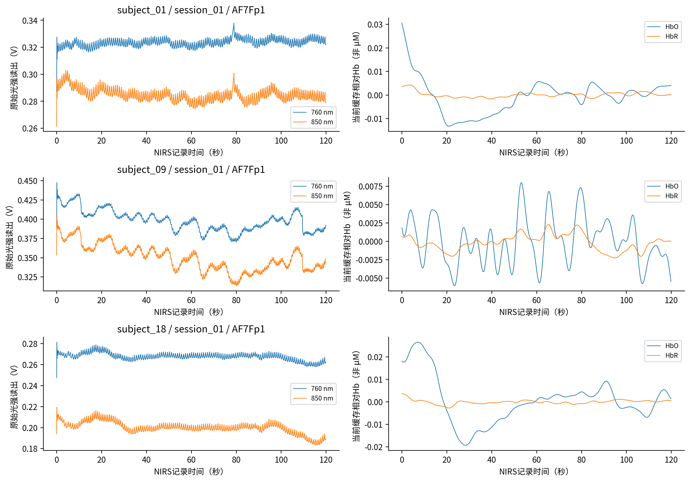

*图13：真实双波长原始读出与现有幅度保留处理；只展示，不拟合teacher*

| 被试 | 记录 | EEG秒 | NIRS秒 | 共享事件 | 平均偏移秒 | 偏移标准差ms |
| --- | --- | --- | --- | --- | --- | --- |
| subject_01 | session_01 | 601.2 | 718 | 20 | 51.25 | 26.95 |
| subject_01 | session_03 | 602.3 | 719.2 | 20 | 52.66 | 22.46 |
| subject_01 | session_05 | 594.3 | 714 | 20 | 51.09 | 19.1 |
| subject_09 | session_01 | 607.4 | 726.8 | 20 | 52.44 | 25.04 |
| subject_09 | session_03 | 600.3 | 720 | 20 | 54.86 | 19.41 |
| subject_09 | session_05 | 603.4 | 726.8 | 20 | 54.27 | 23.18 |
| subject_18 | session_01 | 603.4 | 719.6 | 20 | 52.48 | 26.13 |
| subject_18 | session_03 | 603.5 | 717.2 | 20 | 50.71 | 24.55 |
| subject_18 | session_05 | 600.2 | 715.2 | 20 | 50.61 | 23.61 |

共享并口事件能支持时间映射，但原生EEG/NIRS记录长度和起点明显不同；图14给出实际事件偏移，不能直接按数组索引对齐。ECG／呼吸未找到可映射的数据流，故无法验证它们的时钟、作为已观测辅助量拟合系数，或开展对应的同记录留出检验。

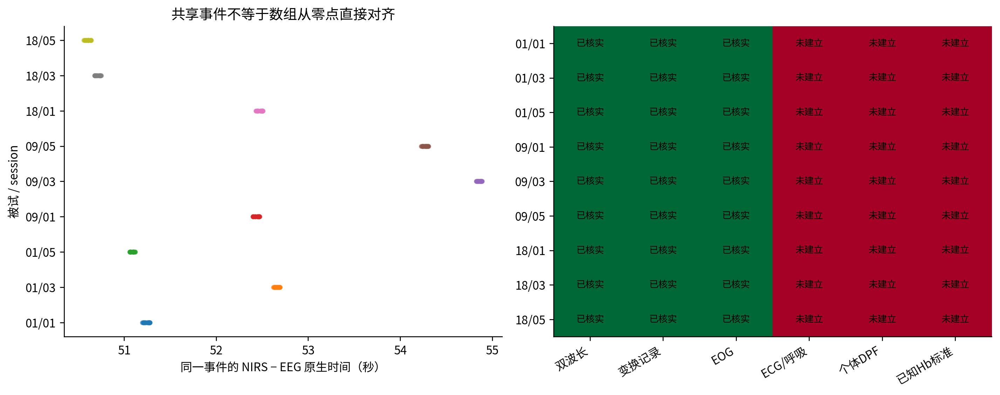

*图14：9条实际记录的时钟和独立观测信息；“未建立”限定于所查文件*

## 10. 计划完成状态与下一步选择

附件三条工作线中：交叉对照、自由矩阵同协方差诊断、无噪声闭环、已知初态／生理消融、慢噪声减弱、连续时长、有效信息、双参数剖面、实际光学／辅助文件核查均完成。实测辅助观测候选的拟合／留出检验未具备输入；原计划C与D因此没有执行。这个缺口来自实际证据，不是计算失败或额外审批要求。

后续优先联系数据持有方核实ECG／呼吸是否存在未包含在当前发布包中的同步文件，或选取确有独立光学／系统生理约束的数据。拿到具体流后先核验单位、时钟与同记录留出解释力，再进入C；ECG／呼吸可约束系统性成分，却不能自动标定光学增益，也不是纯噪声真值。

合成方面应先把连续上下文与初始化策略迁移到实际消费者，并在未知频谱、非平稳污染、错误生理固定量、EEG约束和完整随机SSM中验证。当前正证据不支持马上增加生理状态或启动tokenizer训练。只有独立观测约束已落实、推断在相应合成条件通过，而实测仍稳定出现同类动态偏差时，才有依据改动生理结构。

## 11. 复现、资源与交付验证

主运行在用户systemd服务下使用48个独立物理核心，每worker数值库线程为1，最多48个在途任务；用户linger已启用。6worker试运行覆盖6类任务，10次拟合全部完成。主运行约203秒完成，运行期间一次资源采样内存约1.76 GB，CPU累计约6178 CPU秒（该采样并非峰值或最终资源总量）。配置、命令、source_snapshot、分面板原子结果和失败日志均保留；没有修改旧实验生成物。

本目录analysis.json、method_summary.csv、paired_effects.csv、tau_contrasts.csv、profile_points.csv、profile_summary.csv、coverage.csv、bound_details.json和failures.csv均由上述证据生成。source_audit.json在上级目录，包含具体路径、MAT字段、ZIP成员、处理合同、通道和时钟。原始任务结果分别位于主运行和剖面补密运行的tasks/，报告不是另一个实验事实源。

交付包含本Markdown、可离线阅读HTML、主PDF、图册PDF和14幅240 dpi PNG。PDF正文、表格、图注保持可搜索；全部图形作为PNG图像嵌入，没有向PDF嵌入SVG或矢量图页。检查图像对象、正文提取和渲染页面；本环境没有完成WPS滚动／缩放实测。
