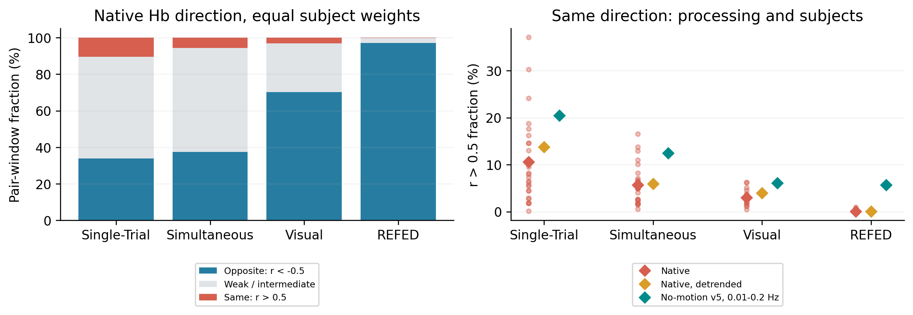
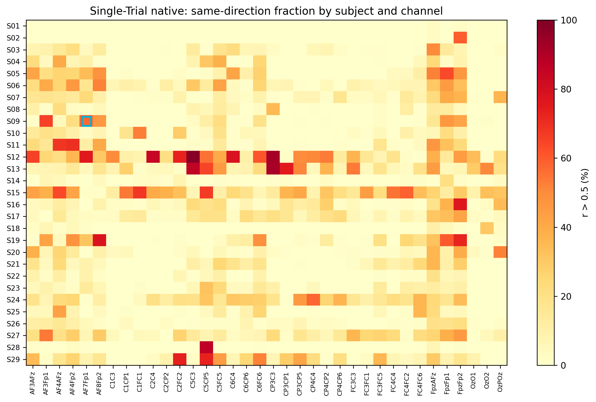
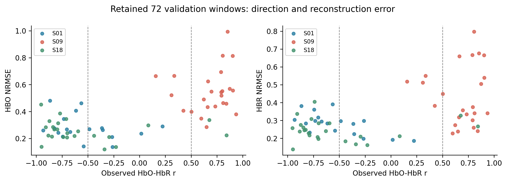

# HbO/HbR 同向变化：生理解释与原始数据普遍性

2026-09-28 · HBO-HBR-PREVALENCE-v1 · 公共观测统计，不含模型训练或受保护评估

同向变化在生理上合理，且在 Single-Trial 中反复出现；它既不是所有数据集的主导模式，也不能凭方向唯一归因为脑活动或运动伪迹。本次证据支持保留原有反向响应机制，同时优先研究能容纳额外共同成分的观测结构。

### 1. 生理含义和统计口径

设 H=HbO+HbR 为有效测量组织中的总血红蛋白量，S 为血氧饱和度：HbO=SH，HbR=(1−S)H。小变化满足 ΔHbO≈S₀ΔH+H₀ΔS，ΔHbR≈(1−S₀)ΔH−H₀ΔS。总 Hb／血容量变化占主导时两者可同向；氧合变化占主导时更容易反向。这是成分关系，不等于已从相对信号估计出绝对 S 或血容量。

健康人实验观察到姿态、呼吸等系统性活动中的同向变化；不同深度测量也显示浅层共同波动与较深层反向波动的差别。[Yamada 等，2012](https://journals.plos.org/plosone/article?id=10.1371/journal.pone.0050271)；[Tufts 原研究说明](https://engineering.tufts.edu/bme/fantini/research/depth-dependence-coherent-hb-and-hbo2-oscillations)。运动也可使相关性变正：[Cui 等，2010](https://pubmed.ncbi.nlm.nih.gov/19945536/)。所以“同向”有多个候选来源，不能据此自动删除信号，也不能直接称为神经血管响应。

覆盖四数据集 103 名被试、786 条记录。按数据合同排除 Visual S06 Part1；REFED 的跨模态空间几何问题不影响本次同一光学通道内的描述统计。原生时间轴上使用连续、不重叠的 30 s 窗口，丢弃不足 30 s 尾段及跨已知拼接边界的窗口。共 13,316 个时间窗口、461,856 个通道窗口，其中 461,768 个有效；未达 95% 共同支持或近乎恒定的行保留但不进入相关比例。

Single-Trial 从正光强转自然对数 OD，再作现有相对 MBLL，无时间滤波、无运动校正；其余三个数据集直接读取发布 Hb。原生采样率／时钟、通道配对和来源文件由统一数据入口核验。v5 对照仍包含 0.01–0.2 Hz 带通和重采样，“无运动校正”不等于没有预处理。各数据集独立报告，不混合其振幅单位。

r 为窗口内 Pearson 相关，r>0.5 是预先规定的明显同向描述阈值，不是生理分类器或显著性检验。同向不是“同时高于基线”，反向也不自动等于正常神经激活。先计算每名被试的通道窗口比例，再等权汇总；95% 区间来自 2000 次被试 bootstrap，不把通道、时间点和相邻窗口当成独立样本。人口外推、残余自相关和设备系统差异仍有限制。

| 数据集 | 人数 | 有效通道窗口 | 同向 r>0.5 [95% CI] | 反向 r<-0.5 | 去趋势后同向 | v5 带通后同向 |
|---|---:|---:|---:|---:|---:|---:|
| Single-Trial | 29 | 146,376 | 10.54% [7.64, 13.86] | 33.91% | 13.73% | 20.45% |
| Simultaneous | 26 | 161,208 | 5.68% [4.19, 7.29] | 37.37% | 5.89% | 12.45% |
| Visual | 16 | 79,156 | 3.02% [2.20, 3.86] | 70.28% | 3.96% | 6.10% |
| REFED | 32 | 75,028 | 0.09% [0.03, 0.16] | 97.06% | 0.05% | 5.68% |

## 2. S09：原始层已经存在，且通道差异大

S09/fold 3/trial 3 对应 subject_09/session_01/event 7、AF7Fp1，原生窗口从 277.96 s 开始。原图保留模型目标的相关系数约 0.853；本次原生及全记录缓存坐标和其处理上下文不同，不能要求逐样本相等。

| 原始身份的处理路径 | r | 去线性趋势后 r |
|---|---:|---:|
| 原生／近似 MBLL | 0.822 | 0.854 |
| v5 带通／近似 MBLL | 0.881 | 0.881 |
| 原生／Prahl | 0.881 | 0.900 |
| v5 带通／Prahl | 0.916 | 0.916 |

该例在滤波前 r=0.822，去掉线性趋势后 r=0.854；两者都说明共同变化不只是一条线性漂移。采用 [Prahl 公开光谱系数](https://omlc.org/spectra/hemoglobin/summary.html) 后原生 r=0.881；系数敏感性不能替代个体路径长度、组织来源或绝对单位校准。Single-Trial 总体明显同向比例也从现有近似 MBLL 的 10.54% 变为 15.27%，v5 从 20.45% 变为 26.92%：比例依赖光学定义，但同向现象并未消失。

Single-Trial 的 29 名被试都出现过明显同向窗口，原生比例范围约 0.14%–37.09%。S09 全通道约 10.05%，并非总体最高；然而 AF7Fp1 的 30 个 MA 心算窗口中 20 个明显同向（66.7%）。BL、LMI、RMI 同通道分别为 56.7%、46.7%、56.7%。这更支持研究被试／通道相关的观测混合差异，而非只为单个失败窗口调一个全局参数。窗口均为事件前 5 s 至后 25 s；不是仅截取 10 s 任务段，也不代表 task-minus-rest 激活效应。

## 3. 与原模型偏差的关系及修改方向

仅回读此前冻结的 conditional_trained_gain/full 重建：每条预处理路径 72 个验证身份，无重新拟合。首次辅助汇总误纳入 72 条合成单元；已在 v2 表显式排除 synthetic，并检验每路径严格 72 条。旧表留存仅供纠错审计；原始数据普遍性统计未受影响。

| 路径 / 关系 | 窗口数 | HbO NRMSE 中位数 | HbR NRMSE 中位数 |
|---|---:|---:|---:|
| MNE TDDR／反向 | 30 | 0.272 | 0.261 |
| MNE TDDR／同向 | 21 | 0.490 | 0.370 |
| MNE TDDR／弱关系 | 21 | 0.246 | 0.236 |
| 无运动校正／反向 | 31 | 0.268 | 0.279 |
| 无运动校正／同向 | 22 | 0.504 | 0.341 |
| 无运动校正／弱关系 | 19 | 0.266 | 0.218 |

无运动校正路径的同向组 HbO 中位 NRMSE 0.504，反向组 0.268，与用户观察一致。但同向 22 条中 20 条来自 S09，反向组没有 S09；且 S09 内弱关系组 HbO 中位误差 0.593，高于同向组的 0.531。因此此面板不能独立识别“方向导致误差”，也不能证明所有同向曲线都难拟合。MNE 路径同样存在被试混杂。全目标重建误差不是跨时间预测误差。

优先方向：保留神经驱动的供血／氧交换支路，测试额外允许 HbO/HbR 同号加载的慢成分及通道相关的观测混合。之前额外共同成分改善重建的结果与本次观察一致，但尚不能命名为确定的头皮、静脉或动脉过程。不要强制把同向曲线改成反向，也不宜用全局 α、E₀ 极端值去吸收所有通道的混合差异。

下一步应比较共同成分的空间同步性、任务锁定性、与原始 OD 突跳及独立生理记录的关系；若无短距离通道或外部生理参照，只能约束候选来源。候选模型在训练部分决定结构和加载，再分别在同向、反向、弱关系组评估留出预测及残差，避免逐验证窗口新增自由曲线只提高重建拟合。

### 4. 证据与边界

主结果：summary.csv；被试层：subject_summary.csv；逐记录行与来源：records/；原始条件分层：single_trial_conditions.csv；困难身份：focus_case.csv；模型辅助关联只使用 model_cases_v2.csv 和 model_association_v2.csv。resolved_config.yaml、source_snapshot、监督运行日志及修正记录保留。本次没有调整正式 SSM，没有删除样本或重新定义原始信号，也没有建立生理来源的因果识别。

图像以 240 dpi PNG 嵌入 PDF，正文／表格保留可选文字。WPS 未安装，未作 WPS 滚动检查。
