# SSM 夜间 N1–N7 实验报告

报告日期：2026-09-10（北京时间）。本报告覆盖 `ssm_next.md` 本轮七族诊断及其公共准备、合成对照、失败追踪；不将更早的项目实验算作本轮新证据。

## 主要结论

两次运行均已完成固定任务队列。含 N7 的主运行有 **16,598 个终态 cell，其中 16,442 个 cell 标记 completed**；这不代表所有拟合成功。全部候选规则仅有 9/12 个选择折有效、51–53/72 个完整外折 trial，**没有规则达到本轮优先验证条件，也没有新增 teacher、参数可辨识或 UQ 资格**。

最清楚的正面证据来自 N2：在非线性 Gaussian + combined 的 24 个合成 trial、W=0、完整输入下，O2 相对 O0 的 r/HbO/HbR NRMSE 从 **0.855/1.007/0.941 降至 0.540/0.232/0.277**；O1 已取得大部分改善。这支持优先修正时间处理与噪声传播的一致性。O2 的实测数据分界尚未暴露，实测分支仍未实现；MAP 区间、参数后验和边际似然未估计。

新增 N7 中，GW 对同折 W-only 的共同有效子集风险从 **6.141203 降至 6.048551（1.51%）**，远低于预设 10%；分母为 53/72。4/9 个完整 G–W session 曲面全部落在 **G=0.6、W=-0.5** 的双边界，另外 5 个曲面不完整。尚无充分理由将 G–W 独立适配升级为新的 teacher 默认规则。

## 1. 完成情况、证据来源和评价口径

主证据：[`20260910_overnight_n7_v1`](../manifest.json)。旧运行：[`20260909_overnight_v2_verified`](../../20260909_overnight_v2_verified/manifest.json)。执行以两份 manifest 和固定任务/终态表为准，科学指标以各族 `trial_metrics.csv`、`summary.json` 和对应 cell 结果为准。本报告是这些保留证据的分析视图，不改写原始报告、冻结输入或 source snapshot。

|运行|北京时间开始|结束|耗时|固定 cell|状态|
|---|---|---|---|---|---|
|原 N1–N6|2026-09-09 23:59:57|2026-09-10 00:07:15|7.31 分钟|7051|completed|
|含 N7 主运行|2026-09-10 00:24:03|2026-09-10 00:38:26|14.39 分钟|16598|completed|

两次都是 16-worker 的独立后台运行，均以 `all_registered_cells_terminal` 结束；没有用满 8 小时，没有超时或预算未启动 cell。重复部分采用同一批 trial/种子，**不得把两次 N1–N6 叠加为独立重复**。逐行核查身份、状态、残差、truth误差及似然：N1/N2/N3/N4/N6完全一致；N5身份与状态一致，数值最大绝对差5.82e-9（似然最大差1.67e-11），只见数值精度层面的差异。本报告统一采用含N7的主运行。

|族|completed / 固定 cell|cell 非成功终态|记账实际 / 计划求解|
|---|---|---|---|
|N1|588/588|{}|3,600/3,600|
|N2|3,168/3,169|{"not_implemented": 1}|3,192/3,192|
|N3|759/780|{"failed_contract": 21}|3,024/4,032|
|N4|261/282|{"failed_contract": 21}|2,754/3,258|
|N5|1,137/1,158|{"failed_contract": 21}|8,520/8,856|
|N6|1,045/1,074|{"failed_numerical": 5, "failed_contract": 21, "failed_domain": 3}|4,794/5,046|
|N7|9,484/9,547|{"failed_contract": 63}|38,676/40,944|

总计实际/计划求解记账为 64,560/68,928。计划含复用基线的名义拟合；actual 不计零成本复用，且某些工程对照/诊断不等于独立科学 trial。结果行还包含复用和汇总，三种分母不可混用。manifest 的 `completed_cells` 是最后一次心跳值（15999），不是最终全部终态数；本报告按固定 task_table 对齐终态 ledger，16,598/16,598 身份齐全、无重复，七族统计一致。

实测仅 3 被试（01/09/18）×3 session（01/03/05）×8 个原训练 MA trial，共 **72 个唯一 trial**；原 MA 位置 4/9 在预处理前排除。4 外折×3 内折，每个 session 外折为 6 训练、2 评价；所有投影、EOG 回归、尺度与候选选择在对应训练折拟合。中心遮挡为 4 秒，预处理前遮挡。N5/N7 共同坐标只做描述，不能进入外折评分。本次报告生成没有读取原生信号、没有重跑模型、没有开放保护数据。

主风险为 B=0.5·NMSE_EEG+0.25·NMSE_HbO+0.25·NMSE_HbR；N4 跨坐标主终点为固定 fNIRS 风险。测量图按 trial→session→subject 等权；图注另有说明的分布或成功子集仅作描述。合成 NRMSE 按对应 truth SD，实测按训练 SD；两者不可直接混比。灰格表示缺失/不适用，不按零填补。只有 3 被试，不报告人群置信区间、ICC 或显著性结论。

<!-- figure:01_completion -->

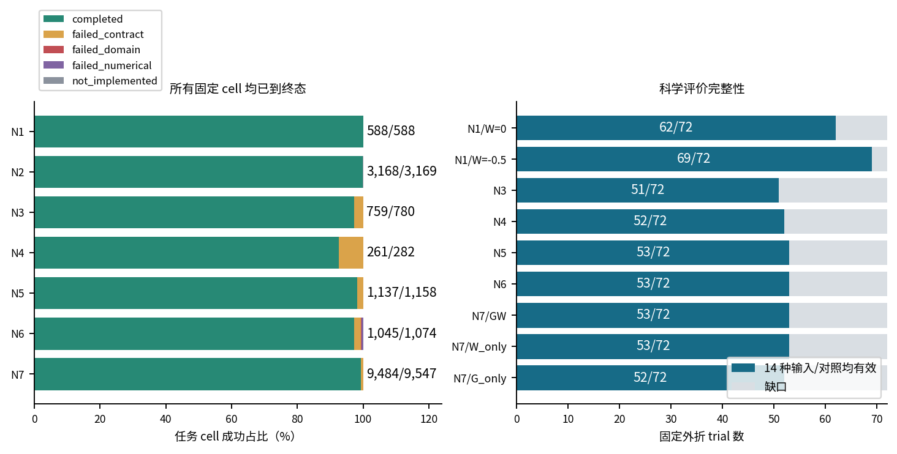

**图 1：运行已结束，候选外折评价仍不完整。**

**内容：** 左：固定任务终态。右：每个 trial 的 14 种输入及对照全部有效才计入完整外折；不能用 cell 完成数替代。

**读法：** 左侧按N1–N7读任务完成比例；右侧蓝色为14种输入/对照均有效的trial，灰色为72个固定身份中的缺口。

**结论：** 运行完成不等于评价完整。候选只有51–53/72个完整外折，没有规则通过本轮筛选。

<!-- /figure -->

详细图：[附图 A1](#detail-02_failures)（可展开附录；完整图册也保留对应图注）。

四个基线内折拟合未通过物理约束，分布在 S09 外折0（35/36有效）、S09 外折3（34/36）、S18 外折2（35/36）。每条选择规则的这 3 折均未定义，依赖的 18 个外折任务保留为 failed_contract；这些是相同失败源的传播，不是 7 组独立模型失败。外折内部的额外物理失败又进一步减少完整 trial 数。

## 2. N1：共享状态、残差和对照

N1 完成所有 588 个 cell，但保留 19 个失败结果行。固定 W=0 的 14 模式完整外折为 62/72；基线自身已不满足全分母比较要求。完整输入、整模态缺失、中心遮挡、自身/模板/配对/移位、同折线性基线、残差尾部、r 影响与时间相关性均在正文及详细图形附录覆盖。原生 200 Hz EEG 电位无法由 log-power PCA 逆变换，本报告不把当前坐标差称为原生电位重建误差。

<!-- figure:05_n1_null_linear -->

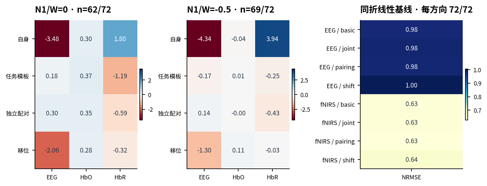

**图 2：N1｜配对增量与线性基线。**

**内容：** 前两图：对照 NMSE−正确联合 NMSE，正值才表示正确联合更好；使用每个 W 下全部模式共同有效的 trial。线性 fNIRS 指标是两种 Hb 的平均 NMSE 再开方；不与 EEG 坐标混为一个终点。

**读法：** 先看增量符号：对照−正确联合NMSE大于0才是联合获益；误差差值大于0则表示退化。各子图标题注明不同口径。

**结论：** EEG的正确联合预测平均逊于自身上下文；现有联合状态尚无稳定的跨模态预测优势。

<!-- /figure -->

<!-- figure:08_n1_tails -->

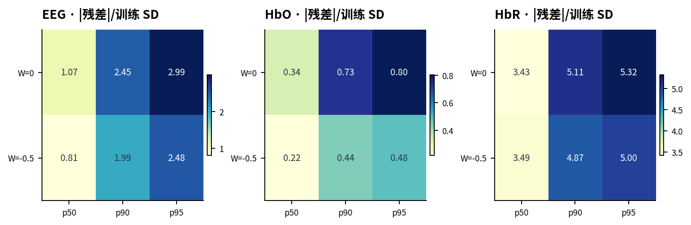

**图 3：N1｜绝对残差的中位数与尾部。**

**内容：** 先取每个 trial 内的残差分位数，再按 session、subject 等权汇总；不是把所有时间点混合后的总体分位数。

**读法：** 三个面板是EEG/HbO/HbR，行区分W，列是trial内绝对残差的p50/p90/p95；同一面板中色深和数值越大，表示相应分位的误差越大。

**结论：** 残差尾部明显高于中位数；单个平均误差无法概括不同模态的极端偏差。

<!-- /figure -->

详细图：[附图 A2](#detail-03_n1_residuals) · [附图 A3](#detail-04_n1_masks) · [附图 A4](#detail-06_n1_compromise) · [附图 A5](#detail-07_n1_acf) · [附图 A6](#detail-09_n1_influence) · [附图 A7](#detail-10_n1_hbt)（可展开附录；完整图册也保留对应图注）。

## 3. N2：时间处理和推断近似

3,168 个合成 solver cell 全部完成，1 个 native measured O2 cell 明确未实现。三种规律×两种处理×两个 W×三种 solver 使用相同输入；主 mask 每组 24 个 trial，整模态缺失每组 8 个固定 trial。

|非线性 Gaussian / W=0 / full|O0 r/HbO/HbR|O1 r/HbO/HbR|O2 r/HbO/HbR|
|---|---|---|---|
|model|0.533 / 0.189 / 0.214|0.536 / 0.183 / 0.217|0.526 / 0.182 / 0.207|
|combined|0.855 / 1.007 / 0.941|0.549 / 0.238 / 0.288|0.540 / 0.232 / 0.277|

combined 下 O2 相对 O0 的 r/HbO/HbR 误差降幅约为 36.9%/76.9%/70.6%；相对 O1 则仅约 1.7%/2.5%/4.0%。在未经过 combined 的匹配 model 条件，三者差异小。Student-t 的 model 条件下 O0 对三种目标的均值误差低于 O1/O2，说明 Gaussian MAP 不能泛化替代原 Student-t 近似。详细图形附录完整保留两种W、全部输入模式及其条件。

<!-- figure:reader_n2_comparison -->

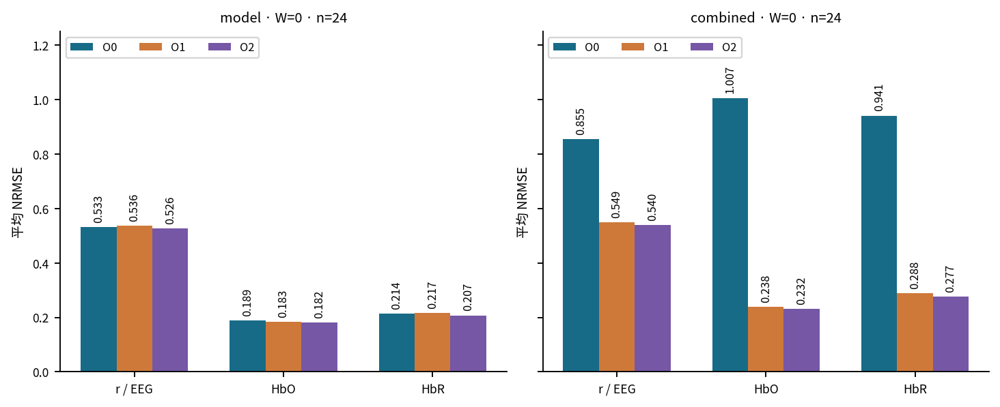

**图 4：N2｜观测时间处理的一致性带来主要改善。**

**内容：** 非线性Gaussian生成、W=0、完整输入，同一24个独立合成trial。O0为逐点近似，O1为线性时序参考，O2为非线性相关Gaussian MAP；r与clean EEG误差相同。

**读法：** 左为匹配model，右为combined时间处理；每组三色分别为O0/O1/O2，柱高为同一24个trial的平均NRMSE，越低越好。

**结论：** combined条件下O1已取得大部分改善；O2进一步收益较小，主要正面证据指向观测时间与噪声合同。

<!-- /figure -->

详细图：[附图 A8](#detail-n2_linearized_gaussian_means) · [附图 A9](#detail-n2_linearized_gaussian_hidden) · [附图 A10](#detail-n2_nonlinear_gaussian_means) · [附图 A11](#detail-n2_nonlinear_gaussian_hidden) · [附图 A12](#detail-n2_nonlinear_student_t_means) · [附图 A13](#detail-n2_nonlinear_student_t_hidden)（可展开附录；完整图册也保留对应图注）。

O2 匹配非线性 Gaussian 均值预检为 24/24，r NRMSE 0.526、r 平均相关 0.848；通过探索预检不等于 teacher 或 UQ 资格。工程误差：线性均值对照 8.92e-13、导数 6.64e-12、隐藏干预 0、密度单位变换 1.42e-14，均低于冻结工程阈值。

原自动摘要将共享原生噪声的带噪区间概括为未估计；逐trial记录和冻结实现显示**O1已实现该条件Gaussian计算，O0/O2未实现**。本报告依照细粒度owner结果区分这三者。O1可见目标的零条件方差与覆盖1来自已观测条件化，不能当作新观测预测能力。

<!-- figure:n2_solver_checks -->

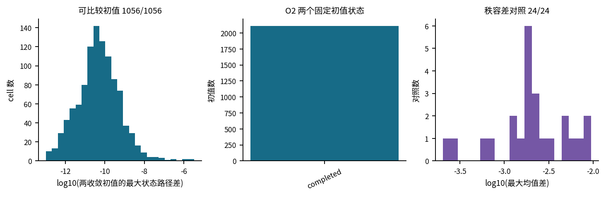

**图 5：N2｜多初值与秩容差的工程核查。**

**内容：** 初值失败、不可行试探和最终案例失败分别保留。多初值接近仅支持这些固定案例的求解一致性；不等同于后验校准。

**读法：** 左右分布图的横轴是差异的log10，越靠左表示差异越小；中图计数为初值状态，不能当作独立trial分母。

**结论：** 固定初值和秩容差检查支持工程一致性；这些检查没有给出MAP后验或teacher资格。

<!-- /figure -->

详细图：[附图 A14](#detail-n2_uncertainty) · [附图 A15](#detail-n2_shared_noisy)（可展开附录；完整图册也保留对应图注）。

## 4. N3：fNIRS 观测噪声权重

噪声共同倍率 0.5/1/2/4；9 个已定义选择折全部保留基线倍率 1。外折 51/72，共同有效子集风险与同一基线完全相同（B=5.952917）。本轮没有得到仅改变共同噪声权重的改进规则。训练一阶差分尺度与实际采用噪声尺度、相关性和 200 次分块重采样如下；不可单凭放宽区间将较好覆盖称为均值预测改善。

<!-- figure:n3_inner -->

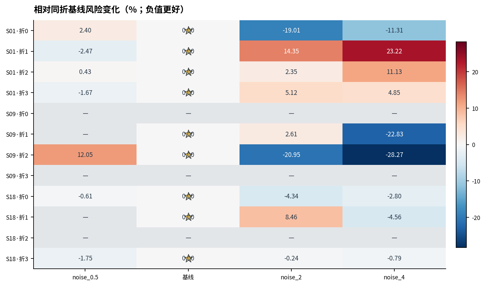

**图 6：N3｜全部冻结候选的内折风险。**

**内容：** 全部预先固定候选在三被试×四个外折中的内折风险。候选只使用对应训练边界；基线失败的选择折保留为空，不另挑成功子集。

**读法：** 行是被试与外折，列是候选；风险变化小于0更好，星号为通过模态退化约束后选中的候选。灰格不参与补选。

**结论：** 全部9个有效选择折均选倍率1；放大或缩小共同fNIRS噪声未形成可用改进。

<!-- /figure -->

详细图：[附图 A18](#detail-n3_noise)（可展开附录；完整图册也保留对应图注）。

## 5. N4：EEG 空间、眼动和频带/符号

六条冻结分支：E0 全通道1–45Hz，E1训练EOG回归，E2排除额部，E3局部1–45Hz，E4局部8–13Hz正特征，E5对E4反号。9 个有效选择折选中 E2 五次、E4 一次、基线三次；外折 52/72，与基线共同 51/72。共同子集固定 fNIRS 风险 7.229241→7.226792，仅约0.034%改善，且配对/移位增量有退化。人工伪迹90/90完成，但没有空间 clean truth 生成器，不能据此证明神经真值恢复。

<!-- figure:n4_artifact -->

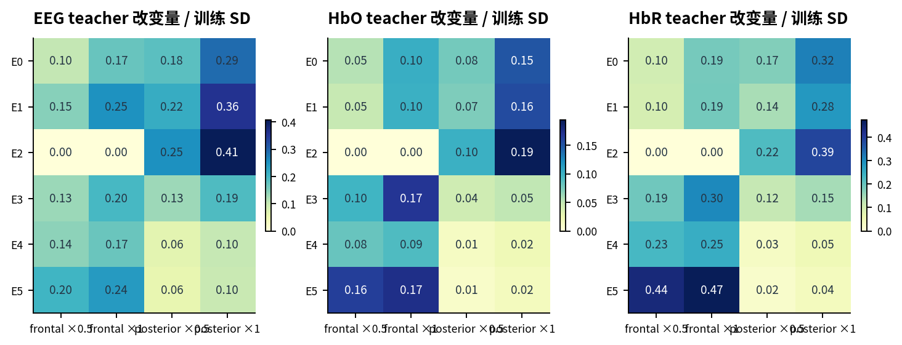

**图 7：N4｜全部人工伪迹条件的敏感性。**

**内容：** 3 被试×6 EEG 分支×（1 未注入参考+4 注入条件）共 90/90 拟合有效。每格为 3 被试均值。未注入实测窗口不是 clean 神经真值；E2 对仅额部注入接近零主要来自排除相应通道的构造。

**读法：** 行是六个EEG分支，列是额部/后部注入及强度，三面板是恢复目标；数值越大表示人工伪迹引起的teacher改变越大，不能把小改变量直接解释为更准确。

**结论：** E2抑制额部注入主要来自排除额部通道；90/90拟合完成没有证明神经clean真值恢复。

<!-- /figure -->

详细图：[附图 A16](#detail-n4_inner)（可展开附录；完整图册也保留对应图注）。

## 6. N5：观测增益补偿和 session

增益选择为 a_N=2 七次、1.5 一次、基线一次；外折53/72，共同基线子集51/72。描述性 B 从5.952917降到4.387177（26.30%），但独立匹配合成 r/EEG/HbO/HbR NRMSE 分别恶化0.102884/0.102884/0.026386/0.014590，且部分配对增量下降。因此不能只凭实测子集改善采用该规则。8/9条完整W曲线均触W=-0.5边界；只有3/9个完整W–增益曲面。

<!-- figure:n5_inner -->

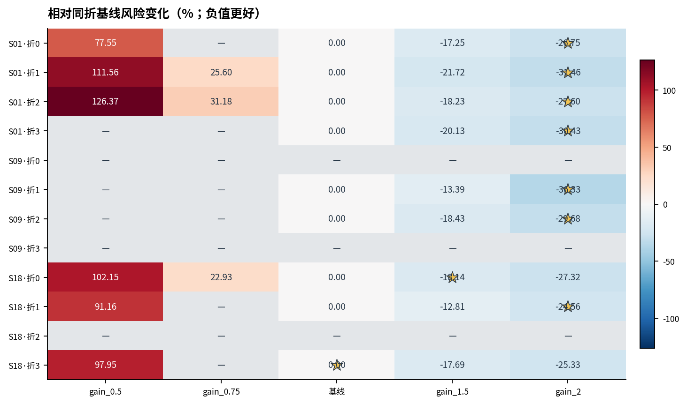

**图 8：N5｜全部冻结候选的内折风险。**

**内容：** 全部预先固定候选在三被试×四个外折中的内折风险。候选只使用对应训练边界；基线失败的选择折保留为空，不另挑成功子集。

**读法：** 行是被试与外折，列是候选；风险变化小于0更好，星号为通过模态退化约束后选中的候选。灰格不参与补选。

**结论：** 8/9个有效折选择更大的观测增益；实测子集风险下降26.30%，但合成r误差增加0.103。

<!-- /figure -->

<!-- figure:n5_w_curves -->

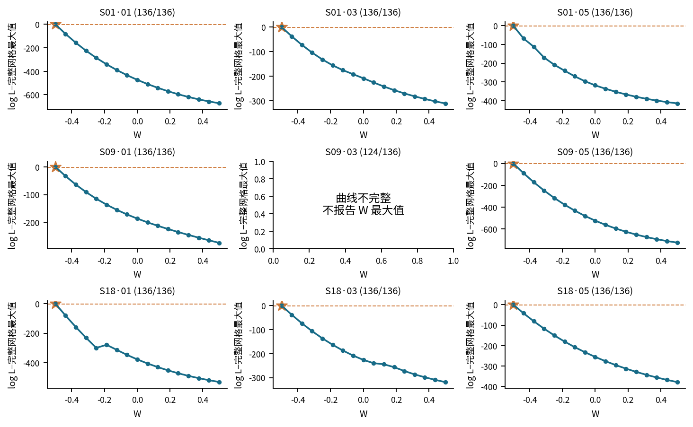

**图 9：N5｜共同坐标下的 W 曲线与 session 重复性。**

**内容：** 8/9 条一维曲线完整，8 条均在 W=-0.5 达到边界最大值；200 次固定 gauge 重采样和奇偶半样本均回到该边界。重复触边不是可辨识性或人群稳定性。S09/session03 保留 124/136 个有效值。

**读法：** 九格对应三被试×三session，横轴W，纵轴为相对最大log L；星号是完整曲线的最大值，虚线是下降2的参考线。

**结论：** 8条完整曲线及其重采样均触W=-0.5边界；重复触边不能解释为参数可辨识。

<!-- /figure -->

详细图：[附图 A19](#detail-n5_surfaces)（可展开附录；完整图册也保留对应图注）。

## 7. N6：过程创新、回放和流量越界

9 个有效选择折中8次选择血流相关过程噪声×2，1次选择r过程噪声×0.5；外折53/72，共同子集风险下降12.99%，但匹配合成r/EEG/HbO误差增加，HbR小幅降低，仍未通过规则筛选。确定性r回放64/72完成；它是闭合诊断，不能当作共享/私有信息占比。

<!-- figure:n6_inner -->

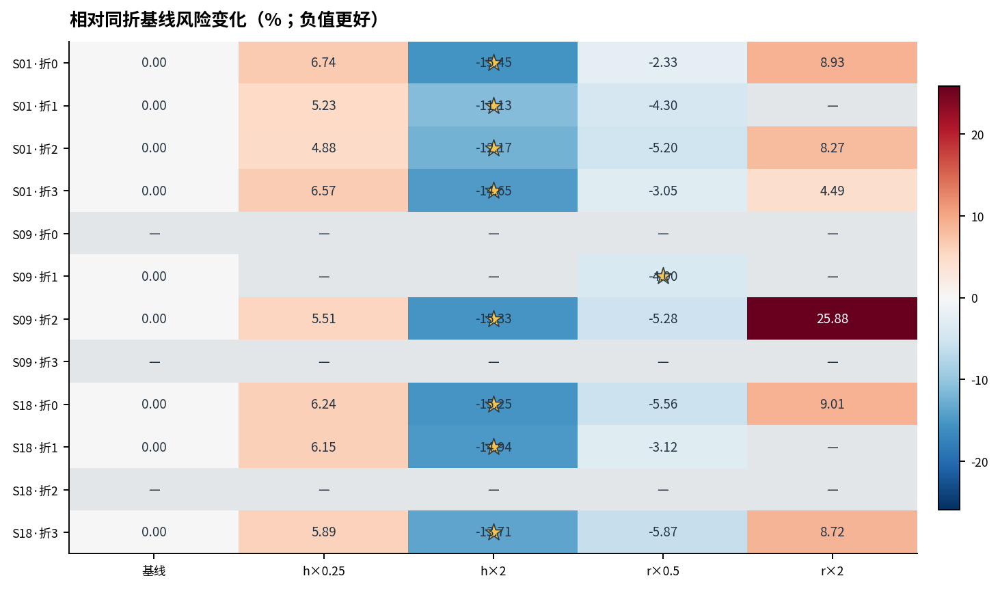

**图 10：N6｜全部冻结候选的内折风险。**

**内容：** 全部预先固定候选在三被试×四个外折中的内折风险。候选只使用对应训练边界；基线失败的选择折保留为空，不另挑成功子集。

**读法：** 行是被试与外折，列是候选；风险变化小于0更好，星号为通过模态退化约束后选中的候选。灰格不参与补选。

**结论：** 8折选择血流过程噪声×2，1折选择r过程噪声×0.5；12.99%的子集改善伴随真值恢复代价。

<!-- /figure -->

<!-- figure:n6_replay -->

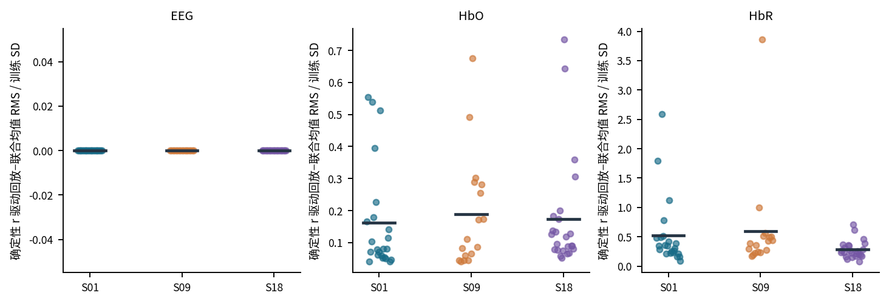

**图 11：N6｜确定性 r 驱动回放的闭合差。**

**内容：** 72 个固定身份中 64 个回放完成，3 个基线全输入不可用，5 个积分失败。黑线为被试有效 trial 均值。总体成功子集 EEG/HbO/HbR 平均差为 0/0.181/0.461；非线性后验均值不必满足确定性闭合，因此该差不是私有信息比例。

**读法：** 三子图对应EEG/HbO/HbR，横轴为被试，每点是一条成功回放；黑线为被试均值，纵轴越大表示闭合差越大。

**结论：** 64个成功回放的EEG/HbO/HbR平均闭合差为0/0.181/0.461；Hb回放不能完全复现联合均值。

<!-- /figure -->

详细图：[附图 A21](#detail-n6_transition) · [附图 A22](#detail-n6_failure_traces)（可展开附录；完整图册也保留对应图注）。

|被试/旧训练索引|W|复现状态|首次f=0事件时间(s)|跳过最后更新后下一步正流量|
|---|---|---|---|---|
|subject_01/4|0.0|failed_domain|21.794199|True|
|subject_01/4|-0.5|failed_domain|22.750023|False|
|subject_01/7|0.0|failed_domain|8.250286|False|
|subject_01/7|-0.5|failed_domain|9.379954|True|
|subject_09/12|0.0|completed|未估计|不适用|
|subject_09/12|-0.5|failed_domain|3.290289|False|

这些旧 prepared training index 与原 MA trial_position 不是同一个编号。5 个越界案例中仅2个可由跳过最后一次更新避免紧接的越界，另外3个之前状态已使下一步不安全；不能把所有失败归于最后一条观测。

## 8. N7：独立 G–W、单方向消融与观测增益替代

25个固定GW候选仅放开G和W，Z、tau、其余生理/噪声设置固定。映射为 `β=β_ref·exp(G+2W)`、`γ=γ_ref·exp(2W)`、`κ=κ_ref·exp(W)`；G=0原本锁定β/γ。GW/W-only/G-only共用同折投影与输入，分别冻结选择规则；G与观测增益从未同时放开。9,547个cell全部终态，其中9,484个completed、63个依赖合同失败；completed cell内还有必须保留的失败拟合。

|规则|有效选择折|完整外折|实测参考|共同n|参考风险→规则风险|共同子集改善|
|---|---|---|---|---|---|---|
|N7/GW|9/12|53/72|N7/W_only|53|6.141203 → 6.048551|1.51%|
|N7/W_only|9/12|53/72|N1/fixed_W=0|51|5.952917 → 5.971503|-0.31%|
|N7/G_only|9/12|52/72|N1/fixed_W=0|51|5.952917 → 5.894800|0.98%|

GW 的选择为 G=0.3/W=0 两次，G=0/W=-0.5一次，G=0/W=-0.25一次，其余五次为基线；没有任何已定义选择折选中G与W同时非零。W-only对应−0.5两次、−0.25一次、基线六次；G-only对应G=0.3两次、基线七次。新增G没有形成强的外折证据。GW相对W-only的1.51%改善来自成功子集，完整72-trial结果未估计。

合成主消融另需分清参照：owner筛选表对GW和W-only都与固定基线比较。按相同9折选择频率、同一16个assessment生成trial比较，GW相对W-only的r/EEG/HbO/HbR NRMSE分别下降0.005639/0.005639/0.003188/0.001405；幅度小，且两者均劣于固定基线。这一局部正面结果不弥补外折缺口和10%风险门槛。

<!-- figure:reader_rules_summary -->

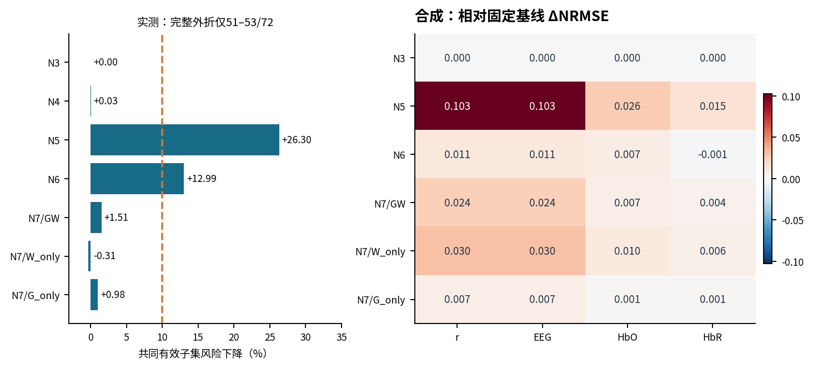

**图 12：N3–N7｜实测改善与合成代价需同时判断。**

**内容：** N4实测使用固定fNIRS风险，GW实测参照同折W-only，其余参照W=0。合成均参照固定基线，来自16个assessment trial按9个选择折频率加权；不是144个独立trial。

**读法：** 左侧风险下降百分比越大越好，虚线为10%；右侧合成ΔNRMSE为正表示退化。每行使用自身共同有效子集，不能跨行排名。

**结论：** N5/N6实测子集分别改善26.30%/12.99%，同时产生合成代价；N7改善1.51%，仍低于10%门槛。

<!-- /figure -->

<!-- figure:reader_n7_selection -->

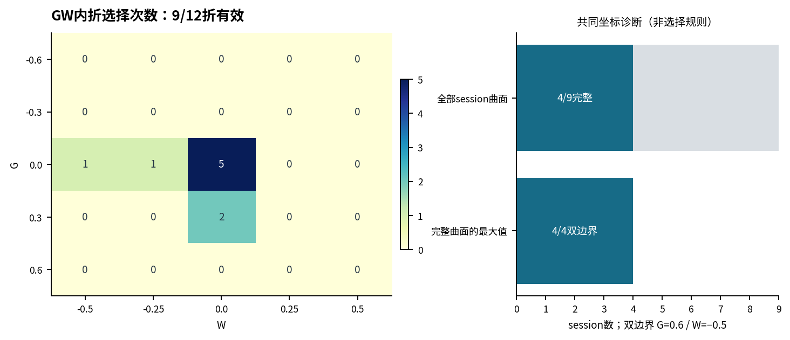

**图 13：N7｜选择频率与描述性边界诊断。**

**内容：** 左侧统计已定义GW规则的9个选择折；右侧统计三被试×三session的共同坐标曲面。两侧是不同分析层次，不能用右侧曲面最优点替代左侧训练折选择。

**读法：** 左为9个有效选择折的G/W选择次数，0是从未选中；右分别显示描述性session曲面完整性及完整曲面的最大值位置。

**结论：** 实测选择没有同时放开G和W；描述性曲面却重复触双边界，两者都未支持稳定生理参数适配。

<!-- /figure -->

<!-- figure:n7_synthetic_ablation -->

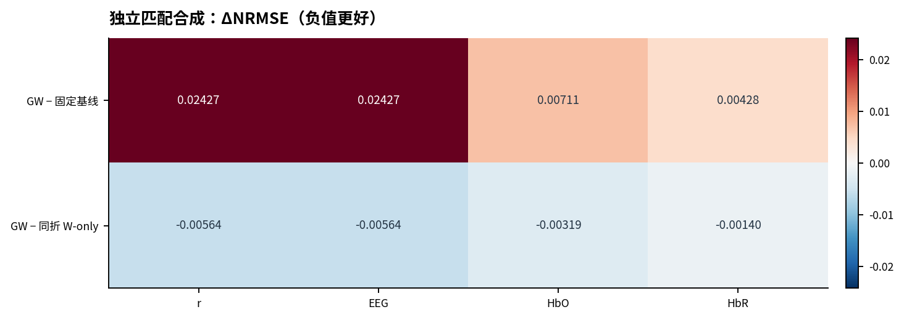

**图 14：N7｜合成消融的两个参照必须区分。**

**内容：** owner原合成筛选统一参考固定基线；GW和W-only均使用同一9个有效选择折、同一16个assessment生成trial。两条规则相减得到同输入消融：GW相对W-only有小幅改善，但仍差于固定基线。不能把144个频率加权比较当成144个独立trial。

**读法：** 两行仅改变参照，分别减固定基线和减W-only；列为恢复目标，负ΔNRMSE才是GW改善，色标以0为中心。

**结论：** GW比W-only略好，却仍差于固定基线；新增G的局部收益不足以改变本轮否定结论。

<!-- /figure -->

详细图：[附图 A17](#detail-n7_inner) · [附图 A23](#detail-rules_comparison) · [附图 A24](#detail-rules_modality_costs) · [附图 A20](#detail-n7_surfaces) · [附图 A42](#detail-n7_truth_discovery) · [附图 A43](#detail-n7_truth_discovery_EEG_only) · [附图 A44](#detail-n7_truth_discovery_fNIRS_only) · [附图 A45](#detail-n7_likelihood_discovery) · [附图 A46](#detail-n7_truth_assessment) · [附图 A47](#detail-n7_truth_assessment_EEG_only) · [附图 A48](#detail-n7_truth_assessment_fNIRS_only) · [附图 A49](#detail-n7_likelihood_assessment)（可展开附录；完整图册也保留对应图注）。

4个完整G–W曲面全部取G=0.6/W=-0.5，近优网格只有该单个边界点；其teacher/r差为0是粗网格仅含一个近优点的直接结果，不是参数不确定性为0。额外true_g、true_w、true_gw、measurement_gain共128个独立生成trial（两种子流×4条件×16），各自比较25个GW和4个独立观测增益候选。响应图保留正负方向，未用truth重选实测规则，也不构成SBC。

## 9. 全部公共合成结果与完整可视化附录

两条独立种子流、六条件、每条件16个独立trial。匹配与失配压力条件分开显示。N1/N3/N5/N6/N7所有冻结候选、三种输入模式的误差均在详细图形附录的分面图覆盖；N4单独使用原生伪迹检查，不冒用三坐标合成作为空间真值。每格有效数、覆盖率和宽度详见 [synthetic_metrics.csv](synthetic_metrics.csv)，新增真值方向详见 [n7_truth_metrics.csv](n7_truth_metrics.csv)。这些CSV是图表的可追溯派生视图，run中的逐trial表仍是证据owner。

详细图：[附图 A39](#detail-synthetic_references) · [附图 A25](#detail-synthetic_N1_discovery_1) · [附图 A26](#detail-synthetic_N1_assessment_1) · [附图 A27](#detail-synthetic_N3_discovery_1) · [附图 A28](#detail-synthetic_N3_assessment_1) · [附图 A29](#detail-synthetic_N5_discovery_1) · [附图 A30](#detail-synthetic_N5_assessment_1) · [附图 A31](#detail-synthetic_N6_discovery_1) · [附图 A32](#detail-synthetic_N6_assessment_1) · [附图 A33](#detail-synthetic_N7_discovery_1) · [附图 A34](#detail-synthetic_N7_discovery_2) · [附图 A35](#detail-synthetic_N7_discovery_3) · [附图 A36](#detail-synthetic_N7_assessment_1) · [附图 A37](#detail-synthetic_N7_assessment_2) · [附图 A38](#detail-synthetic_N7_assessment_3) · [附图 A40](#detail-synthetic_discovery_uq) · [附图 A41](#detail-synthetic_assessment_uq)（可展开附录；完整图册也保留对应图注）。

## 10. 结论与下一步建议

本轮首先定位到时间处理/噪声传播合同问题；N2 的正面合成效应远大于新增G自由度的外折效应。优先推进既有O2实测特征层分界和正确噪声传播的实现，并针对已保留的物理失败身份检查均值/协方差近似与更新行为。

保持现有所有负结果和分母；后续完整评价需要版本化解决基线失败，不能删除失败后再次排名。N3暂不扩大噪声倍率；N4没有足够的跨模态增量；N5/N6的实测子集改善需同时解决合成真值代价；N7暂不扩大GW网格，也不将边界重复解释为个人生理参数。任何新实测运行按其范围和合同另行定义，本次未启动额外实验。

本次产物验证：固定任务与终态逐一对齐；冻结的task/config/scope/fold/preflight哈希匹配；候选完整trial与owner表一致；每幅图均从保存结果生成；HTML图片内嵌；SVG及PDF图册可导出。未把MAP缺失的区间填为零，未借用其他solver的方差。

## 证据与复现入口

|内容|入口|
|---|---|
|原自动报告|[OVERNIGHT_REPORT.md](../OVERNIGHT_REPORT.md)|
|运行记录|[manifest.json](../manifest.json)|
|候选规则汇总|[candidate_table.csv](../candidate_table.csv)|
|源代码身份|[source_snapshot_identity.json](../source_snapshot_identity.json)|
|报告核查|[report_validation.json](report_validation.json)|
|PDF正文与完整图册|[REPORT.pdf](REPORT.pdf) / [FIGURES.pdf](FIGURES.pdf)|
|生成脚本|[render_ssm_overnight_report.py](../../../../../scripts/render_ssm_overnight_report.py)|

云端提供实验结论、汇总数值和可视化；逐任务表、压缩逐任务表、任务状态流水与原生/准备数组仅保留在本地，不作为阅读报告的前提。图表重建需要本地保留证据，云端包不提供逐项输出审计。

## 阅读详细图形

正文保留14幅核心图，其余条件、候选和输入模式放在下方可展开的详细图形附录中。PDF正文采用连续排版；完整矢量图及各自caption见 [FIGURES.pdf](FIGURES.pdf)。图册按正文图1–14、附图A1起排序，正文图片可点击打开对应图册页。

## 详细图形附录

附图 A1 · 失败来源与跨族依赖传播

<figure>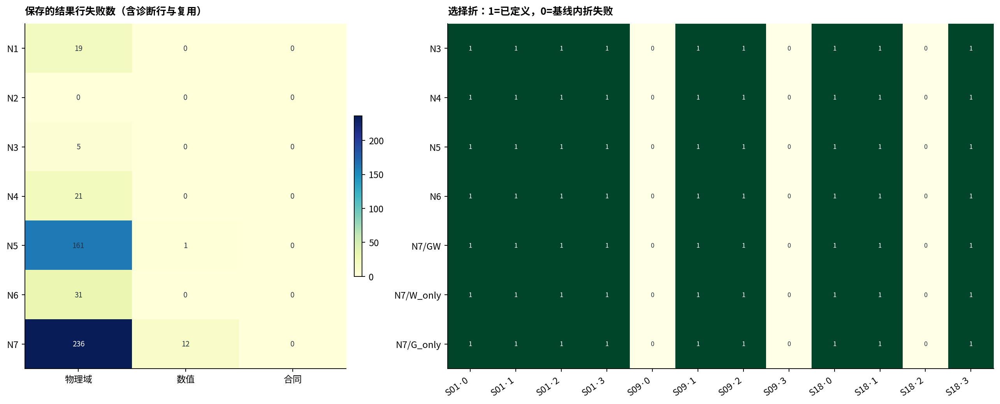<figcaption>
附图 A1：失败来源与跨族依赖传播

<b>内容：</b>同一基线在 S09 的外折 0/3、S18 的外折 2 不完整；每条规则因此损失 3 个选择折及 18 个外折任务。行失败数含复用，不是独立失败事件数。

<b>读法：</b>按子图标题选择比较条件，再在同一色标内比较；误差越小越好，灰格是缺失或不适用。

<b>结论：</b>三处基线选择折缺口传播到全部规则；跨族相同缺口不能算作独立失败。
</figcaption></figure>

附图 A2 · N1｜完整输入仍存在显著模态残差

<figure>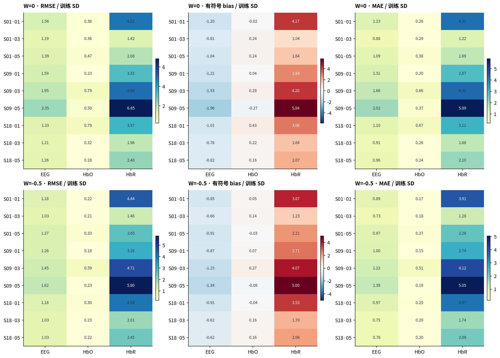<figcaption>
附图 A2：N1｜完整输入仍存在显著模态残差

<b>内容：</b>每个格为该 session 有效 trial 的均值。误差符号为预测−目标；跨 trial 先计算后聚合。完整输入 W=0 有效 69/72，W=-0.5 有效 71/72。

<b>读法：</b>行是被试/session，列是模态；上下两排分别为W=0/−0.5，三列面板依次为RMSE、带符号bias、MAE。误差越低越好，bias越接近0越好。

<b>结论：</b>完整输入仍有模态残差与session差异；W=-0.5增加有效拟合数，但不足以建立状态恢复资格。
</figcaption></figure>

附图 A3 · N1｜整模态缺失、中心遮挡与四种对照

<figure>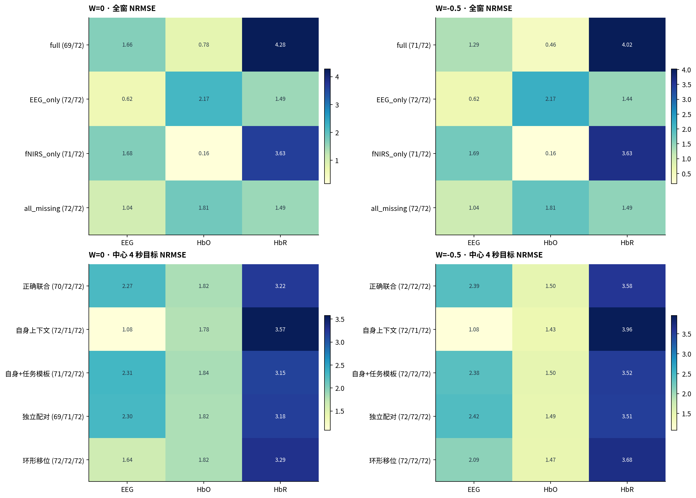<figcaption>
附图 A3：N1｜整模态缺失、中心遮挡与四种对照

<b>内容：</b>等权 trial→session→subject 后对 NMSE 开方。上图各模态都评分；下图只评分被遮挡目标。各行分母不同，仅作条件描述；配对增量见下一图。下图括号为 EEG/fNIRS 有效 trial 数，分母均为 72。

<b>读法：</b>左右区分W；上排比较完整窗输入模式，下排只比较中心遮挡目标。行是对照，列是模态；同一色标下NRMSE越小越好，括号列出有效分母。

<b>结论：</b>增加联合输入没有在所有目标、所有遮挡方式下稳定占优；不同成功分母限制直接比较。
</figcaption></figure>

附图 A4 · N1｜共享状态改变与模态妥协代价

<figure>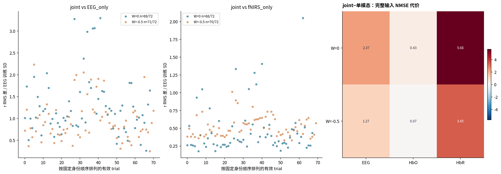<figcaption>
附图 A4：N1｜共享状态改变与模态妥协代价

<b>内容：</b>r 改变量大不等于共享信息增加，必须结合上一图的遮挡和配对结果。散点展示全部有效身份；颜色按 W 分组。

<b>读法：</b>左/中散点按固定trial身份排列，纵轴为联合与单模态的r差，颜色区分W；右侧热图为联合−单模态NMSE，正值表示完整输入拟合代价。

<b>结论：</b>联合输入明显改变r，却没有相应稳定的遮挡预测增益，状态改变本身不足以证明共享信息。
</figcaption></figure>

附图 A5 · N1｜创新和残差的时间相关结构

<figure>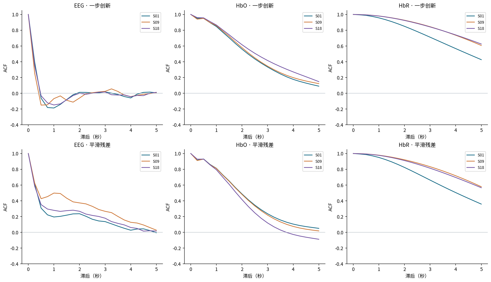<figcaption>
附图 A5：N1｜创新和残差的时间相关结构

<b>内容：</b>W=0、完整输入有效 trial；各被试内作描述性均值。不能把这些相关时间点当作独立重复，亦不能由低残差直接推出正确的概率模型。

<b>读法：</b>横轴为滞后秒数，纵轴为ACF，颜色区分被试；上排为一步创新，下排为平滑残差，远离零线表示剩余时间相关。

<b>结论：</b>创新与平滑残差含有时间相关结构，逐点独立误差近似未消除时间处理失配。
</figcaption></figure>

附图 A6 · N1｜改变共享状态是否带来预测增量

<figure>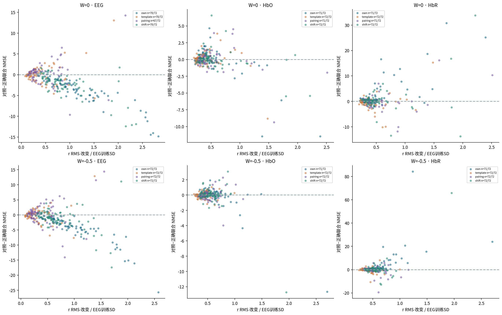<figcaption>
附图 A6：N1｜改变共享状态是否带来预测增量

<b>内容：</b>每个点为一个固定外折 trial 与一种对照的配对结果；纵轴正值表示正确联合预测更好。横向改变大而纵向增量不足，不能解释为共享神经信息的证据。所有有效身份保留，不删除极端值。

<b>读法：</b>横轴为对照引起的r改变，纵轴为对照−正确联合NMSE，颜色区分对照；零线以上才是联合获益，右下方表示状态变了但预测变差。

<b>结论：</b>r变化较大时仍可出现零增益或负增益；对另一模态敏感不等于预测获益。
</figcaption></figure>

附图 A7 · N1｜HbT 代数与当前坐标残差

<figure>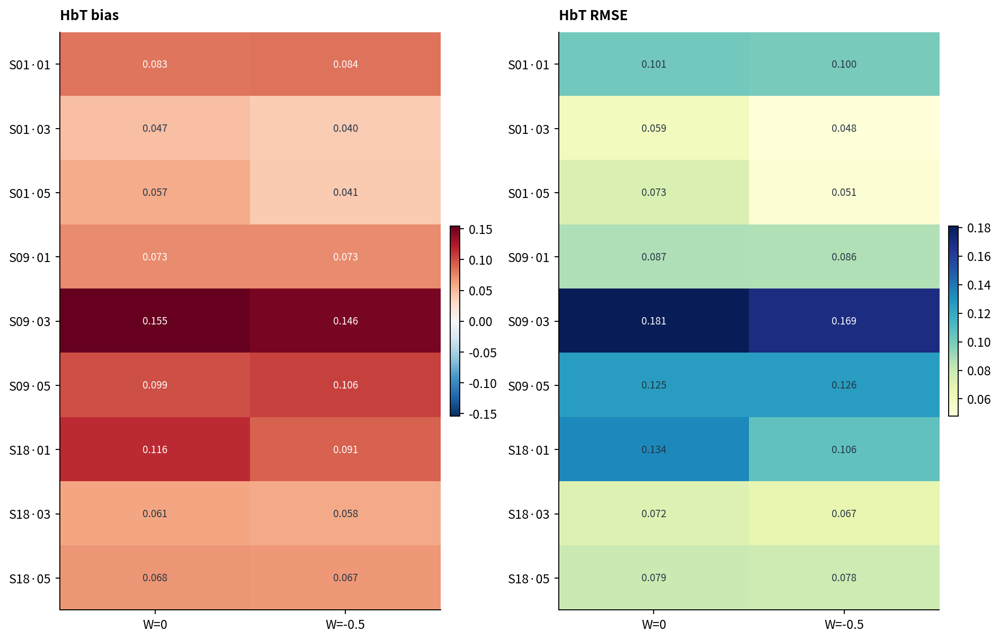<figcaption>
附图 A7：N1｜HbT 代数与当前坐标残差

<b>内容：</b>HbT按HbO+HbR逐点相加，采用相同的Hb坐标尺度。图示当前观测坐标单位，不能直接当作绝对浓度；仅含完整输入有效trial。

<b>读法：</b>行对应被试/session，列区分W；左侧bias可正可负，接近0更好，右侧RMSE越小越好。只在当前Hb观测坐标内解读。

<b>结论：</b>HbO/HbR相加后仍存在session相关偏差；代数关系正确不能替代观测恢复检查。
</figcaption></figure>

附图 A8 · N2｜线性 Gaussian：全轨迹 clean NRMSE

<figure>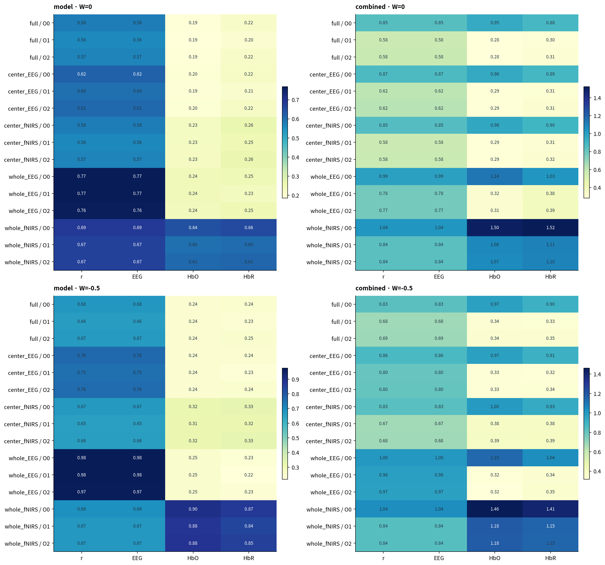<figcaption>
附图 A8：N2｜线性 Gaussian：全轨迹 clean NRMSE

<b>内容：</b>每个 full/中心遮挡格含 24 个独立合成 trial；整模态缺失格含固定的前 8 个 trial。各格全部完成。O0=逐点近似，O1=静息线性时序，O2=非线性相关 Gaussian MAP。隐藏区间表的 full 行不适用；指标按各自评分区间的 truth SD 归一化。

<b>读法：</b>行按输入mask分组，每组三行为O0/O1/O2；列为r/EEG/HbO/HbR；上下为W=0/−0.5，左右为model/combined。NRMSE越小越好。

<b>结论：</b>线性匹配参考为区分观测时间处理与非线性近似提供对照，不能把线性参考本身当作非线性Student-t资格。
</figcaption></figure>

附图 A9 · N2｜线性 Gaussian：隐藏区间 clean NRMSE

<figure>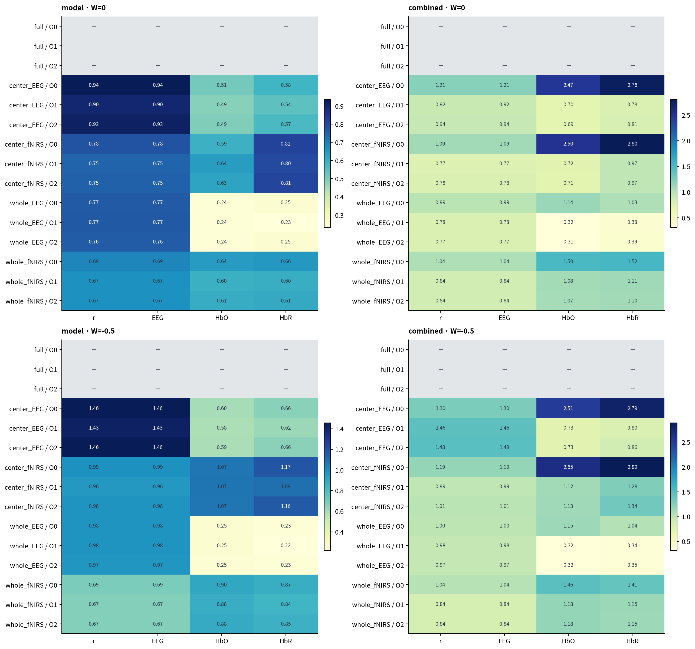<figcaption>
附图 A9：N2｜线性 Gaussian：隐藏区间 clean NRMSE

<b>内容：</b>每个 full/中心遮挡格含 24 个独立合成 trial；整模态缺失格含固定的前 8 个 trial。各格全部完成。O0=逐点近似，O1=静息线性时序，O2=非线性相关 Gaussian MAP。隐藏区间表的 full 行不适用；指标按各自评分区间的 truth SD 归一化。

<b>读法：</b>行按输入mask分组，每组三行为O0/O1/O2；列为r/EEG/HbO/HbR；上下为W=0/−0.5，左右为model/combined。NRMSE越小越好。

<b>结论：</b>线性匹配参考为区分观测时间处理与非线性近似提供对照，不能把线性参考本身当作非线性Student-t资格。
</figcaption></figure>

附图 A10 · N2｜非线性 Gaussian：全轨迹 clean NRMSE

<figure>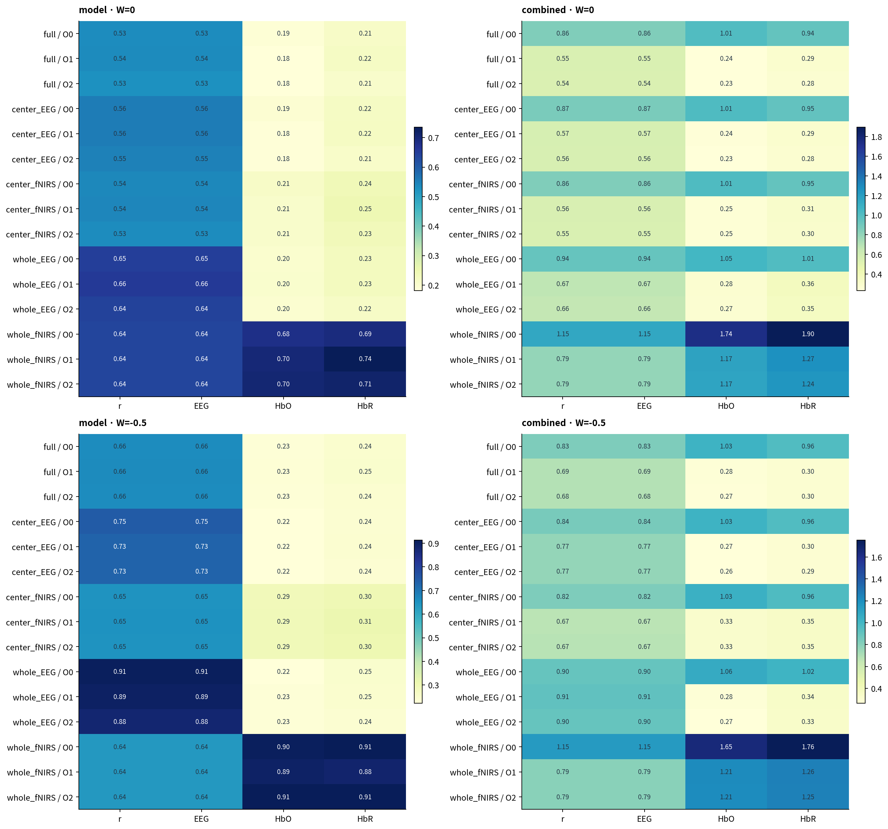<figcaption>
附图 A10：N2｜非线性 Gaussian：全轨迹 clean NRMSE

<b>内容：</b>每个 full/中心遮挡格含 24 个独立合成 trial；整模态缺失格含固定的前 8 个 trial。各格全部完成。O0=逐点近似，O1=静息线性时序，O2=非线性相关 Gaussian MAP。隐藏区间表的 full 行不适用；指标按各自评分区间的 truth SD 归一化。

<b>读法：</b>行按输入mask分组，每组三行为O0/O1/O2；列为r/EEG/HbO/HbR；上下为W=0/−0.5，左右为model/combined。NRMSE越小越好。

<b>结论：</b>combined完整输入下r/HbO/HbR由O0的0.855/1.007/0.941降至O2的0.540/0.232/0.277；O1已实现大部分改善。
</figcaption></figure>

附图 A11 · N2｜非线性 Gaussian：隐藏区间 clean NRMSE

<figure>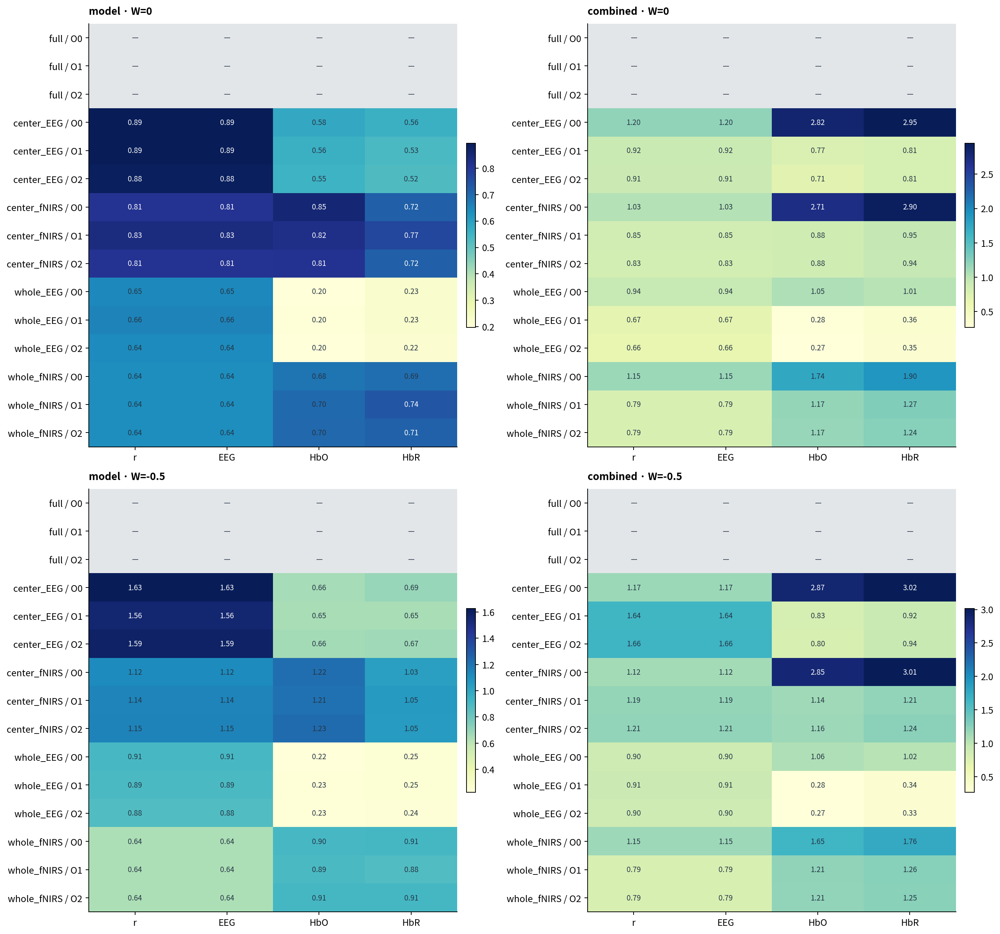<figcaption>
附图 A11：N2｜非线性 Gaussian：隐藏区间 clean NRMSE

<b>内容：</b>每个 full/中心遮挡格含 24 个独立合成 trial；整模态缺失格含固定的前 8 个 trial。各格全部完成。O0=逐点近似，O1=静息线性时序，O2=非线性相关 Gaussian MAP。隐藏区间表的 full 行不适用；指标按各自评分区间的 truth SD 归一化。

<b>读法：</b>行按输入mask分组，每组三行为O0/O1/O2；列为r/EEG/HbO/HbR；上下为W=0/−0.5，左右为model/combined。NRMSE越小越好。

<b>结论：</b>隐藏区间须单独判断，缺失整模态时不等于完整输入拟合；该面板没有提供实测teacher资格。
</figcaption></figure>

附图 A12 · N2｜非线性 Student-t stress：全轨迹 clean NRMSE

<figure>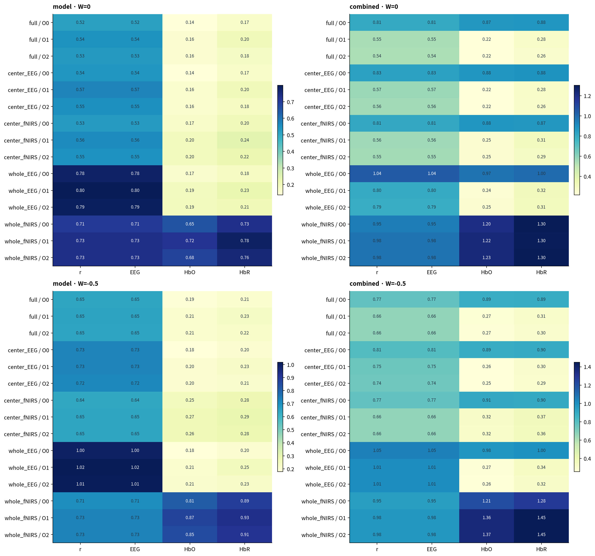<figcaption>
附图 A12：N2｜非线性 Student-t stress：全轨迹 clean NRMSE

<b>内容：</b>每个 full/中心遮挡格含 24 个独立合成 trial；整模态缺失格含固定的前 8 个 trial。各格全部完成。O0=逐点近似，O1=静息线性时序，O2=非线性相关 Gaussian MAP。隐藏区间表的 full 行不适用；指标按各自评分区间的 truth SD 归一化。

<b>读法：</b>行按输入mask分组，每组三行为O0/O1/O2；列为r/EEG/HbO/HbR；上下为W=0/−0.5，左右为model/combined。NRMSE越小越好。

<b>结论：</b>匹配Student-t的完整输入均值中O0优于Gaussian近似；Gaussian MAP的改善并不跨噪声规律普遍成立。
</figcaption></figure>

附图 A13 · N2｜非线性 Student-t stress：隐藏区间 clean NRMSE

<figure>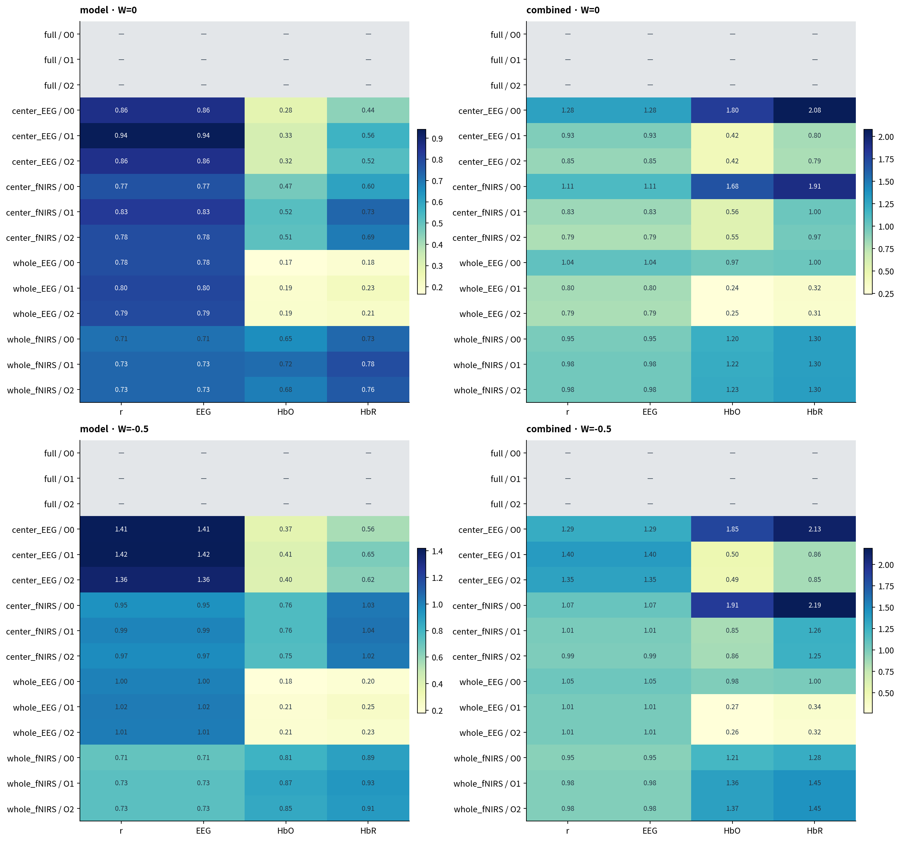<figcaption>
附图 A13：N2｜非线性 Student-t stress：隐藏区间 clean NRMSE

<b>内容：</b>每个 full/中心遮挡格含 24 个独立合成 trial；整模态缺失格含固定的前 8 个 trial。各格全部完成。O0=逐点近似，O1=静息线性时序，O2=非线性相关 Gaussian MAP。隐藏区间表的 full 行不适用；指标按各自评分区间的 truth SD 归一化。

<b>读法：</b>行按输入mask分组，每组三行为O0/O1/O2；列为r/EEG/HbO/HbR；上下为W=0/−0.5，左右为model/combined。NRMSE越小越好。

<b>结论：</b>隐藏区间仍随输入模式和噪声失配而变化；均值图中的优势不能自动外推到所有隐藏目标。
</figcaption></figure>

附图 A14 · N2｜覆盖率必须与区间宽度共同解读

<figure>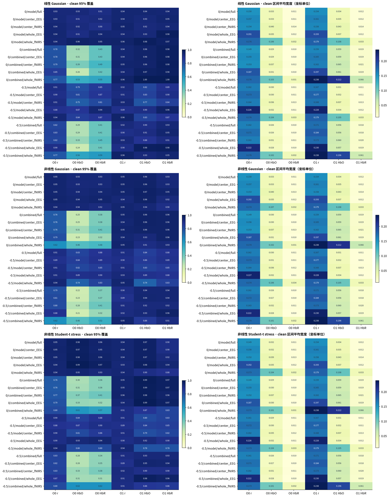<figcaption>
附图 A14：N2｜覆盖率必须与区间宽度共同解读

<b>内容：</b>完整轨迹 clean 区间的条件近似评价；EEG 与 r 在该模型下数值相同，图中只列 r。O2 未估计区间、参数后验或边际似然；O1另有共享原生噪声的带噪目标条件区间，见下一图。

<b>读法：</b>每行是一种W/时间处理/输入模式；左右分别看clean覆盖与宽度，列区分solver和目标。覆盖需与0.95比较，宽区间带来的高覆盖不等于精确恢复。

<b>结论：</b>均值改善没有自动带来校准资格；O2缺少区间，不能由O0/O1区间代替。
</figcaption></figure>

附图 A15 · N2｜O1 已实现的共享原生噪声条件预测

<figure>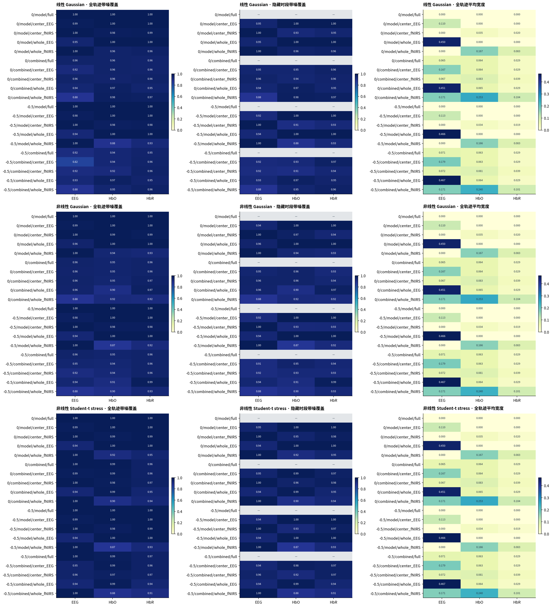<figcaption>
附图 A15：N2｜O1 已实现的共享原生噪声条件预测

<b>内容：</b>O1在R_target,input中保留同一原生噪声；O0/O2对应带噪区间未估计。条件已给定的观测坐标可以出现覆盖1、宽度0，这是对已见随机变量的条件化，不是新噪声预测或完美校准。隐藏覆盖在整个被遮挡时段计算，图中的可见模态仍可能是已给定值。

<b>读法：</b>先按标题区分生成规律与输入条件，再对照覆盖率和宽度：95%覆盖需接近0.95，区间宽度需同时查看。已见目标的覆盖1、宽度0是条件化结果。

<b>结论：</b>O1确有共享噪声条件区间；已见目标的覆盖1和宽度0不是完美的未来观测预测。
</figcaption></figure>

附图 A16 · N4｜全部冻结候选的内折风险

<figure>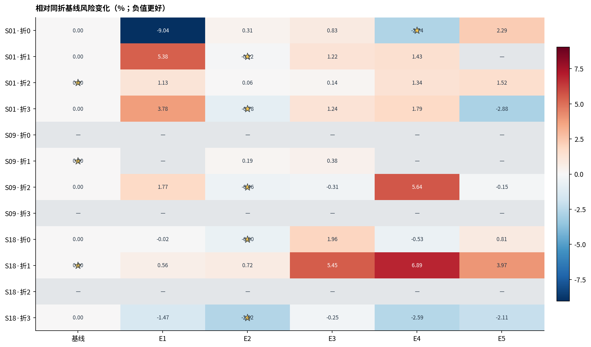<figcaption>
附图 A16：N4｜全部冻结候选的内折风险

<b>内容：</b>全部预先固定候选在三被试×四个外折中的内折风险。候选只使用对应训练边界；基线失败的选择折保留为空，不另挑成功子集。

<b>读法：</b>行是被试与外折，列是候选；风险变化小于0更好，星号为通过模态退化约束后选中的候选。灰格不参与补选。

<b>结论：</b>E2被选5次、E4被选1次、基线3次；外折fNIRS风险仅改善0.034%，没有稳定收益。
</figcaption></figure>

附图 A17 · N7｜全部冻结候选的内折风险

<figure>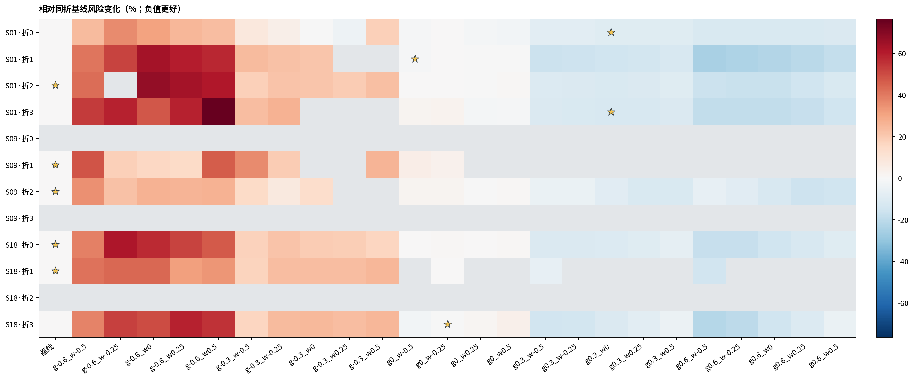<figcaption>
附图 A17：N7｜全部冻结候选的内折风险

<b>内容：</b>全部预先固定候选在三被试×四个外折中的内折风险。候选只使用对应训练边界；基线失败的选择折保留为空，不另挑成功子集。

<b>读法：</b>行是被试与外折，列是候选；风险变化小于0更好，星号为通过模态退化约束后选中的候选。灰格不参与补选。

<b>结论：</b>GW规则9折中5折保留基线；没有有效折同时选中非零G与非零W。
</figcaption></figure>

附图 A18 · N3｜训练噪声尺度及相关性

<figure>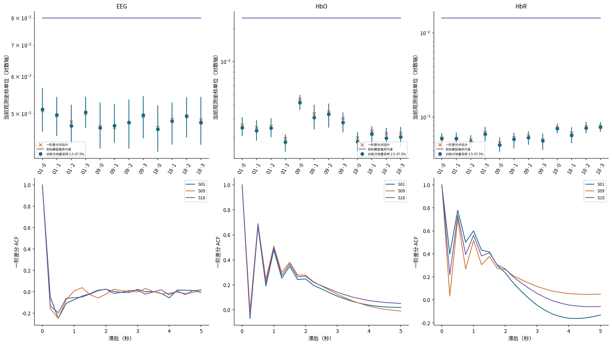<figcaption>
附图 A18：N3｜训练噪声尺度及相关性

<b>内容：</b>12 个训练折；每折 200 次 trial 内移动块重采样，块长 8 点。重采样区间是噪声描述区间，不是生理参数区间。实际噪声尺度还受既有下限规则约束。

<b>读法：</b>上排按训练折比较重采样区间、差分点估计和实际噪声尺度，纵轴为对数尺度；下排按被试看一阶差分ACF，非零滞后不接近0表示仍有时间结构。

<b>结论：</b>训练噪声估计与模型实际尺度并非同一个量；仅调整共同倍率没有解决候选筛选问题。
</figcaption></figure>

附图 A19 · N5｜W–观测增益 共同坐标似然曲面

<figure>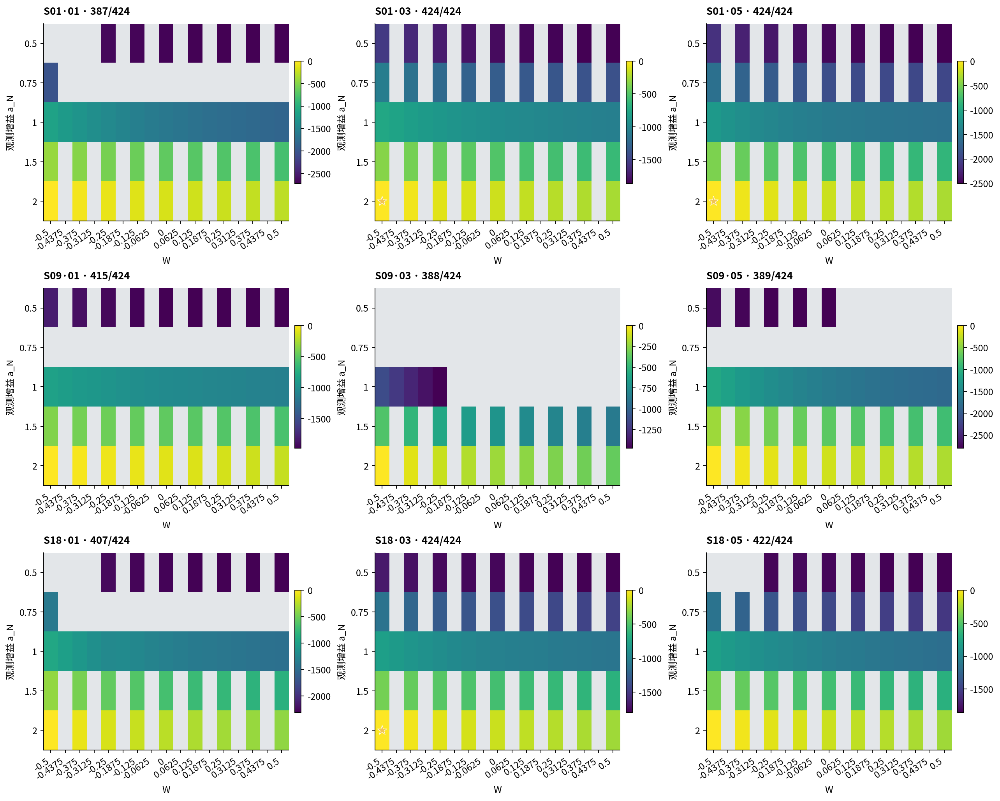<figcaption>
附图 A19：N5｜W–观测增益 共同坐标似然曲面

<b>内容：</b>每个有效格都要求同一 session 的 8 个 trial 全部有效；缺一即灰色，不对成功子集求和。颜色为相对该图可见最大值的 Δlog L，刻度按 session 独立；仅完整曲面标星。N5 的增益=1 行额外有 17 点细网格，其他增益行仅 9 点，交错灰格属于未设计。

<b>读法：</b>横轴W，纵轴为观测增益或G；颜色为本session相对最大log L，越接近0越好。只在完整曲面标星，不能跨子图比较色深。

<b>结论：</b>只有3/9个二维曲面完整；一维W边界现象不能用来宣称观测增益与生理时间已被分离。
</figcaption></figure>

附图 A20 · N7｜G–W 共同坐标似然曲面

<figure>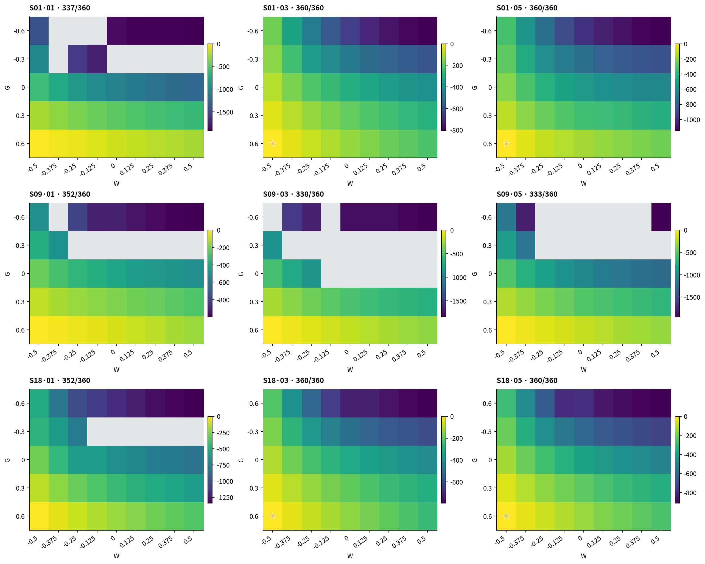<figcaption>
附图 A20：N7｜G–W 共同坐标似然曲面

<b>内容：</b>每个有效格都要求同一 session 的 8 个 trial 全部有效；缺一即灰色，不对成功子集求和。颜色为相对该图可见最大值的 Δlog L，刻度按 session 独立；仅完整曲面标星。

<b>读法：</b>横轴W，纵轴为观测增益或G；颜色为本session相对最大log L，越接近0越好。只在完整曲面标星，不能跨子图比较色深。

<b>结论：</b>4/9个完整曲面均最大于G=0.6、W=-0.5的双边界，其余5个不完整；未得到内部稳定最优点。
</figcaption></figure>

附图 A21 · N6｜过程创新和合成回放参照

<figure>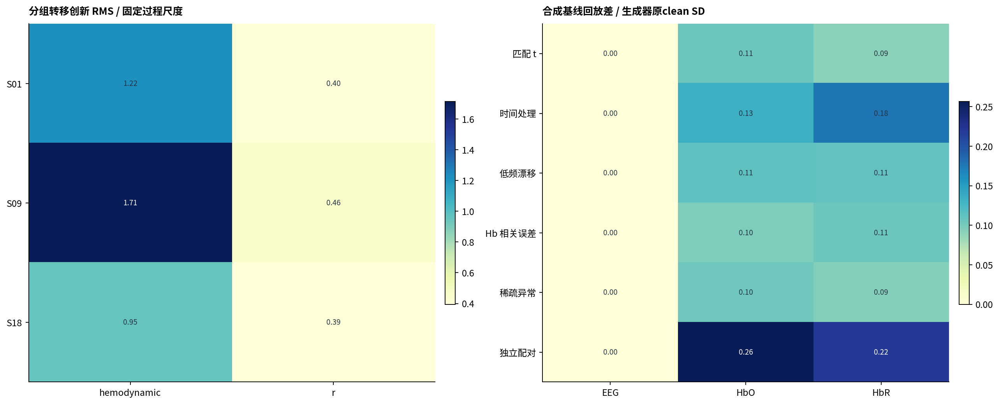<figcaption>
附图 A21：N6｜过程创新和合成回放参照

<b>内容：</b>左：有效实测回放的分组转移诊断；右：独立 assessment 六条件，每条件最多 16 trial。实测和合成的归一化分母不同，不能直接把数值相除解释为比例。

<b>读法：</b>左侧按被试比较不同状态组的转移创新；右侧按六种assessment条件比较EEG/HbO/HbR回放差。两侧归一化分母不同，只在各面板内比较大小。

<b>结论：</b>联合均值与确定性r驱动回放存在闭合差；过程创新可参与拟合，但这里不能量化私有信息比例。
</figcaption></figure>

附图 A22 · N6｜全部六个固定越界复现案例

<figure>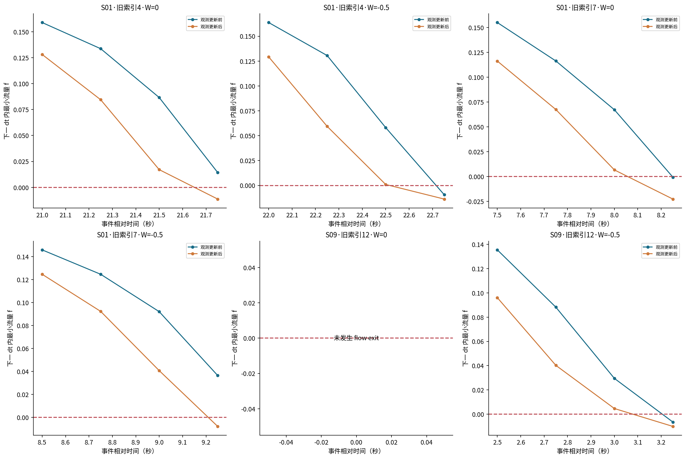<figcaption>
附图 A22：N6｜全部六个固定越界复现案例

<b>内容：</b>5/6 复现 flow-domain exit，1/6 完成。图示 owner 保留的最后 4 次更新，横坐标为原事件时间；只追踪所保留时间窗，不反推更早风险。跳过最后更新仅在 2 个失败案例中使下一步恢复正流量。

<b>读法：</b>横轴为事件相对时间；两条曲线比较观测更新前后未来一个步长内的最小流量，跌破红色零线表示流量越界。

<b>结论：</b>5/6案例复现越界；跳过最后更新仅修复其中2例的下一步，最后一条观测不是唯一原因。
</figcaption></figure>

附图 A23 · 候选结果｜实测子集改善与合成代价

<figure>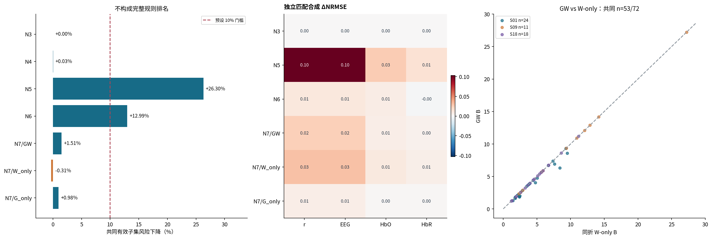<figcaption>
附图 A23：候选结果｜实测子集改善与合成代价

<b>内容：</b>左：每行仅限其自身共同有效身份，N4 用固定 fNIRS 风险，N7/GW 参考 W-only，其他参考 W=0；禁止跨行直接排名。中：按 9 个已定义选择折的频率加权，来自同一组 16 个独立 assessment trial，144 是加权比较数，不是 144 个独立 trial。中图各规则统一参考 N1 固定基线，GW 的实测主消融仍以 W-only 为准。

<b>读法：</b>左侧风险下降百分比越大越好，虚线为10%；右侧合成ΔNRMSE为正表示退化。每行使用自身共同有效子集，不能跨行排名。

<b>结论：</b>N5/N6较大的实测子集收益伴随合成代价；N7/GW对W-only仅改善1.51%，全部规则仍未合格。
</figcaption></figure>

附图 A24 · 候选结果｜EEG、HbO、HbR各自的代价

<figure>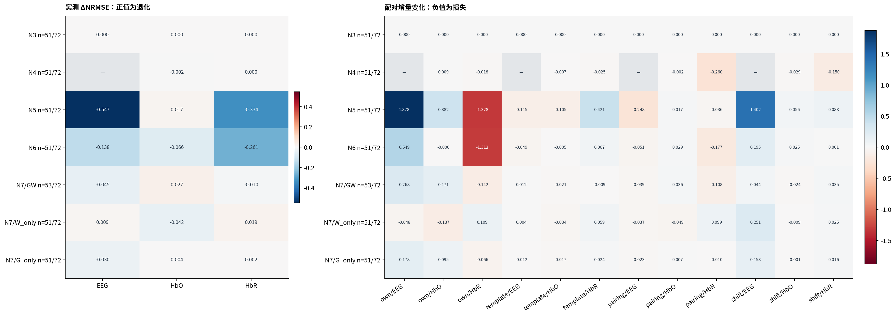<figcaption>
附图 A24：候选结果｜EEG、HbO、HbR各自的代价

<b>内容：</b>均为各规则自身共同有效子集。左按trial→session→subject等权后开方；右采用owner候选表中共同trial等权的增量变化。N4的EEG坐标已改变，对应跨坐标差留空。GW参考同折W-only，其余参考W=0；不能据不同子集横向排名。

<b>读法：</b>先看增量符号：对照−正确联合NMSE大于0才是联合获益；误差差值大于0则表示退化。各子图标题注明不同口径。

<b>结论：</b>综合风险下降并未保证各模态及配对增量同时改善；N5/N6的收益不能视为无代价改进。
</figcaption></figure>

附图 A25 · N1｜discovery 全部合成候选与单模态消融

<figure>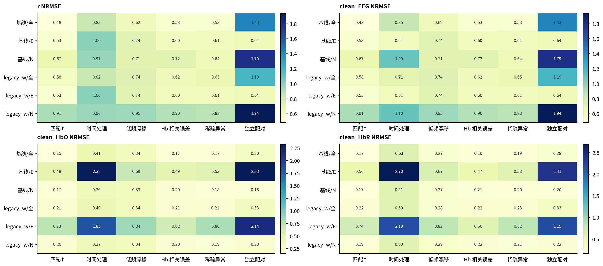<figcaption>
附图 A25：N1｜discovery 全部合成候选与单模态消融

<b>内容：</b>每格预定 16 个独立 trial；图中为有效拟合的平均 NRMSE，失败率及其固定分母在配套 synthetic_metrics.csv、完成率图保留。E=仅 EEG，N=仅 fNIRS。独立配对条件的 r 真值只对应 EEG 驱动，禁止赋予两个模态共同生理真值。

<b>读法：</b>行是候选×输入模式（全/E/N），列是六种合成条件，四子图是r/EEG/HbO/HbR；每格16个trial，NRMSE越低越好。

<b>结论：</b>本图首个恢复目标的平均NRMSE跨展示条件为0.482–1.939，结果依赖输入与扰动方向；不能把其中最小格推广为整套实验优势。
</figcaption></figure>

附图 A26 · N1｜assessment 全部合成候选与单模态消融

<figure>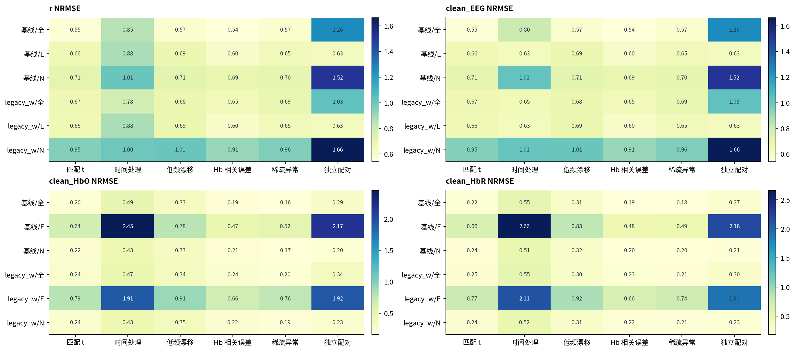<figcaption>
附图 A26：N1｜assessment 全部合成候选与单模态消融

<b>内容：</b>每格预定 16 个独立 trial；图中为有效拟合的平均 NRMSE，失败率及其固定分母在配套 synthetic_metrics.csv、完成率图保留。E=仅 EEG，N=仅 fNIRS。独立配对条件的 r 真值只对应 EEG 驱动，禁止赋予两个模态共同生理真值。

<b>读法：</b>行是候选×输入模式（全/E/N），列是六种合成条件，四子图是r/EEG/HbO/HbR；每格16个trial，NRMSE越低越好。

<b>结论：</b>本图首个恢复目标的平均NRMSE跨展示条件为0.538–1.664，结果依赖输入与扰动方向；不能把其中最小格推广为整套实验优势。
</figcaption></figure>

附图 A27 · N3｜discovery 全部合成候选与单模态消融

<figure>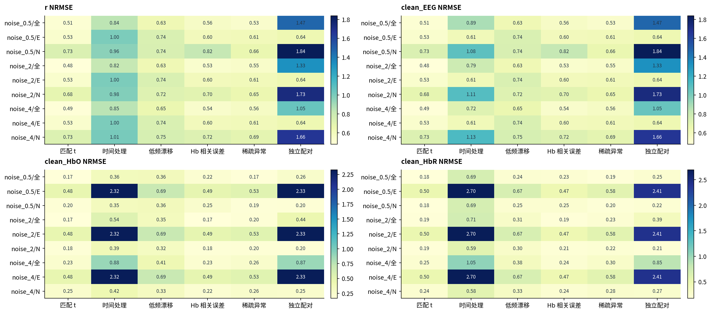<figcaption>
附图 A27：N3｜discovery 全部合成候选与单模态消融

<b>内容：</b>每格预定 16 个独立 trial；图中为有效拟合的平均 NRMSE，失败率及其固定分母在配套 synthetic_metrics.csv、完成率图保留。E=仅 EEG，N=仅 fNIRS。独立配对条件的 r 真值只对应 EEG 驱动，禁止赋予两个模态共同生理真值。

<b>读法：</b>行是候选×输入模式（全/E/N），列是六种合成条件，四子图是r/EEG/HbO/HbR；每格16个trial，NRMSE越低越好。

<b>结论：</b>本图首个恢复目标的平均NRMSE跨展示条件为0.479–1.839，结果依赖输入与扰动方向；不能把其中最小格推广为整套实验优势。
</figcaption></figure>

附图 A28 · N3｜assessment 全部合成候选与单模态消融

<figure>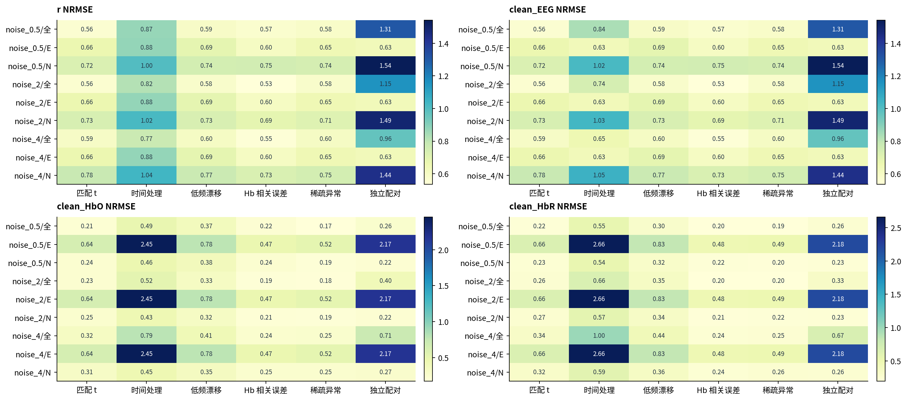<figcaption>
附图 A28：N3｜assessment 全部合成候选与单模态消融

<b>内容：</b>每格预定 16 个独立 trial；图中为有效拟合的平均 NRMSE，失败率及其固定分母在配套 synthetic_metrics.csv、完成率图保留。E=仅 EEG，N=仅 fNIRS。独立配对条件的 r 真值只对应 EEG 驱动，禁止赋予两个模态共同生理真值。

<b>读法：</b>行是候选×输入模式（全/E/N），列是六种合成条件，四子图是r/EEG/HbO/HbR；每格16个trial，NRMSE越低越好。

<b>结论：</b>本图首个恢复目标的平均NRMSE跨展示条件为0.535–1.542，结果依赖输入与扰动方向；不能把其中最小格推广为整套实验优势。
</figcaption></figure>

附图 A29 · N5｜discovery 全部合成候选与单模态消融

<figure>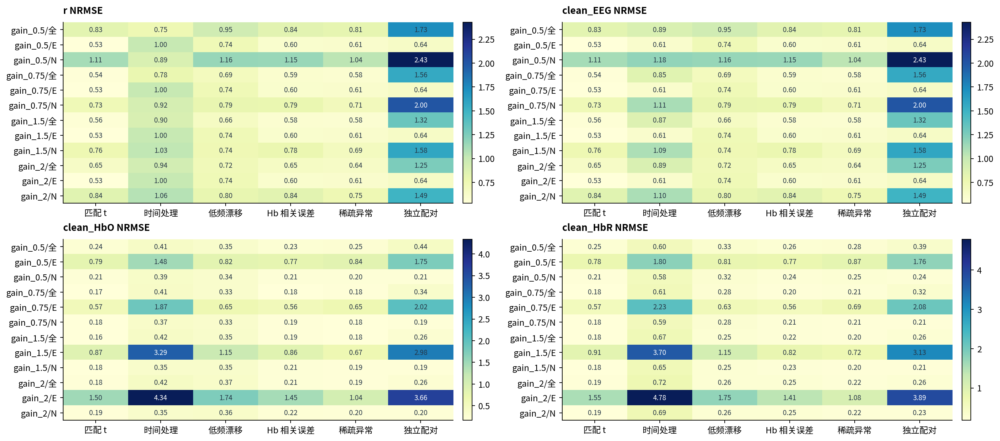<figcaption>
附图 A29：N5｜discovery 全部合成候选与单模态消融

<b>内容：</b>每格预定 16 个独立 trial；图中为有效拟合的平均 NRMSE，失败率及其固定分母在配套 synthetic_metrics.csv、完成率图保留。E=仅 EEG，N=仅 fNIRS。独立配对条件的 r 真值只对应 EEG 驱动，禁止赋予两个模态共同生理真值。

<b>读法：</b>行是候选×输入模式（全/E/N），列是六种合成条件，四子图是r/EEG/HbO/HbR；每格16个trial，NRMSE越低越好。

<b>结论：</b>本图首个恢复目标的平均NRMSE跨展示条件为0.531–2.429，结果依赖输入与扰动方向；不能把其中最小格推广为整套实验优势。
</figcaption></figure>

附图 A30 · N5｜assessment 全部合成候选与单模态消融

<figure>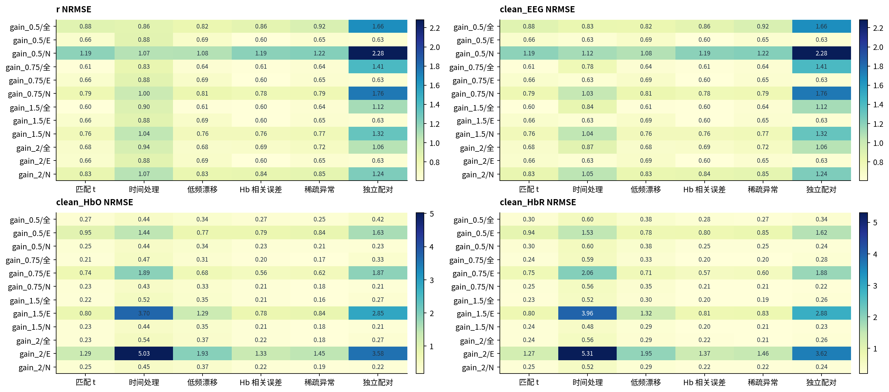<figcaption>
附图 A30：N5｜assessment 全部合成候选与单模态消融

<b>内容：</b>每格预定 16 个独立 trial；图中为有效拟合的平均 NRMSE，失败率及其固定分母在配套 synthetic_metrics.csv、完成率图保留。E=仅 EEG，N=仅 fNIRS。独立配对条件的 r 真值只对应 EEG 驱动，禁止赋予两个模态共同生理真值。

<b>读法：</b>行是候选×输入模式（全/E/N），列是六种合成条件，四子图是r/EEG/HbO/HbR；每格16个trial，NRMSE越低越好。

<b>结论：</b>本图首个恢复目标的平均NRMSE跨展示条件为0.601–2.284，结果依赖输入与扰动方向；不能把其中最小格推广为整套实验优势。
</figcaption></figure>

附图 A31 · N6｜discovery 全部合成候选与单模态消融

<figure>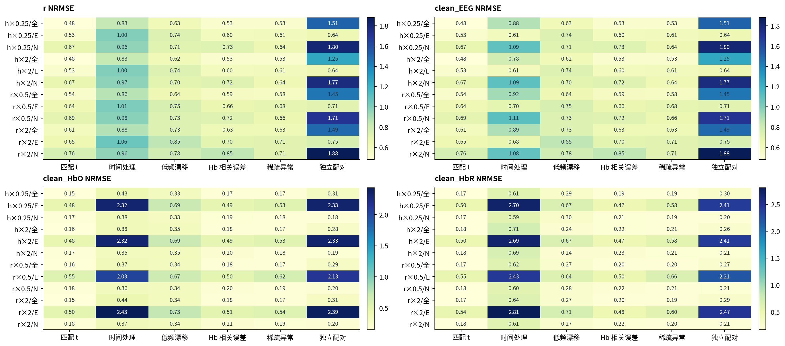<figcaption>
附图 A31：N6｜discovery 全部合成候选与单模态消融

<b>内容：</b>每格预定 16 个独立 trial；图中为有效拟合的平均 NRMSE，失败率及其固定分母在配套 synthetic_metrics.csv、完成率图保留。E=仅 EEG，N=仅 fNIRS。独立配对条件的 r 真值只对应 EEG 驱动，禁止赋予两个模态共同生理真值。

<b>读法：</b>行是候选×输入模式（全/E/N），列是六种合成条件，四子图是r/EEG/HbO/HbR；每格16个trial，NRMSE越低越好。

<b>结论：</b>本图首个恢复目标的平均NRMSE跨展示条件为0.481–1.882，结果依赖输入与扰动方向；不能把其中最小格推广为整套实验优势。
</figcaption></figure>

附图 A32 · N6｜assessment 全部合成候选与单模态消融

<figure>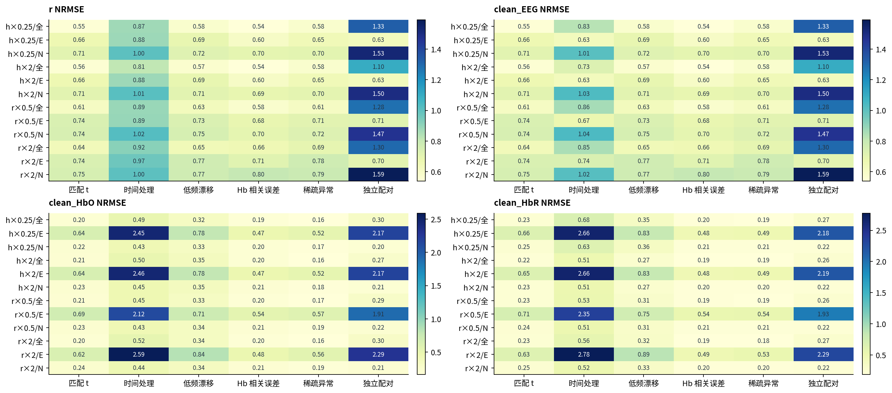<figcaption>
附图 A32：N6｜assessment 全部合成候选与单模态消融

<b>内容：</b>每格预定 16 个独立 trial；图中为有效拟合的平均 NRMSE，失败率及其固定分母在配套 synthetic_metrics.csv、完成率图保留。E=仅 EEG，N=仅 fNIRS。独立配对条件的 r 真值只对应 EEG 驱动，禁止赋予两个模态共同生理真值。

<b>读法：</b>行是候选×输入模式（全/E/N），列是六种合成条件，四子图是r/EEG/HbO/HbR；每格16个trial，NRMSE越低越好。

<b>结论：</b>本图首个恢复目标的平均NRMSE跨展示条件为0.538–1.592，结果依赖输入与扰动方向；不能把其中最小格推广为整套实验优势。
</figcaption></figure>

附图 A33 · N7｜discovery 全部合成候选与单模态消融（1/3）

<figure>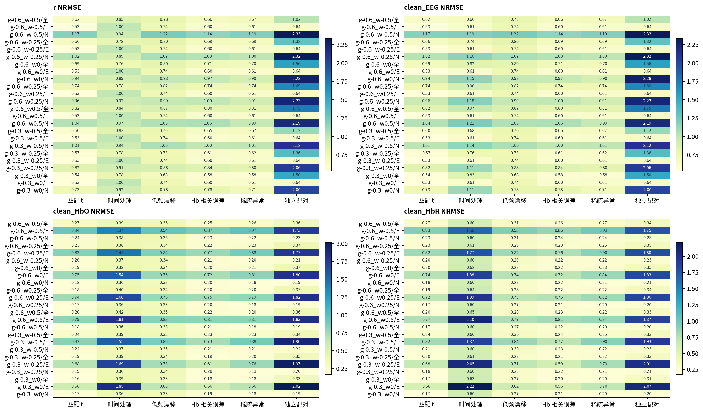<figcaption>
附图 A33：N7｜discovery 全部合成候选与单模态消融（1/3）

<b>内容：</b>每格预定 16 个独立 trial；图中为有效拟合的平均 NRMSE，失败率及其固定分母在配套 synthetic_metrics.csv、完成率图保留。E=仅 EEG，N=仅 fNIRS。独立配对条件的 r 真值只对应 EEG 驱动，禁止赋予两个模态共同生理真值。

<b>读法：</b>行是候选×输入模式（全/E/N），列是六种合成条件，四子图是r/EEG/HbO/HbR；每格16个trial，NRMSE越低越好。

<b>结论：</b>本图首个恢复目标的平均NRMSE跨展示条件为0.531–2.331，结果依赖输入与扰动方向；不能把其中最小格推广为整套实验优势。
</figcaption></figure>

附图 A34 · N7｜discovery 全部合成候选与单模态消融（2/3）

<figure>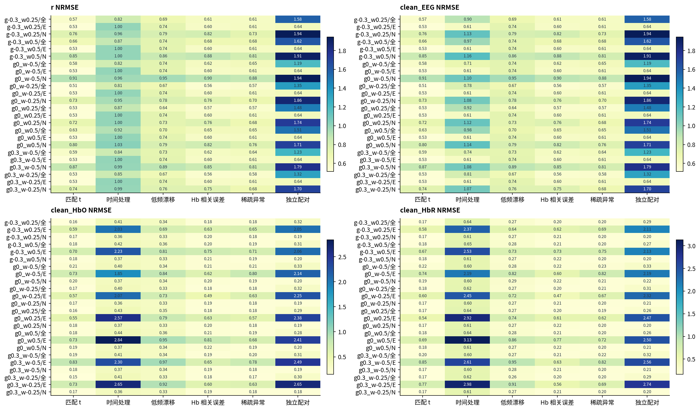<figcaption>
附图 A34：N7｜discovery 全部合成候选与单模态消融（2/3）

<b>内容：</b>每格预定 16 个独立 trial；图中为有效拟合的平均 NRMSE，失败率及其固定分母在配套 synthetic_metrics.csv、完成率图保留。E=仅 EEG，N=仅 fNIRS。独立配对条件的 r 真值只对应 EEG 驱动，禁止赋予两个模态共同生理真值。

<b>读法：</b>行是候选×输入模式（全/E/N），列是六种合成条件，四子图是r/EEG/HbO/HbR；每格16个trial，NRMSE越低越好。

<b>结论：</b>本图首个恢复目标的平均NRMSE跨展示条件为0.515–1.944，结果依赖输入与扰动方向；不能把其中最小格推广为整套实验优势。
</figcaption></figure>

附图 A35 · N7｜discovery 全部合成候选与单模态消融（3/3）

<figure>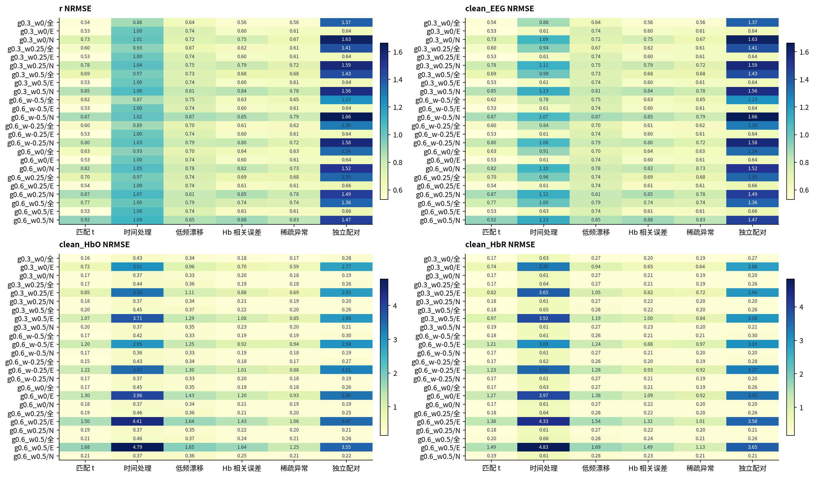<figcaption>
附图 A35：N7｜discovery 全部合成候选与单模态消融（3/3）

<b>内容：</b>每格预定 16 个独立 trial；图中为有效拟合的平均 NRMSE，失败率及其固定分母在配套 synthetic_metrics.csv、完成率图保留。E=仅 EEG，N=仅 fNIRS。独立配对条件的 r 真值只对应 EEG 驱动，禁止赋予两个模态共同生理真值。

<b>读法：</b>行是候选×输入模式（全/E/N），列是六种合成条件，四子图是r/EEG/HbO/HbR；每格16个trial，NRMSE越低越好。

<b>结论：</b>本图首个恢复目标的平均NRMSE跨展示条件为0.531–1.664，结果依赖输入与扰动方向；不能把其中最小格推广为整套实验优势。
</figcaption></figure>

附图 A36 · N7｜assessment 全部合成候选与单模态消融（1/3）

<figure>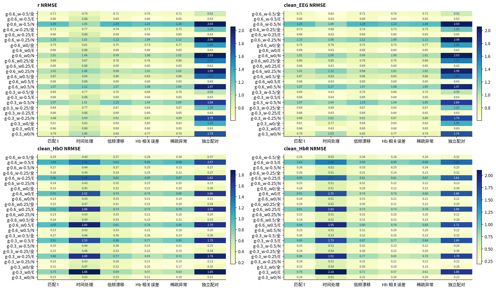<figcaption>
附图 A36：N7｜assessment 全部合成候选与单模态消融（1/3）

<b>内容：</b>每格预定 16 个独立 trial；图中为有效拟合的平均 NRMSE，失败率及其固定分母在配套 synthetic_metrics.csv、完成率图保留。E=仅 EEG，N=仅 fNIRS。独立配对条件的 r 真值只对应 EEG 驱动，禁止赋予两个模态共同生理真值。

<b>读法：</b>行是候选×输入模式（全/E/N），列是六种合成条件，四子图是r/EEG/HbO/HbR；每格16个trial，NRMSE越低越好。

<b>结论：</b>本图首个恢复目标的平均NRMSE跨展示条件为0.601–2.057，结果依赖输入与扰动方向；不能把其中最小格推广为整套实验优势。
</figcaption></figure>

附图 A37 · N7｜assessment 全部合成候选与单模态消融（2/3）

<figure>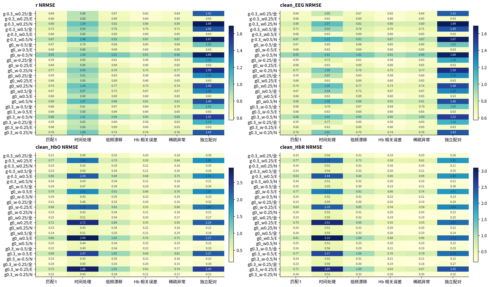<figcaption>
附图 A37：N7｜assessment 全部合成候选与单模态消融（2/3）

<b>内容：</b>每格预定 16 个独立 trial；图中为有效拟合的平均 NRMSE，失败率及其固定分母在配套 synthetic_metrics.csv、完成率图保留。E=仅 EEG，N=仅 fNIRS。独立配对条件的 r 真值只对应 EEG 驱动，禁止赋予两个模态共同生理真值。

<b>读法：</b>行是候选×输入模式（全/E/N），列是六种合成条件，四子图是r/EEG/HbO/HbR；每格16个trial，NRMSE越低越好。

<b>结论：</b>本图首个恢复目标的平均NRMSE跨展示条件为0.576–1.691，结果依赖输入与扰动方向；不能把其中最小格推广为整套实验优势。
</figcaption></figure>

附图 A38 · N7｜assessment 全部合成候选与单模态消融（3/3）

<figure>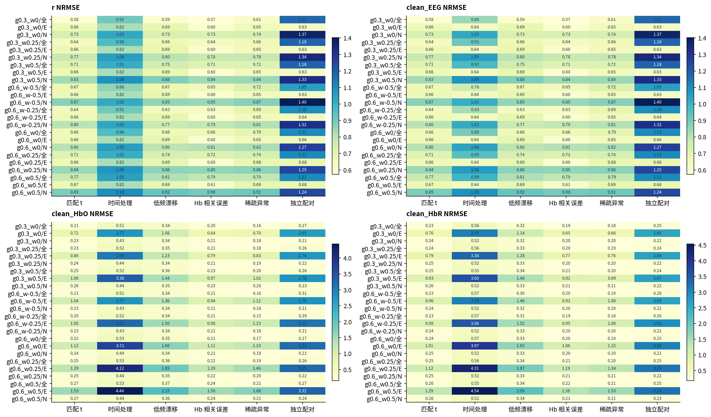<figcaption>
附图 A38：N7｜assessment 全部合成候选与单模态消融（3/3）

<b>内容：</b>每格预定 16 个独立 trial；图中为有效拟合的平均 NRMSE，失败率及其固定分母在配套 synthetic_metrics.csv、完成率图保留。E=仅 EEG，N=仅 fNIRS。独立配对条件的 r 真值只对应 EEG 驱动，禁止赋予两个模态共同生理真值。

<b>读法：</b>行是候选×输入模式（全/E/N），列是六种合成条件，四子图是r/EEG/HbO/HbR；每格16个trial，NRMSE越低越好。

<b>结论：</b>本图首个恢复目标的平均NRMSE跨展示条件为0.573–1.402，结果依赖输入与扰动方向；不能把其中最小格推广为整套实验优势。
</figcaption></figure>

附图 A39 · 公共合成｜联合模型与原带噪、自身平滑的比较

<figure>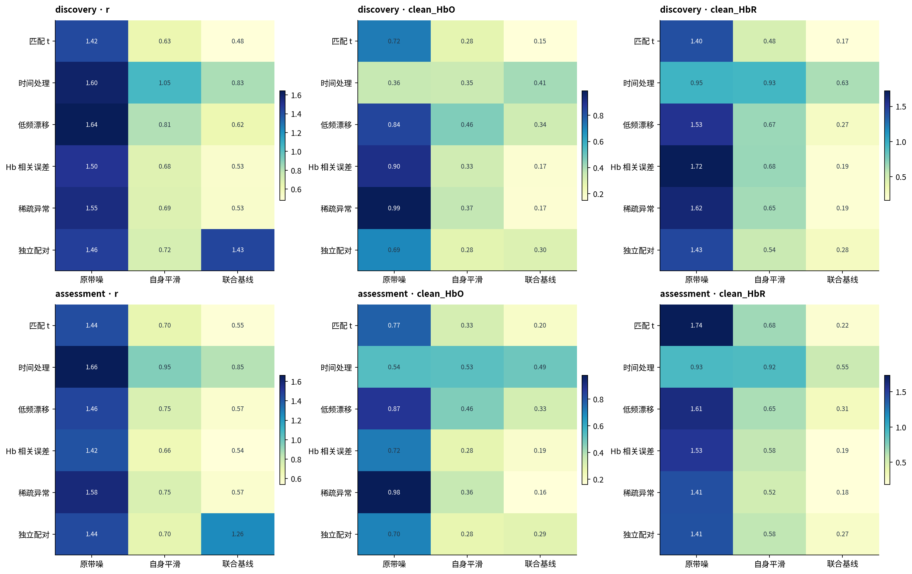<figcaption>
附图 A39：公共合成｜联合模型与原带噪、自身平滑的比较

<b>内容：</b>每条件 16 个独立 trial。自身平滑为预设 Gaussian 平滑。r 的原带噪/平滑参照使用 EEG 坐标；clean EEG 与 r 数值相同。

<b>读法：</b>上下排是独立discovery/assessment种子流，列面板区分恢复目标；每格按六种失配条件比较原带噪、自身平滑和联合基线，NRMSE越低越好。

<b>结论：</b>联合模型的优势取决于目标与失配条件，不能将单一匹配条件的优势推广到全部压力场景。
</figcaption></figure>

附图 A40 · 公共合成｜discovery 全候选覆盖、宽度和分母

<figure>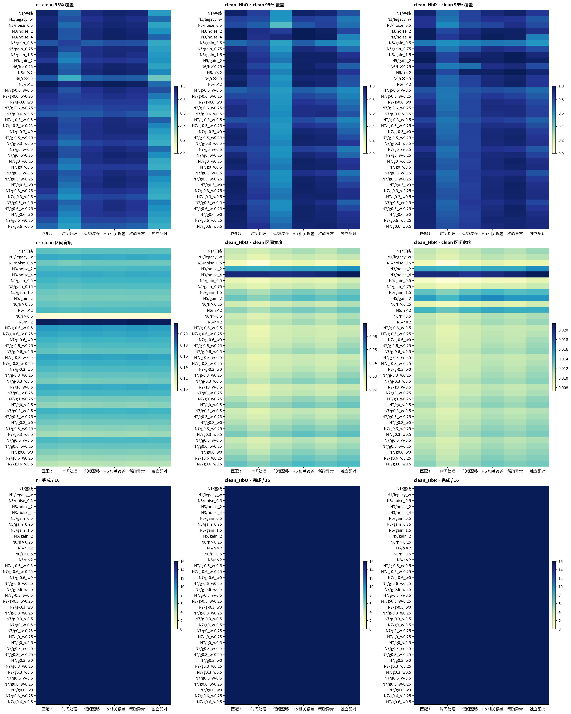<figcaption>
附图 A40：公共合成｜discovery 全候选覆盖、宽度和分母

<b>内容：</b>完整输入的所有固定候选；对应逐格数值和三种输入模式均见 synthetic_metrics.csv。宽度为各自当前观测坐标单位，不能跨不同物理映射直接排序；灰色缺值不按零覆盖处理。

<b>读法：</b>行是候选，列是六种合成条件；从上到下依次读覆盖、宽度、完成数。覆盖须与95%目标及相应宽度共同判断。

<b>结论：</b>候选完成数不等于区间校准，覆盖与宽度随失配条件变化；本面板不新增UQ资格。
</figcaption></figure>

附图 A41 · 公共合成｜assessment 全候选覆盖、宽度和分母

<figure>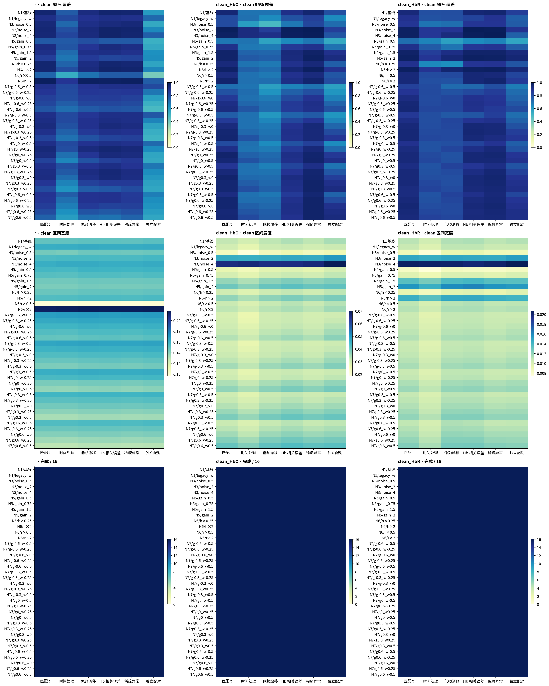<figcaption>
附图 A41：公共合成｜assessment 全候选覆盖、宽度和分母

<b>内容：</b>完整输入的所有固定候选；对应逐格数值和三种输入模式均见 synthetic_metrics.csv。宽度为各自当前观测坐标单位，不能跨不同物理映射直接排序；灰色缺值不按零覆盖处理。

<b>读法：</b>行是候选，列是六种合成条件；从上到下依次读覆盖、宽度、完成数。覆盖须与95%目标及相应宽度共同判断。

<b>结论：</b>候选完成数不等于区间校准，覆盖与宽度随失配条件变化；本面板不新增UQ资格。
</figcaption></figure>

附图 A42 · N7｜discovery 独立真值方向与观测增益替代

<figure>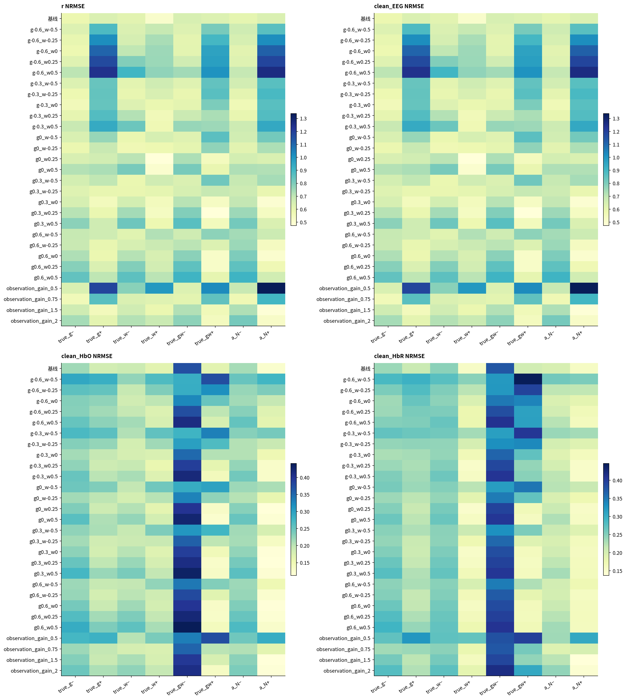<figcaption>
附图 A42：N7｜discovery 独立真值方向与观测增益替代

<b>内容：</b>每列 8 个独立 trial，负/正两列保留真实方向而不相互抵消。true_g=±0.3、true_w=±0.25、true_gw 同号组合；a_N=0.75/1.5。25 个 GW 候选（含基线）与 4 个独立观测增益对照共用同一输入。该图是固定候选响应，不用真值选择再宣称参数恢复。

<b>读法：</b>行是29个固定候选，列是真G、真W、联合扰动及观测增益的正/负方向；每列8个trial，四子图按恢复目标区分，误差越低越好。

<b>结论：</b>本图首个恢复目标的平均NRMSE跨展示条件为0.474–1.338，结果依赖输入与扰动方向；不能把其中最小格推广为整套实验优势。
</figcaption></figure>

附图 A43 · N7｜discovery 真值方向：EEG_only

<figure>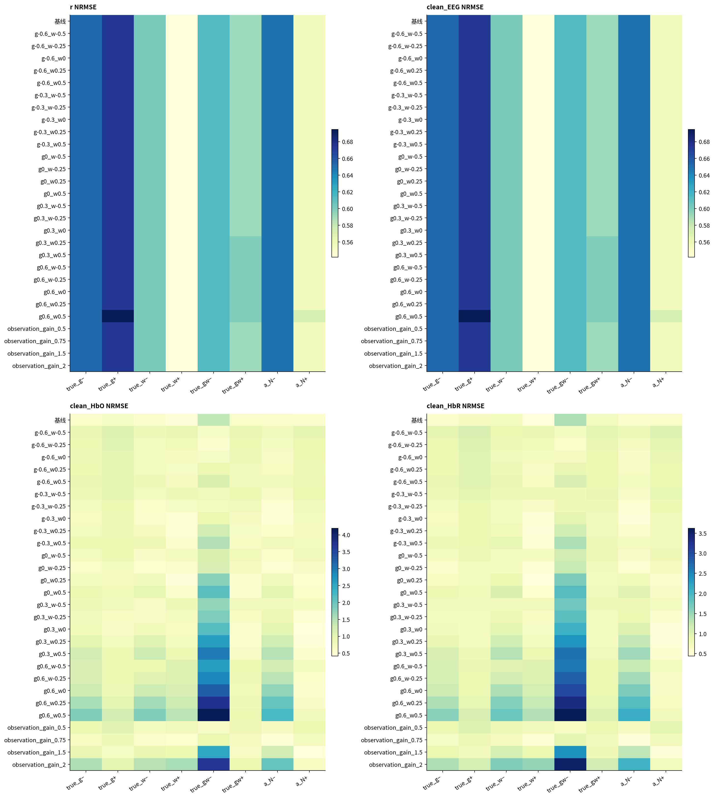<figcaption>
附图 A43：N7｜discovery 真值方向：EEG_only

<b>内容：</b>与对应完整输入图使用相同的生成身份和29个固定候选；每列8个独立trial，只保留标题指定的输入模态。误差、覆盖、区间宽度和失败分母均可在n7_truth_metrics.csv按模式复核。

<b>读法：</b>行是29个固定候选，列是真G、真W、联合扰动及观测增益的正/负方向；每列8个trial，四子图按恢复目标区分，误差越低越好。

<b>结论：</b>本图首个恢复目标的平均NRMSE跨展示条件为0.542–0.695，结果依赖输入与扰动方向；不能把其中最小格推广为整套实验优势。
</figcaption></figure>

附图 A44 · N7｜discovery 真值方向：fNIRS_only

<figure>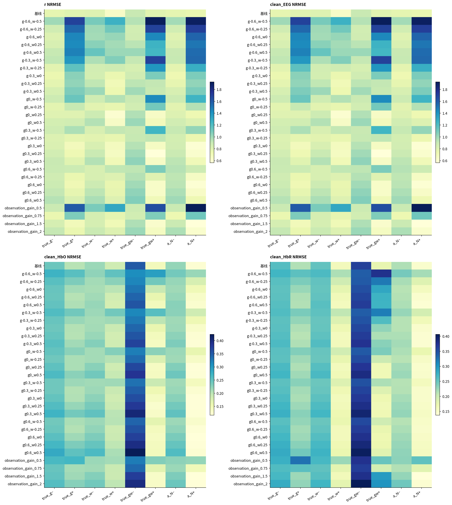<figcaption>
附图 A44：N7｜discovery 真值方向：fNIRS_only

<b>内容：</b>与对应完整输入图使用相同的生成身份和29个固定候选；每列8个独立trial，只保留标题指定的输入模态。误差、覆盖、区间宽度和失败分母均可在n7_truth_metrics.csv按模式复核。

<b>读法：</b>行是29个固定候选，列是真G、真W、联合扰动及观测增益的正/负方向；每列8个trial，四子图按恢复目标区分，误差越低越好。

<b>结论：</b>本图首个恢复目标的平均NRMSE跨展示条件为0.566–1.927，结果依赖输入与扰动方向；不能把其中最小格推广为整套实验优势。
</figcaption></figure>

附图 A45 · N7｜discovery 真值方向的似然响应

<figure>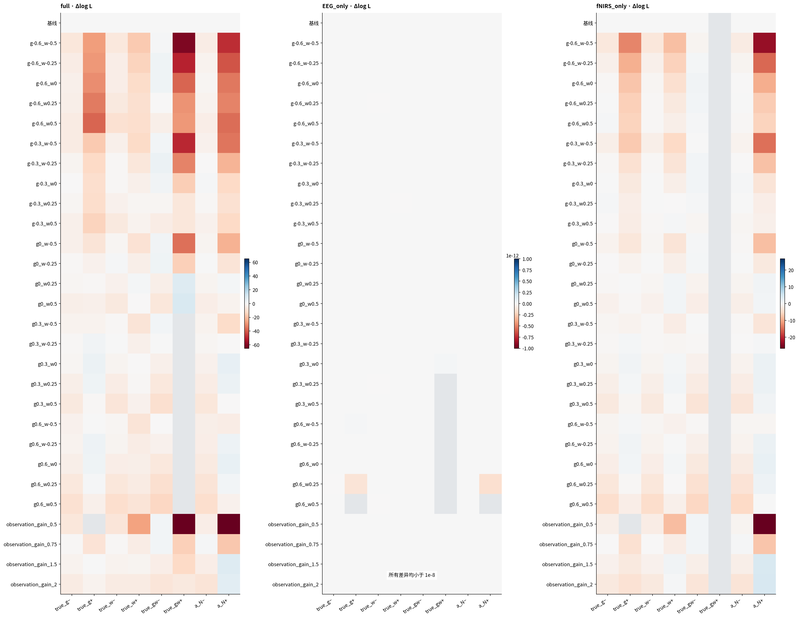<figcaption>
附图 A45：N7｜discovery 真值方向的似然响应

<b>内容：</b>同一输入、同一模式内，相对G=W=0、a_N=1基线的平均log L差。每格必须8/8有效才着色；不同输入模式的可见维度不同，不比较绝对似然。似然响应并不构成参数后验、区间或恢复资格。

<b>读法：</b>行是候选，列是真值扰动方向；三个子图区分输入模式。Δlog L大于0表示优于固定基线，但不同输入模式的绝对值不可比较。

<b>结论：</b>仅EEG输入下候选似然差均小于1e-8，无法靠该似然分辨G/W；出现其他方向响应也不等于参数恢复。
</figcaption></figure>

附图 A46 · N7｜assessment 独立真值方向与观测增益替代

<figure>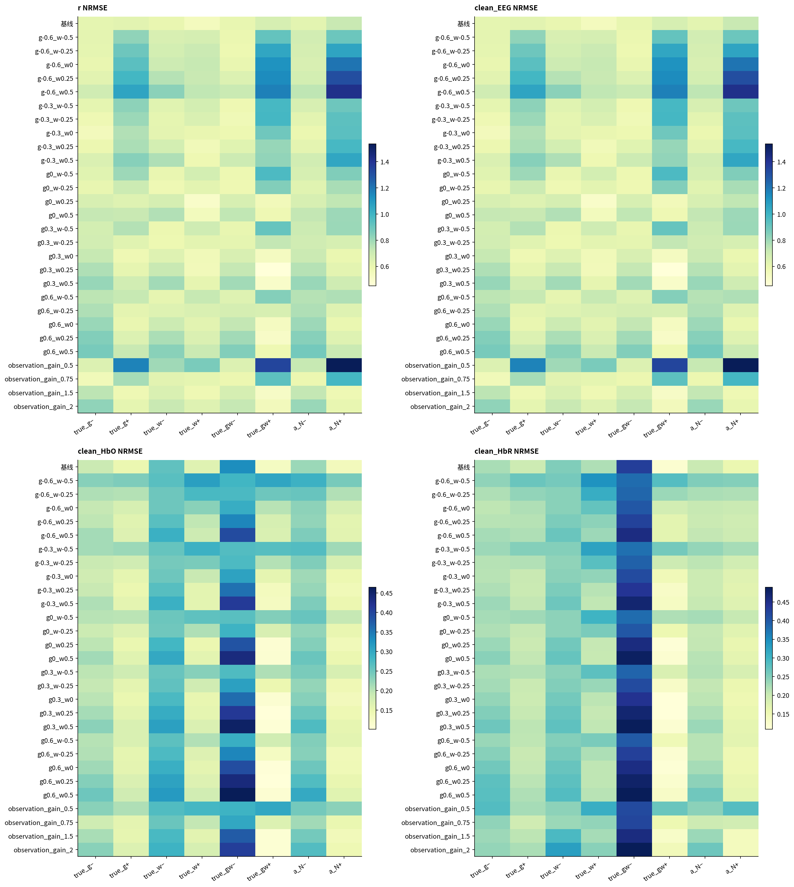<figcaption>
附图 A46：N7｜assessment 独立真值方向与观测增益替代

<b>内容：</b>每列 8 个独立 trial，负/正两列保留真实方向而不相互抵消。true_g=±0.3、true_w=±0.25、true_gw 同号组合；a_N=0.75/1.5。25 个 GW 候选（含基线）与 4 个独立观测增益对照共用同一输入。该图是固定候选响应，不用真值选择再宣称参数恢复。

<b>读法：</b>行是29个固定候选，列是真G、真W、联合扰动及观测增益的正/负方向；每列8个trial，四子图按恢复目标区分，误差越低越好。

<b>结论：</b>本图首个恢复目标的平均NRMSE跨展示条件为0.452–1.537，结果依赖输入与扰动方向；不能把其中最小格推广为整套实验优势。
</figcaption></figure>

附图 A47 · N7｜assessment 真值方向：EEG_only

<figure>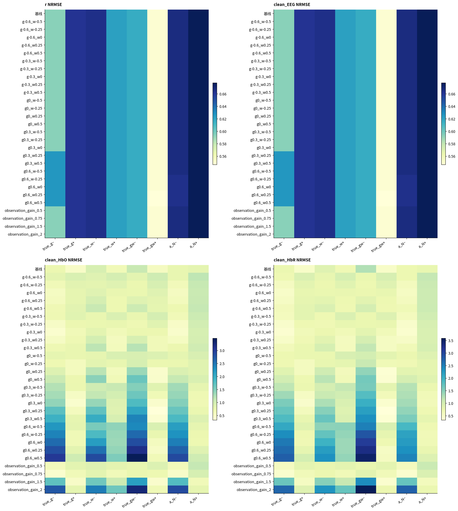<figcaption>
附图 A47：N7｜assessment 真值方向：EEG_only

<b>内容：</b>与对应完整输入图使用相同的生成身份和29个固定候选；每列8个独立trial，只保留标题指定的输入模态。误差、覆盖、区间宽度和失败分母均可在n7_truth_metrics.csv按模式复核。

<b>读法：</b>行是29个固定候选，列是真G、真W、联合扰动及观测增益的正/负方向；每列8个trial，四子图按恢复目标区分，误差越低越好。

<b>结论：</b>本图首个恢复目标的平均NRMSE跨展示条件为0.547–0.678，结果依赖输入与扰动方向；不能把其中最小格推广为整套实验优势。
</figcaption></figure>

附图 A48 · N7｜assessment 真值方向：fNIRS_only

<figure>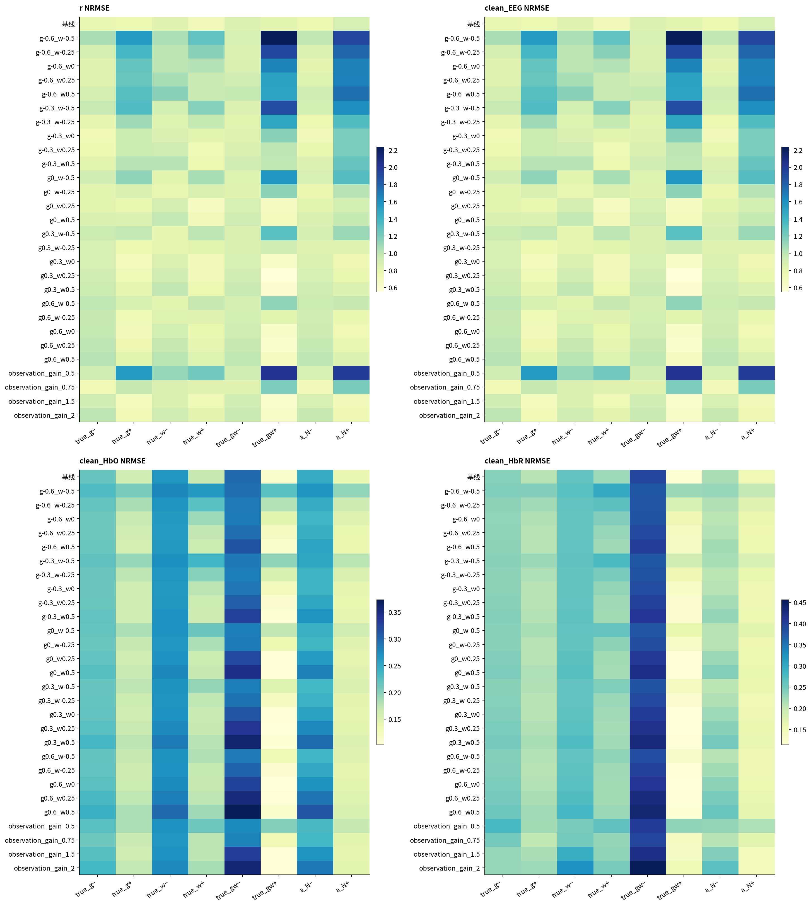<figcaption>
附图 A48：N7｜assessment 真值方向：fNIRS_only

<b>内容：</b>与对应完整输入图使用相同的生成身份和29个固定候选；每列8个独立trial，只保留标题指定的输入模态。误差、覆盖、区间宽度和失败分母均可在n7_truth_metrics.csv按模式复核。

<b>读法：</b>行是29个固定候选，列是真G、真W、联合扰动及观测增益的正/负方向；每列8个trial，四子图按恢复目标区分，误差越低越好。

<b>结论：</b>本图首个恢复目标的平均NRMSE跨展示条件为0.551–2.236，结果依赖输入与扰动方向；不能把其中最小格推广为整套实验优势。
</figcaption></figure>

附图 A49 · N7｜assessment 真值方向的似然响应

<figure>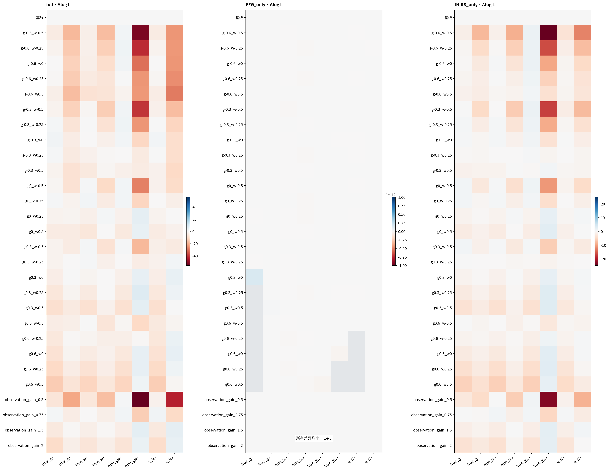<figcaption>
附图 A49：N7｜assessment 真值方向的似然响应

<b>内容：</b>同一输入、同一模式内，相对G=W=0、a_N=1基线的平均log L差。每格必须8/8有效才着色；不同输入模式的可见维度不同，不比较绝对似然。似然响应并不构成参数后验、区间或恢复资格。

<b>读法：</b>行是候选，列是真值扰动方向；三个子图区分输入模式。Δlog L大于0表示优于固定基线，但不同输入模式的绝对值不可比较。

<b>结论：</b>仅EEG输入下候选似然差均小于1e-8，无法靠该似然分辨G/W；出现其他方向响应也不等于参数恢复。
</figcaption></figure>

