# SSM 观测合同 v3 实验报告

本轮没有规则满足完整实测改进筛查。合成时间处理收益与实测推断稳定性必须分开判断。

运行 `20260911_observation_contract_v3_continuation_v1`；控制器状态 `completed`。证据来自冻结任务表和逐cell结果，报告不重跑拟合。

原控制器因派生报告的空值处理异常中断；本目录继承已完成结果并在原八小时起点下续跑，未重做完成拟合。继承身份和原失败见 `continuation.json`。

原坐标非线性Gaussian全输入预检完成 24/24：r NRMSE 0.484，r相关 0.871。这只支持Gaussian均值预检，不提供Student-t或MAP区间资格。

|同一Gaussian MAP、组合处理全输入|r NRMSE|clean HbR NRMSE|
|---|---|---|
|逐点均值/对角噪声|0.792|0.827|
|时间均值/对角噪声|0.640|0.626|
|时间均值/相关噪声|0.494|0.227|

冻结控制器结束时未刷新末次心跳计数（7312）；逐任务终态台账已核验为 7481/7481，本报告使用台账计数。

分离开发种子的SVD容差检查完成 30/30 次拟合；在1e-8/1e-10/1e-12下，相对主容差的最大轨迹RMS变化为 0.004898 个完整trial真值SD。它是数值敏感性检查，不增加主面板的独立重复数。[完整数值记录](../rank_sensitivity_development_v1/summary.json)。

## 数据边界与总体完成情况

三名被试、三个session、72个原训练身份；原MA位置4/9及其他被试信号排除。缺失施加于非线性特征构造之后。MAP区间与teacher资格均未估计。

|阶段|completed cell / 预定|主任务求解调用 / 最大规则行|
|---|---|---|
|S1|3601 / 3601|3600 / 3600|
|S2|215 / 292|2268 / 3024|
|S3_synthetic|1685 / 1717|14688 / 19008|
|S3_measured|1 / 265|0 / 3168|
|S4_synthetic|1221 / 1221|11544 / 14400|
|S4_measured|211 / 385|2412 / 4608|

completed cell可以包含失败拟合；复用自身基线的规则行不重复计作求解调用。软件pilot另列于原运行证据。

## 主要判定与风险

|中心隐藏目标|成功身份 / 72|NRMSE（自身成功子集）|
|---|---|---|
|O0/EEG|54|1.698|
|O0/HbO|54|2.084|
|O0/HbR|54|3.153|
|O1/EEG|6|1.054|
|O1/HbO|6|0.403|
|O1/HbR|6|1.105|
|O2/EEG|0|未估计|
|O2/HbO|0|未估计|
|O2/HbR|0|未估计|

|规则|共同完整身份 / 72|候选B|基线B|完整分母|
|---|---|---|---|---|
|S2/O0|21|3.648|3.648|False|
|S2/O1|2|0.831|4.851|False|
|S2/O2|0|未估计|未估计|False|
|S3_measured/O2|0|未估计|未估计|False|
|S4_measured/O0|10|1.999|2.232|False|
|S4_measured/O2|0|未估计|未估计|False|

完整主风险要求72个身份及适配时12个选择折都完整。共同子集结果只描述对应身份，不填补失败分母；没有完整分母就不判为规则改进。

## 合成资格与适配门槛

- `v3_S1_gate`：状态 `completed`，继续条件 `True`，判定 `Gaussian均值预检`。
- `v3_gain_screen`：状态 `completed`，继续条件 `False`，判定 `incomplete`。
- `v3_process_screen`：状态 `completed`，继续条件 `True`，判定 `inconclusive`。

Q倍率的独立panel选择次数（每行固定分母4）：

|真值条件|solver|0.5|1|2|选择完成|
|---|---|---|---|---|---|
|q_low|O0|2|1|1|4|
|q_low|O2|1|2|1|4|
|matched|O0|1|2|1|4|
|matched|O2|1|1|2|4|
|q_high|O0|1|0|3|4|
|q_high|O2|0|1|3|4|
|student_t|O0|1|3|0|4|
|student_t|O2|0|0|4|4|
|independent_pairing|O0|0|0|4|4|
|independent_pairing|O2|0|0|4|4|

oracle仅知道所检验增益或Q轴的真值，其他G/W等生理参数仍固定。四个独立panel决定Monte Carlo样本量，候选频率和mask不是额外独立重复。

## 图表与解释

<!-- figure:v3_completion -->
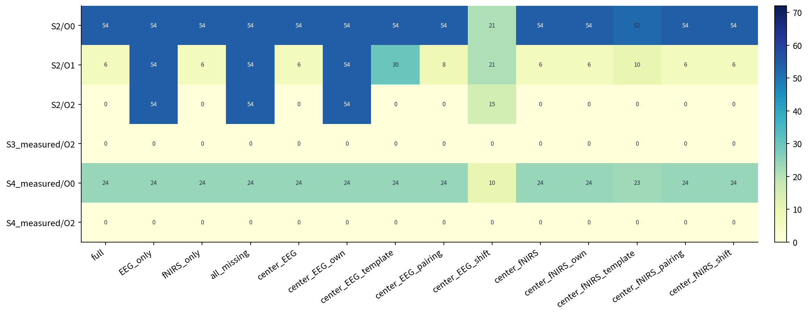
**图 1：实测模式完成数与固定分母**  每格分母均为72个预定身份；14模式完整性另由规则表判断。 数字是成功路径数，灰色或零不等于零误差。输入准备、依赖及求解失败全部留在分母。 任一规则存在缺口时，成功子集不能替代完整72-trial结果。
<!-- /figure -->

<!-- figure:v3_temporal_r -->
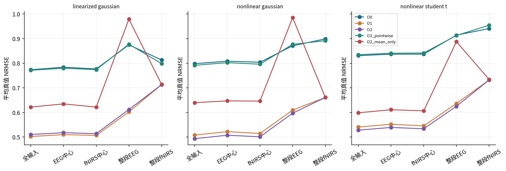
**图 2：时间均值与相关噪声消融：r**  三种独立生成规律；每个条件24个120点trial，同trial的输入、真值与噪声实现共享。 在同一Gaussian MAP中比较逐点、只修正时间均值和完整O2；O0/O1是额外参考。误差越低越好。 组合处理收益须与缺失模式一起判断；Gaussian均值结果不提供Student-t或MAP区间资格。
<!-- /figure -->

<!-- figure:v3_temporal_clean_HbR -->
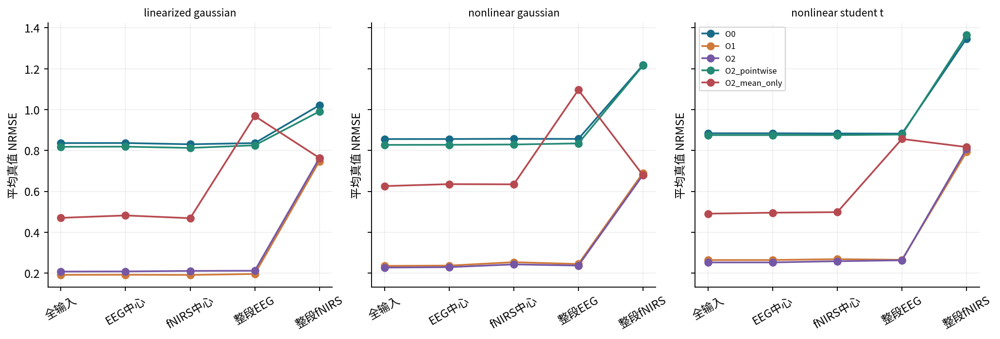
**图 3：时间均值与相关噪声消融：clean_HbR**  三种独立生成规律；每个条件24个120点trial，同trial的输入、真值与噪声实现共享。 在同一Gaussian MAP中比较逐点、只修正时间均值和完整O2；O0/O1是额外参考。误差越低越好。 组合处理收益须与缺失模式一起判断；Gaussian均值结果不提供Student-t或MAP区间资格。
<!-- /figure -->

<!-- figure:v3_missing_support -->
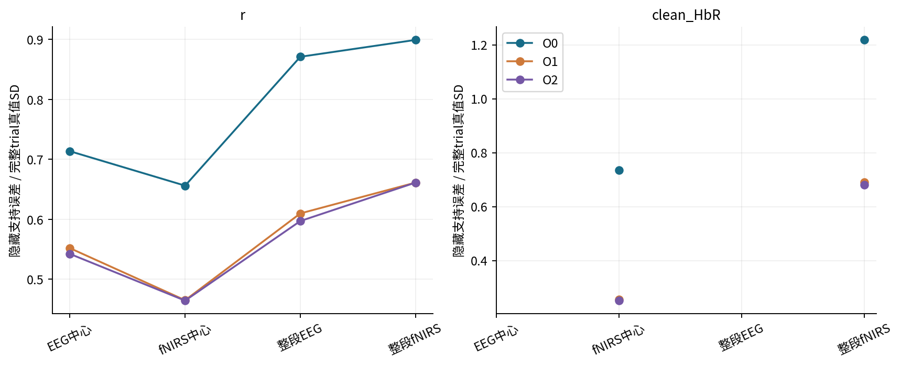
**图 4：按实际缺失支持检查状态恢复**  使用保存的观测mask重新计算缺失坐标；r采用任一模态缺失的时间并集。 中心缺失为16点，整模态缺失为120点；分母统一为完整trial真值SD。无缺失的目标不绘制数值。 该表与冻结行中固定16点窗口的hidden_truth字段分开，避免把整模态缺失误作中心窗口恢复。
<!-- /figure -->

<!-- figure:v3_adaptation_gain -->
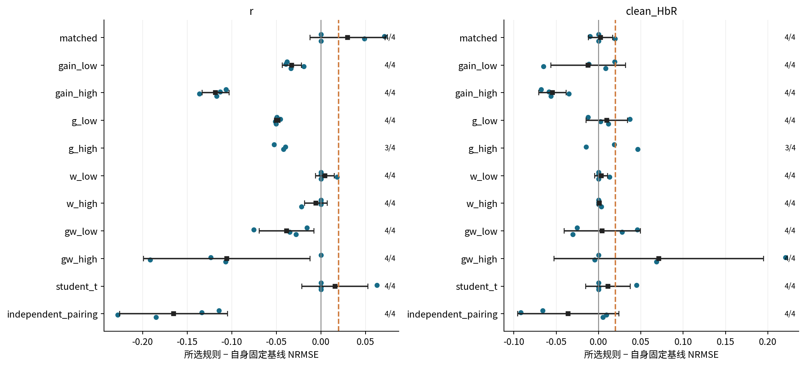
**图 5：独立合成适配：gain**  每条件4个独立panel；每panel训练18、assessment 6，展示O2相对自身基线的变化。 圆点是完整panel配对差，黑线给出df=3的两侧显示范围（端点各对应单侧95%界），虚线为+0.02容差。右侧是完整panel数。 当前门槛判定：incomplete；不完整或不确定不建立无害适配结论。
<!-- /figure -->

<!-- figure:v3_oracle_selection_gain -->
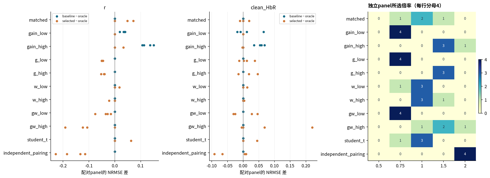
**图 6：真值轴oracle与实际选择：gain**  左两图逐panel比较固定基线、所选规则与真值轴oracle；右图每个独立选择只计一次。 负差表示该panel中误差低于oracle；oracle只知道被扫描的一个轴。选择数不足4时保留缺口。 候选选择率与assessment误差分别读取，不能用六个assessment trial把一次选择计成六次重复。
<!-- /figure -->

<!-- figure:v3_adaptation_process -->
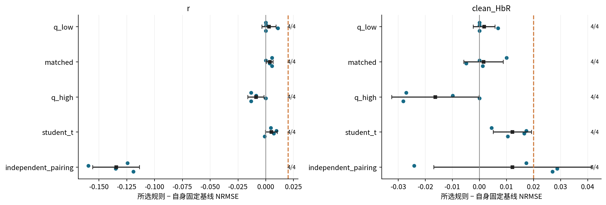
**图 7：独立合成适配：process**  每条件4个独立panel；每panel训练18、assessment 6，展示O2相对自身基线的变化。 圆点是完整panel配对差，黑线给出df=3的两侧显示范围（端点各对应单侧95%界），虚线为+0.02容差。右侧是完整panel数。 当前门槛判定：inconclusive；不完整或不确定不建立无害适配结论。
<!-- /figure -->

<!-- figure:v3_oracle_selection_process -->
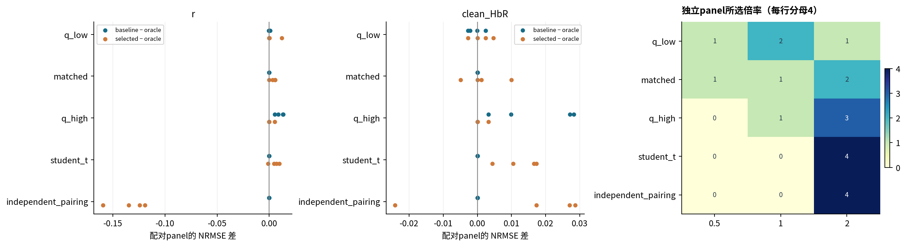
**图 8：真值轴oracle与实际选择：process**  左两图逐panel比较固定基线、所选规则与真值轴oracle；右图每个独立选择只计一次。 负差表示该panel中误差低于oracle；oracle只知道被扫描的一个轴。选择数不足4时保留缺口。 候选选择率与assessment误差分别读取，不能用六个assessment trial把一次选择计成六次重复。
<!-- /figure -->

<!-- figure:v3_residual_whitening -->
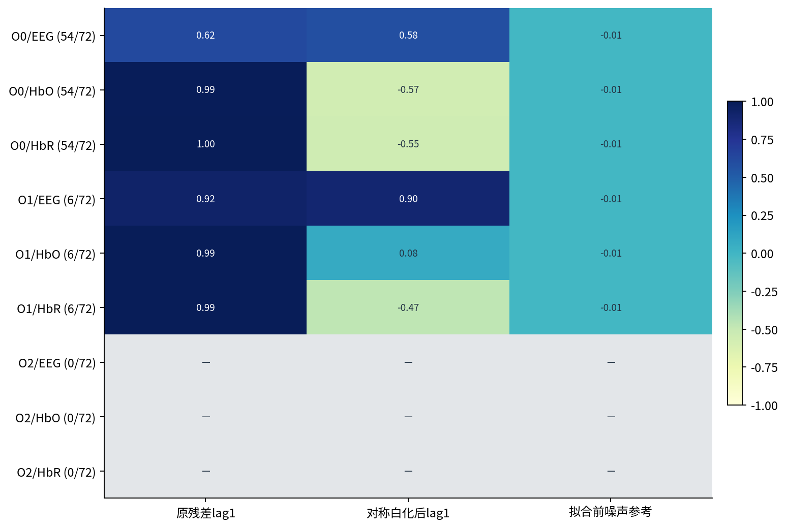
**图 9：共同噪声合同下的残差时间相关**  按冻结训练噪声做对称子空间白化，保留120点输出时钟；基线约束使参考协方差为投影矩阵。 各solver仅汇总成功full行。第三列是噪声合同的相邻坐标相关参考，未扣除轨迹拟合带来的影响。 该诊断描述剩余时间结构，不是白噪声检验p值；不同完成分母仍限制solver比较。
<!-- /figure -->

<!-- figure:v3_residuals -->
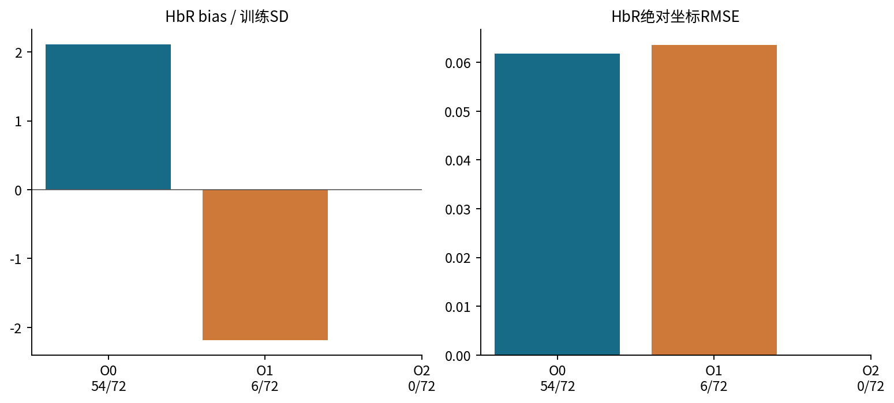
**图 10：完整输入HbR残差的尺度与偏差**  使用clean-map残差，按trial→session→subject等权；标签保留各solver的完整输入成功分母。 左图归一化偏差，右图绝对坐标RMSE。不同成功身份集合仅作条件描述，不作候选排名。 同源带噪条件预测可以复现已见目标，仍须单独检查clean-map残差与训练尺度。
<!-- /figure -->

<!-- figure:v3_residual_tails -->
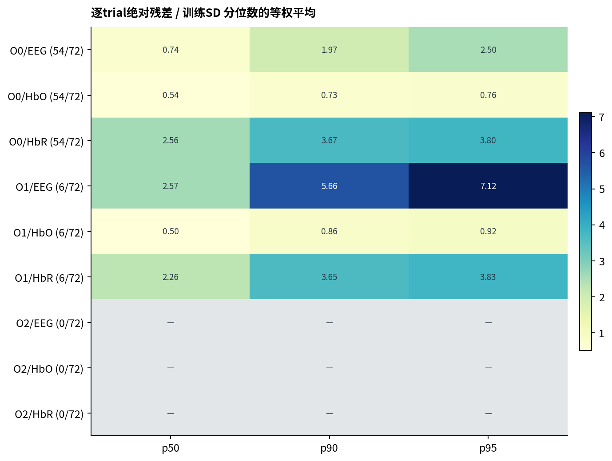
**图 11：完整输入残差尾部**  先在各trial内求分位数，再session和subject等权；各solver仅使用成功full行。 比较同一行的p50、p90、p95；不同完成分母不能直接解释为求解器优劣。 归一化尾部需与绝对坐标偏差共同阅读，缺失行没有被填为零。
<!-- /figure -->

<!-- figure:v3_pairing_increments -->
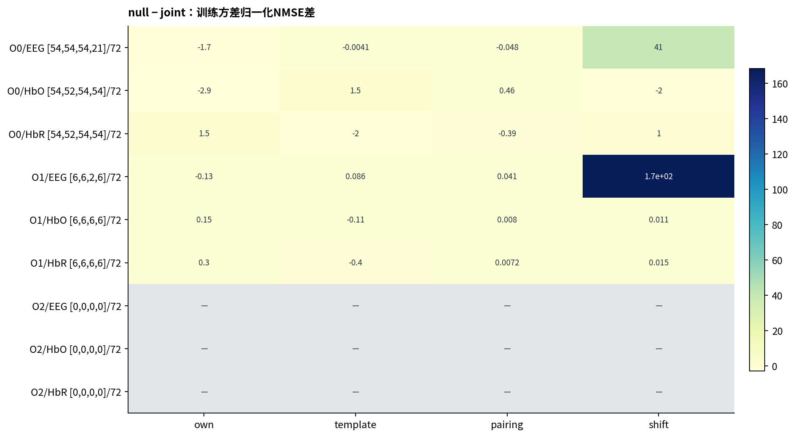
**图 12：正确配对相对四类对照的单模式增量**  每列只配对该joint和null均成功的身份，再按session和subject等权；括号按列列出成功数。 正值表示正确joint预测误差更小；每列固定分母72，成功子集可能不同。 单模式增量保留可用结果，但不能补齐完整14模式主风险或支持跨solver排名。
<!-- /figure -->

<!-- figure:v3_process_replay -->
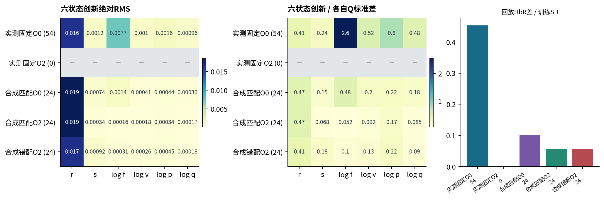
**图 13：过程创新与独立r驱动回放**  固定自身Q=1的完成子集；初态取同一拟合初态，回放不再加入过程创新。数字是有效行数。 依次比较绝对创新、按各自Q归一化的创新和回放HbR差；O0为后验均值，O2为MAP。 回放差含有初态、动力学与非线性均值效应；不能解释为私有信息比例。
<!-- /figure -->

<!-- figure:v3_precision -->
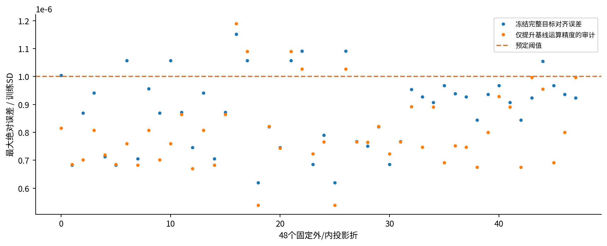
**图 14：完整目标重组的有限精度检查**  读取同一运行的算术审计；不涉及重新拟合或改变原始资格。 高于虚线即超过预定1e-6阈值；第二组点只是单项精度变更的定位结果。 只提升基线运算精度仍不能满足全部折的目标对齐，冻结失败保持有效。
<!-- /figure -->

<!-- figure:v3_replay_closure_audit -->
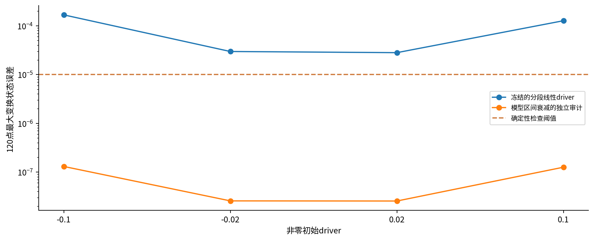
**图 15：非零driver下的确定性回放闭合**  同一零过程创新轨迹，以独立DOP853核对不同采样间driver处理。 按同一初始driver比较误差与1e-5阈值；修正审计不改变本轮冻结Q选择及回放结果。 零driver通过不能外推到动态driver；原回放包含插值误差，需要与生理/过程创新分开。
<!-- /figure -->

## 失败归因与下一步

|拟合行归因|预定行数|
|---|---|
|MAP_evaluation_budget|1346|
|MAP_path_physical_check|176|
|dependency_failure|4608|
|failed_domain|2|
|linear_reference_mean_physical_check|483|
|not_started_prerequisite|1800|
|posterior_mean_physical_check|56|

输入重组、选择依赖、物理路径和求解收敛分别保留。首先处理未满足的数值/观测接口，再依据独立合成适配结果决定后续诊断；本报告不放宽冻结阈值或扩大候选网格。

缺失支持表从保存的mask计算：整模态为120点、中心为16点，使用完整trial真值SD。它与原始固定中心窗口hidden_truth字段分开。

[逐预定拟合状态](fit_status.csv) · [全时间真值及区间](synthetic_state_truth.csv) · [实际缺失支持真值指标](missing_support_truth.csv) · [处理后可见clean真值](processed_visible_truth.csv) · [中心预测](center_prediction.csv) · [逐模式null增量](mode_specific_null_increments.csv) · [残差白化](full_residual_whitening.csv) · [同折线性对照](linear_controls.csv) · [校验记录](report_validation.json)

旧四个内折失败及五个越界案例均按原owner身份映射到新合同结果；新输入及折内对象不同，不能称为同输入失败复现。详见[旧失败身份映射](historical_failure_identity_mapping.csv)。
