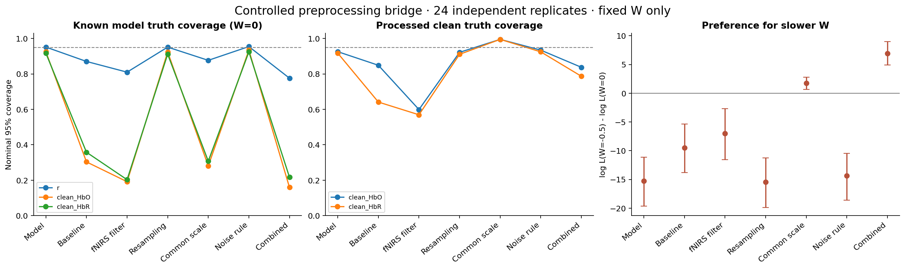
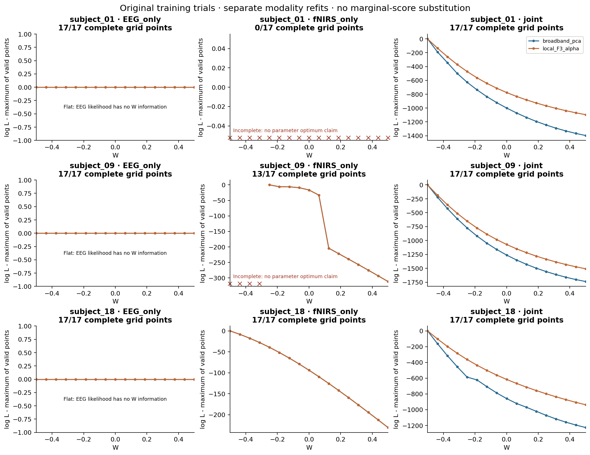
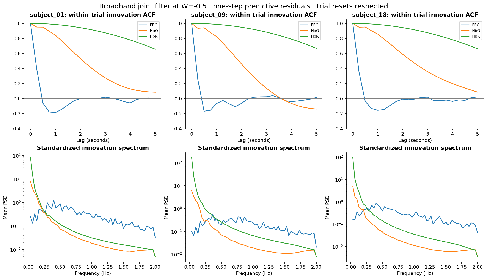
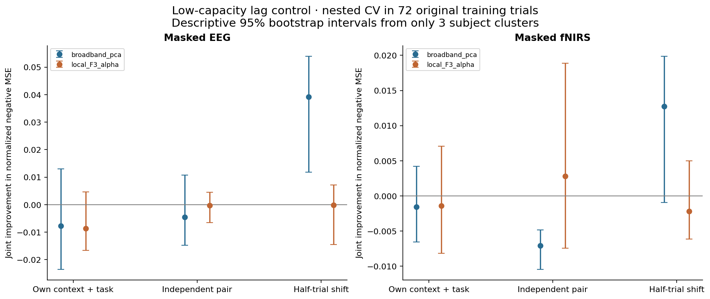

# Step5 实测观测适配诊断（2026-09-08）

**结论：在受限面板内，预处理与原观测模型的不一致已能复现慢 W 偏好和状态欠覆盖；实测的持续 HbR 偏差仍在，预定义局部 EEG 替换及低容量滞后对照没有提供稳定的配对增量。应先修正并验证观测合同，暂不扩大 GWZ 搜索或开展全面 UQ。**

这是探索性诊断，不能把桥接机制直接归因为全部实测失败的唯一原因，也不证明不存在其他非线性跨模态关系。

## 范围与完成情况

- 模型保持六状态共享 Balloon、GWZ 原支持域与既有联合 Student-t 推断。旧 Step5 代码、结果、失败及 teacher 负判定保留。
- 预选 subjects 01/09/18，sessions 01/03/05：72 个原训练 MA trial。原试次位置 4/9 在切片和预处理前排除；本次未处理或评分 Step5B 原留出 trial。
- 原始 EEG 文件含同被试多个完整 session，fNIRS 缓存以完整记录存储；读取文件后只处理已声明训练窗口。未读取 subjects 19–29 文件。
- 24 组合成桥接 × 7 处理分支 × 2 个固定 W = 336 次推断全部有完整结果。
- 306 个实测模态曲线点中 264 个完成、42 个失败；72 个积分阶数检查任务与48 个嵌套 CV 折任务全部完成。42 个失败全部来自 fNIRS-only，两个 EEG 坐标重复使用相同 fNIRS，不能算作42个独立失败 trial。
- 本次没有新被试/新 session 泛化检验、teacher 授权、tokenizer 训练、参数扩边、全面 UQ 或外部发布。

## 1. 受控预处理合成桥接

真值固定 W=0；同一组合成观测分别经过各处理。每个重复另有独立训练 trial 估计噪声。正的 Δlog L 表示 W=−0.5 优于 W=0。覆盖率首先对未变换模型真值计算，W 均固定为0。

| 处理 | r覆盖95% | clean HbO覆盖95% | clean HbR覆盖95% | Δlog L均值 [95% CI] | 偏好−0.5 |
| --- | ---: | ---: | ---: | --- | ---: |
| 原模型坐标 | 95.17% | 92.57% | 91.74% | -15.234 [-19.625, -11.115] | 2/24 |
| 基线扣除 | 87.05% | 30.35% | 35.80% | -9.495 [-13.791, -5.328] | 3/24 |
| fNIRS滤波 | 81.01% | 19.17% | 20.31% | -6.970 [-11.531, -2.711] | 5/24 |
| 重采样往返 | 95.14% | 92.40% | 91.15% | -15.442 [-19.854, -11.265] | 2/24 |
| HbO/HbR共同×0.5 | 87.67% | 28.12% | 30.76% | +1.741 [+0.673, +2.817] | 18/24 |
| 训练噪声规则 | 95.45% | 93.44% | 92.47% | -14.378 [-18.581, -10.455] | 1/24 |
| 组合处理 | 77.60% | 15.94% | 21.70% | +6.900 [+4.930, +9.001] | 23/24 |

真实状态误差如下，NRMSE按各trial原模型真值的标准差归一化；均为24个独立trial的平均。慢W的似然更高不自动意味着driver更接近真值。

| 处理 | r NRMSE，W=0 | r NRMSE，W=−0.5 | clean HbO NRMSE，W=0 | clean HbR NRMSE，W=0 |
| --- | ---: | ---: | ---: | ---: |
| 原模型坐标 | 0.489 | 0.619 | 0.134 | 0.152 |
| 基线扣除 | 0.614 | 0.771 | 0.475 | 0.487 |
| fNIRS滤波 | 0.717 | 0.704 | 0.915 | 0.936 |
| 重采样往返 | 0.490 | 0.621 | 0.135 | 0.153 |
| HbO/HbR共同×0.5 | 0.615 | 0.589 | 0.597 | 0.602 |
| 训练噪声规则 | 0.490 | 0.624 | 0.134 | 0.152 |
| 组合处理 | 0.793 | 0.772 | 0.952 | 0.945 |

基线扣除、滤波各自会破坏部分真值恢复，但在这个面板中，二者单独并未把总体似然偏好推到−0.5。共同幅度变化已使平均偏好转正，组合处理将偏好−0.5的比例从2/24提高到23/24。因此，**相对 EEG 的 fNIRS 幅度/观测映射，至少是一条无需改变血流动力学即可复现慢 W 偏好的机制**。这里的固定×0.5是受控诊断，不是从实测结果选出的校正系数。

模型 clean truth 与处理后的 clean truth 不能混用。对处理后真值，基线扣除分支 HbO/HbR 覆盖为84.90%/64.13%；滤波分支为59.90%/56.94%。共同缩放分支处理后覆盖接近99.5%，却不代表模型潜状态正确；原模型真值覆盖仅约28%/31%。

桥接仅隔离可控线性处理：滤波使用既有0.01–0.2 Hz三阶算子在4 Hz模型坐标执行，重采样为4→10→4往返；没有模拟原始宽频 EEG、完整10 Hz采集、OD/运动校正/MBLL。这些结果支持机制定位，不是完整原始实测生成模型的验证。24个固定W真值重复也不是参数先验SBC。



## 2. 谁在推动 W 下界

EEG-only曲线在浮点误差范围内完全平坦：W不进入EEG的独立驱动分布，不能从EEG-only的数值并列最大点推断W。联合曲线在两种EEG坐标、三个被试上均偏好原范围下界。下表为全部24个训练trial的联合密度差；分段保留历史滤波上下文，不能解释为三个独立似然。

| 被试 | EEG坐标 | 全部 Δlog L | 基线 | 任务 | 恢复 |
| --- | --- | ---: | ---: | ---: | ---: |
| subject_01 | broadband_pca | +999.94 | -22.83 | +388.85 | +633.92 |
| subject_01 | local_F3_alpha | +776.01 | -16.39 | +265.38 | +527.02 |
| subject_09 | broadband_pca | +1261.91 | -22.73 | +416.93 | +867.71 |
| subject_09 | local_F3_alpha | +1071.58 | -12.89 | +338.32 | +746.15 |
| subject_18 | broadband_pca | +859.15 | -8.24 | +230.49 | +636.91 |
| subject_18 | local_F3_alpha | +616.11 | -5.47 | +152.63 | +468.94 |

慢W收益主要来自任务和恢复段，基线段贡献均为负。局部F3 alpha坐标降低了部分似然差，但没有改变偏好方向；不能宣称它已经建立神经血管对应关系。训练选择的fNIRS对分别是AF3Fp1、C5CP5、AF7Fp1，F3与全部这些局部观测的解剖对应尚未验证。

fNIRS-only：subject_01的17个点全部遇到至少一个trial失败；subject_09的最低4个W点失败，其余13点完成；subject_18的17点全部完成，独立fNIRS也偏好−0.5（Δlog L=+93.861）。因此**fNIRS自身可以推动慢响应，但当前失败曲线使我们无法把所有人的边界偏好唯一分解为单模态来源或联合冲突**。不能把subject_09剩余曲线的−0.25称为完整支持域的最优点。

预先指定第一训练trial上的36组13/17阶积分比较全部完成，最大绝对log-likelihood差为0.001853。这支持这些短例的积分稳定，不验证所有trial、完整W后验分辨率或高斯闭合近似。



## 3. 创新残差揭示持续偏差与时间相关

以下是宽频PCA、联合滤波、W=−0.5的一步预测标准化残差。ACF在trial内去均值计算，不跨独立重置拼接。低频比例为非零频率至0.2 Hz的PSD占比。

| 被试 | 通道 | 均值 | RMS | 0.25s ACF | 低频功率比例 |
| --- | --- | ---: | ---: | ---: | ---: |
| subject_01 | EEG | +0.125 | 0.809 | 0.395 | 9.8% |
| subject_01 | HbO | -0.997 | 1.347 | 0.951 | 86.7% |
| subject_01 | HbR | -2.834 | 3.859 | 0.999 | 96.6% |
| subject_09 | EEG | +0.059 | 0.637 | 0.250 | 7.2% |
| subject_09 | HbO | -1.005 | 1.287 | 0.934 | 85.4% |
| subject_09 | HbR | -4.591 | 5.529 | 0.999 | 96.5% |
| subject_18 | EEG | +0.112 | 0.756 | 0.353 | 10.1% |
| subject_18 | HbO | -0.870 | 1.102 | 0.949 | 86.7% |
| subject_18 | HbR | -3.305 | 4.029 | 0.998 | 96.4% |

HbR出现明显负偏差、较大标准化误差和近乎连续的低频残差；换成F3 alpha或固定W=0并未消除。这支持优先检查符号/幅度、基线算子和有色误差合同。残差结构本身不能在这些机制之间给出唯一因果归因，放大独立噪声也不能自动恢复配对特异信息。



## 4. 低容量跨模态滞后对照

每个坐标和方向均有72个原训练trial的外折预测，四外折/三内折按session内训练trial序号固定分配；PCA、fNIRS通道、尺度和岭强度都在相应训练折拟合。基础模型含目标自身可见端点与独立训练任务模板；联合模型再加六个固定滞后。配对和移位null只在外折改变另一模态。EEG重建可用未来fNIRS，所以是离线遮挡重建。

数值为联合相对各对照的负MSE增量，按外折训练方差归一化；正值有利。区间以三个被试为cluster，仅作描述性提示，与旧Step5B的log-score数值不可直接比较。本对照没有在同一外折上重评SSM，不能视为两个模型的直接性能排名。

| 坐标 | 目标 | 对照 | 增量均值 [95% CI] |
| --- | --- | --- | --- |
| broadband_pca | EEG | basic | -0.00776 [-0.02357, +0.01307] |
| broadband_pca | EEG | independent_pairing | -0.00456 [-0.01480, +0.01079] |
| broadband_pca | EEG | circular_shift | +0.03914 [+0.01180, +0.05398] |
| broadband_pca | fNIRS | basic | -0.00158 [-0.00653, +0.00421] |
| broadband_pca | fNIRS | independent_pairing | -0.00706 [-0.01047, -0.00484] |
| broadband_pca | fNIRS | circular_shift | +0.01275 [-0.00094, +0.01988] |
| local_F3_alpha | EEG | basic | -0.00860 [-0.01665, +0.00461] |
| local_F3_alpha | EEG | independent_pairing | -0.00031 [-0.00657, +0.00454] |
| local_F3_alpha | EEG | circular_shift | -0.00010 [-0.01445, +0.00723] |
| local_F3_alpha | fNIRS | basic | -0.00140 [-0.00815, +0.00707] |
| local_F3_alpha | fNIRS | independent_pairing | +0.00281 [-0.00745, +0.01890] |
| local_F3_alpha | fNIRS | circular_shift | -0.00217 [-0.00614, +0.00499] |

两种坐标都没有在两个方向同时、稳定优于自身上下文＋任务模板、错配与移位。宽频EEG方向虽然优于半trial移位，仍未优于基础/错配对照；宽频fNIRS方向甚至不如错配。不能挑单个正null差作为共享信息证据，也不能由三个被试的负结果断言所有坐标均无跨模态信息。



## 5. 保留的数值域失败及同输入复核

本节是看到fNIRS-only失败后，对相同已准备训练输入做的定位；未用于替换原曲线或改变判定。先在W=0/−0.5逐trial重放，再对每个有失败的被试/设定取第一个失败trial比较2/8/32子步。

| 被试 | W | 失败trial/24 | 首次失败标识 | 2子步失败时间 |
| --- | ---: | ---: | --- | ---: |
| subject_01 | 0.0 | 2/24 | session_01/MA位置5 | 22.00s |
| subject_01 | -0.5 | 2/24 | session_01/MA位置5 | 22.75s |
| subject_09 | 0.0 | 0/24 | — | — |
| subject_09 | -0.5 | 1/24 | session_03/MA位置5 | 3.25s |
| subject_18 | 0.0 | 0/24 | — | — |
| subject_18 | -0.5 | 0/24 | — | — |

这次固定设定重放中的失败均在正流量下计算出浮点E=1，从而触发严格E<1检查；首例的 `1−E` 仍是有限正数（约6.43×10⁻⁵³、9.21×10⁻²²、6.92×10⁻²⁰）。三个代表失败在8/32子步下仍发生，且事件相对时间不变。因此，这些触发点可定位为极低推断流量处的浮点饱和，不能简单归于两子步积分过粗。**为何观测把推断带到极低流量，仍是另一个模型适配问题**；本轮没有放宽检查、截断状态或重记原失败。

具体流量、`log(1−E)`、浮点E值、失败前状态及8/32子步结果保留在 [diagnostic_review.json](diagnostic_review.json)。这些重放是当前训练trial的异常定位，不是对旧Step5B两个留出异常的重新读取或修复，也不构成真实生理异常证据。

## 决策与可复现入口

本轮已完成指定诊断及失败记录。证据支持下一步先建立与baseline/filter/相对幅度一致的观测前向算子及噪声合同，在相同真值桥接上验证；随后才在训练边界内复核固定/单参数SSM的配对增量。当前不扩大GWZ范围、不把内部参数或区间膨胀当修复、不晋级teacher和全面UQ。局部F3替换未给出继续沿该坐标搜索的积极依据。

运行：

```bash
.venv/bin/python experiments/evaluate_step5_observation_diagnostic.py \
  --run-dir experiments/runs/physiology_semantic_tokenizer/step5/<fresh-run> --stage all
.venv/bin/python experiments/scripts/review_step5_observation_diagnostic.py \
  --run-dir experiments/runs/physiology_semantic_tokenizer/step5/<fresh-run>
```

冻结配置见 [resolved_config.yaml](resolved_config.yaml)，原运行源码见 [runner_snapshot.py](runner_snapshot.py)，版本/源文件SHA见 [manifest.json](manifest.json)。原 [summary.json](summary.json) 与所有case JSON保留；本复核将平坦曲线的浮点并列最大标记为“无W信息”，将不完整曲线明确标记为“无完整最优点主张”，不改动原似然值。
